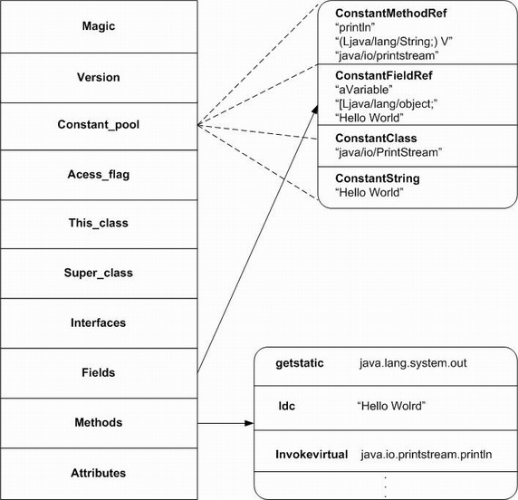

# 版本

asm 版本：5.2

jdk 版本：1.7


​    

# java class 文件结构





**Magic：**magic 被称为「魔数」，用来标识 .class 文件的开头。所有合法的 .class 字节码都应该是该数开头，占 4 个字节。

**Version：**当前 .class 文件的版本号，该版本号一般由编译器产生，并且由sun定义。占4个字节。

**Constant Pool：**该项为常量池，存放不同类型的常量。虚拟机必须为每一个被装载的类维护一个常量池，常量池中存储了相应类型所用到的所有类型、字段和方法的符号引用，因此它在 Java 的动态链接中起到了核心的作用。常量池的大小平均占到了整个类大小的 60% 左右。

**Access_flag：**该项指明了该类或接口的访问权限，如 public，private，abstract 等。

**This Class：**指向 constant pool 的索引值，指定当前字节码定义的类或接口。

**Super Class：**指向 constant pool 的索引值，指定当前字节码定义的类或接口的直接父类。只有 Object 类才没有直接父类，此时该索引值为 0 。并且父类不能是 final 类型。接口的父类都是 Object 类。

**Interfaces：**一个指针数组，存放了该类或接口实现的所有接口名称的字符串常量的指针。

**Fields：**该项存放类或接口的字段（不包括从父类和父接口继承而来的字段）。

**Methods：**该项存放了类或接口中的方法（不包括从父类和父接口继承定义的方法）。


​    

# asm 的核心类

**ClassReader：**负责从 class 文件中读取，并依照固定的顺序调用 ClassVisitor 中声明的多个 visitXxx 方法。

**ClassVisitor：**抽象类，负责访问 class 内容。

**ClassWriter：**是 ClassVisitor 的子类，负责生成 byte[] 字节流。


​    

# asm 的模型

有两种模型：事件模型（core API）和对象模型（tree API）。


### 事件模型

事件模型在设计模式中采用了访问者模式。ClassReader 在 `accept` 一个  ClassVisitor 时，该 ClassVisitor 会调用 `visit` 方法并开始进行访问。`visit` 之后会继续按顺序调用其他 visitXxx 方法，如 `visitSource`，`visitOuterClass` 等。

需要注意的是，在访问每个字段或方法时，ClassVisitor 都会返回一个 FieldVisitor 或者 MethodVisitor（也有可能返回 null）。如果不是 null，则 ClassReader 会接着让该 FieldVisitor 和 MethodVisitor 进行访问其详细信息。每当一个 Visitor 访问完，它都会调用 `visitEnd` 方法来结束访问。


#### 生成 class

```java
/*
 * asm 5.2 官方例子：生成class，并调用它的 main方法。
 */
public class Helloworld extends ClassLoader implements Opcodes {

    public static void main(final String args[]) throws Exception {
        // Generates the bytecode corresponding to the following Java class:
        //
        // public class Example {
        // public static void main (String[] args) {
        // System.out.println("Hello world!");
        // }
        // }
    	
        // creates a ClassWriter for the Example public class,
        // which inherits from Object
        ClassWriter cw = new ClassWriter(0);
        cw.visit(V1_7, ACC_PUBLIC, "Example", null, "java/lang/Object", null);

        // creates a MethodWriter for the (implicit) constructor
        MethodVisitor mw = cw.visitMethod(ACC_PUBLIC, "<init>", "()V", null,
                null);
        // pushes the 'this' variable
        mw.visitVarInsn(ALOAD, 0);
        // invokes the super class constructor
        mw.visitMethodInsn(INVOKESPECIAL, "java/lang/Object", "<init>", "()V",
                false);
        mw.visitInsn(RETURN);
        // this code uses a maximum of one stack element and one local variable
        mw.visitMaxs(1, 1);
        mw.visitEnd();

        // creates a MethodWriter for the 'main' method
        mw = cw.visitMethod(ACC_PUBLIC + ACC_STATIC, "main",
                "([Ljava/lang/String;)V", null, null);
        // pushes the 'out' field (of type PrintStream) of the System class
        mw.visitFieldInsn(GETSTATIC, "java/lang/System", "out",
                "Ljava/io/PrintStream;");
        // pushes the "Hello World!" String constant
        mw.visitLdcInsn("Hello world!");
        // invokes the 'println' method (defined in the PrintStream class)
        mw.visitMethodInsn(INVOKEVIRTUAL, "java/io/PrintStream", "println",
                "(Ljava/lang/String;)V", false);
        mw.visitInsn(RETURN);
        // this code uses a maximum of two stack elements and two local
        // variables
        mw.visitMaxs(2, 2);
        mw.visitEnd();

        // gets the bytecode of the Example class, and loads it dynamically
        byte[] code = cw.toByteArray();

        FileOutputStream fos = new FileOutputStream("Example.class");
        fos.write(code);
        fos.close();

        Helloworld loader = new Helloworld();
        Class<?> exampleClass = loader.defineClass("Example", code, 0,
                code.length);

        // uses the dynamically generated class to print 'Helloworld'
        exampleClass.getMethods()[0].invoke(null, new Object[] { null });

        // ------------------------------------------------------------------------
        // Same example with a GeneratorAdapter (more convenient but slower)
        // ------------------------------------------------------------------------

        cw = new ClassWriter(ClassWriter.COMPUTE_MAXS);
        cw.visit(V1_1, ACC_PUBLIC, "Example", null, "java/lang/Object", null);

        // creates a GeneratorAdapter for the (implicit) constructor
        Method m = Method.getMethod("void <init> ()");
        GeneratorAdapter mg = new GeneratorAdapter(ACC_PUBLIC, m, null, null,
                cw);
        mg.loadThis();
        mg.invokeConstructor(Type.getType(Object.class), m);
        mg.returnValue();
        mg.endMethod();

        // creates a GeneratorAdapter for the 'main' method
        m = Method.getMethod("void main (String[])");
        mg = new GeneratorAdapter(ACC_PUBLIC + ACC_STATIC, m, null, null, cw);
        mg.getStatic(Type.getType(System.class), "out",
                Type.getType(PrintStream.class));
        mg.push("Hello world!");
        mg.invokeVirtual(Type.getType(PrintStream.class),
                Method.getMethod("void println (String)"));
        mg.returnValue();
        mg.endMethod();

        cw.visitEnd();

        code = cw.toByteArray();
        loader = new Helloworld();
        exampleClass = loader.defineClass("Example", code, 0, code.length);

        // uses the dynamically generated class to print 'Helloworld'
        exampleClass.getMethods()[0].invoke(null, new Object[] { null });
    }
}
```

#### 修改 class

大致思路是先用 ClassReader 解析后，由 ClassWriter 来负责生成它的字节流，最后把原文件覆盖掉。

修改一个 class 文件可以根据事件模型的原理写一个 ClassVisitor 的子类来实现。比如，移除某个内部类时，可以在该 ClassVisitor 的 `visitInnerClass` 方法中不进行访问内部类的操作，这样 ClassVisitor 就没有访问到，最后新生成的 class 也不会包含该内部类，从而实现了移除。移除某字段和方法时也类似，在 `visitField` 或 `visitMethod` 方法中判断确定是要移除的成员时返回 `null` 即可，这样 ClassReader 没有拿到 FieldVisitor 和 MethodVisitor 就访问不到了。

而添加一个类成员，比如添加某个字段或者方法时需要注意，不能直接在 ClassVisitor 的 `visitField` 和 `visitMethod` 方法中进行操作。因为 ClassReader 会遍历访问每个字段和方法，这样可能会造成重复添加了多个。

所以解决方法是，在 ClassVisitor 的 `visitEnd` 方法中实现添加。因为 ClassReader 在 ClassVisitor 访问完后最后一定会调用它的 `visitEnd` 方法，并且只调用一次。

```java
public class ModifyClass {

	@SuppressWarnings("resource")
	public static void main(String[] args) throws Exception {
		File file = new File("Example.class");
		InputStream input = new FileInputStream(file);
        byte[] byt = new byte[input.available()];
        input.read(byt);
        
		ClassReader cr = new ClassReader(byt);
		ClassWriter cw = new ClassWriter(0);
        ClassVisitor cv = new ModifyClassMethodVisitor(cw);
        cr.accept(cv, 0);
        
        FileOutputStream fout = new FileOutputStream(file);
        fout.write(cw.toByteArray());
        fout.close();
	}
	
	private static class ModifyClassMethodVisitor extends ClassVisitor{
		 
	    public ModifyClassMethodVisitor(int api) {
	        super(api);
	    }
	 
	    public ModifyClassMethodVisitor(ClassWriter cw) {
	        super(Opcodes.ASM5, cw);
	    }
	 
	    // 移除内部类
	    @Override
	    public void visitInnerClass(String name, String outerName, String innerName, int access) {
	    }
	 
	    @Override
	    public MethodVisitor visitMethod(int access, String name, String desc, String signature, String[] exceptions) {
	        if ("main".equals(name)) {
	            // 移除main方法
	            return null;
	        }
	        return cv.visitMethod(access, name, desc, signature, exceptions);
	    }
	    
	    // 添加一个字段
	    @Override
	    public void visitEnd() {
            FieldVisitor fv = cv.visitField(Opcodes.ACC_PRIVATE, "addedField", "I", null, null);
            if (fv != null) {
                fv.visitEnd();
            }
	        cv.visitEnd();
	    }
	}
}
```

​    

### 对象模型

对象模型的本质其实是一个经过封装了的事件模型。它通过一个树状图来描述一个类，一个类包含多个节点，比如方法节点，字段节点，每个节点又有子节点，比如方法节点有操作码子节点等。

对象模型对开发者来说更方便简单，但会消耗更多的时间和内存。

#### 生成 class

```java
// 要生成的class：
// public abstract class TreeExample {
//	  
//   public static final int zero = 0;
//  
//   public abstract int methodA(Object arg0);
// }
public class GenerateClass {
  
	public static void main(String[] args){
		ClassWriter cw = new ClassWriter(Opcodes.ASM5);
        ClassNode cn = generate();
        cn.accept(cw);
        try {
            File file = new File("TreeExample.class");
            FileOutputStream fout = new FileOutputStream(file);
            fout.write(cw.toByteArray());
            fout.close();
        } catch (Exception e) {
            e.printStackTrace();
        }
	}
  
	@SuppressWarnings("unchecked")
	private static ClassNode generate() {
        ClassNode classNode = new ClassNode();
        classNode.version = Opcodes.V1_7;
        classNode.access = Opcodes.ACC_PUBLIC + Opcodes.ACC_ABSTRACT;
        classNode.name = "demo/tree/TreeExample";
        classNode.superName = "java/lang/Object";
        classNode.fields.add(new FieldNode(Opcodes.ACC_PUBLIC + Opcodes.ACC_FINAL + Opcodes.ACC_STATIC, 
        		"zero", "I", null, new Integer(0)));
        classNode.methods.add(new MethodNode(Opcodes.ACC_PUBLIC + Opcodes.ACC_ABSTRACT, 
        		"methodA", "(Ljava/lang/Object;)I", null, null));
        return classNode;
    }
}
```

#### 修改 class

```java
File file = new File("TreeExample.class");
InputStream input = new FileInputStream(file);
byte[] byt = new byte[input.available()];
input.read(byt);

ClassReader cr = new ClassReader(byt);
ClassNode cn = new ClassNode();
cr.accept(cn, 0);

// 添加字段
cn.fields.add(new FieldNode(Opcodes.ACC_PUBLIC + Opcodes.ACC_FINAL + Opcodes.ACC_STATIC, 
                            "one", "I", null, new Integer(1)));
// 删除方法
Iterator<MethodNode> i = cn.methods.iterator();
while (i.hasNext()) {
  MethodNode mn = i.next();
  if ("methodA".equals(mn.name)) {
    i.remove();
  }
}

ClassWriter cw = new ClassWriter(0);
cn.accept(cw);
FileOutputStream fout = new FileOutputStream(file);
fout.write(cw.toByteArray());
fout.close();
```

