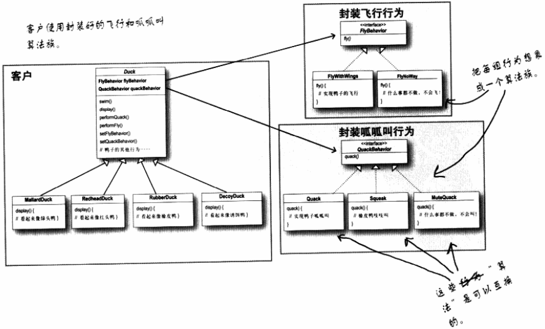

## 第1章 策略模式（Strategy Pattern）

策略模式定义了算法族，分别封装起来，让它们之间可以互相替换。

使用了**组合**，而不是继承。

​    

比如下面的鸭子的例子：

原先每个 Duck 都可以 fly 飞行，且行为都是一样的（用翅膀飞），所以会直接在 Duck 这个父类里写 fly 具体方法，然后每个 Duck 的子类去继承它。

但是，现在有了新的一些特殊的鸭子，比如橡皮鸭，它虽然属于 Duck，但并不会飞。

所以这里使用了策略模式，即把 fly 行为抽象出一个接口（FlyBehavior），然后根据不同的 fly 描述会有不同的实现类，像 FlyWithWings、FlyNoWay 子类，然后 Duck 类用**组合**的方式拥有 `FlyBehavior flyBehavior;` （每个 Duck 的子类可以在初始化时设置 flyBehavior 变量）。且可通过 `public void setFlyBehavior(FlyBehavior fb){}`  方法，给用户提供一个动态设置具体的 fly 行为（是 FlyWithWings 还是 FlyNoWay）的功能。

