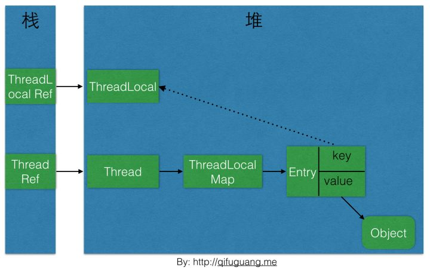

# 第4章 Java 并发编程基础

​    

### Daemon 守护线程

当一个 Java 虚拟机中不存在非 Daemon 线程的时候，Java 虚拟机将会退出。即使有 finally 代码块，也不会执行而直接停止。

在 start() 前 通过 thread.setDaemon(true); 可设置为 Daemon 线程。

​    

### 中断

从 Java 的 API 中可以看到，许多声明抛出 InterruptedException 的方法（例如 Thread.sleep(long millis) 方法）这些方法在抛出 InterruptedException 之前，Java虚拟机会先将该线程的中断标识位清除，然后抛出 InterruptedException，此时调用 isInterrupted() 方法将会返回 false。

而其他在正常运行中的线程，中断后 isInterrupted() 方法会返回 true 。

​    

### notify() 与 wait()

调用 wait() 方法，线程状态由 RUNNING 变为 WAITING，并释放锁，将当前线程放置到对象的等待队列。 

notify() 方法将等待队列中的一个等待线程从等待队列中移到同步队列中，而 notifyAll() 方法则是将等待队列中所有的线程全部移到同步队列，被移动的线程状态由 WAITING 变为
BLOCKED。

等待线程在获得锁后 wait() 方法才会返回。

​    

### 管道输入 / 输出流

PipedOutputStream、PipedInputStream、PipedReader 和 PipedWriter 

​    

### Thread.join() 

如果一个线程 A 执行了 thread.join() 语句，其含义是：当前线程 A 等待 thread 线程终止之后才从 thread.join() 返回（终止时会调用线程自身的 notifyAll() 方法，而通知所有等待在该线程对象上的线程）。线程 Thread 除了提供 join() 方法之外，还提供了 join(long millis) 和 join(long millis,int nanos) 两个具备超时特性的方法。这两个超时方法表示，如果线程 thread 在给定的超时时间里没有终止，那么将会从该超时方法中返回。 

​    

### ThreadLocal

作用是提供线程内的局部变量。

https://www.zhihu.com/question/23089780

#### 使用

##### get() / set() 

获取 / 设置当前线程关联的 ThreadLocal 上的值。

##### remove()

删除当前线程的 ThreadLocal 绑定的值。

##### initialValue()

设置 ThreadLocal 的初始值。在第一次调用 get 方法时会被调用。或手动调用 remove 方法后，再次调用 get 方法时也会被调用。

##### 例子

```java
public class TestThreadLocal {

    public static void main(String[] args) {
        for (int i = 0; i < 5; i++) {
            new Thread(new MyThread(i)).start();
        }
    }
    
    private static final ThreadLocal<Integer> value = new ThreadLocal<Integer>() {
        @Override
        protected Integer initialValue() {
            return 0;
        }
    };

    static class MyThread implements Runnable {
        private int index;

        public MyThread(int index) {
            this.index = index;
        }

        public void run() {
            System.out.println("线程" + index + "的初始value:" + value.get());
            for (int i = 0; i < 10; i++) {
                value.set(value.get() + i);
            }
            System.out.println("线程" + index + "的累加value:" + value.get());
        }
    }
}
```

执行结果为：

```
线程0的初始value:0
线程3的初始value:0
线程2的初始value:0
线程2的累加value:45
线程1的初始value:0
线程3的累加value:45
线程0的累加value:45
线程1的累加value:45
线程4的初始value:0
线程4的累加value:45
```

各个线程的 value 值是相互独立的。

#### 内部实现原理

ThreadLocal 类内部会创建一个 Map，然后用线程的 ID 作为该 Map 的 key，实例对象作为 Map 的value，这样就能达到各个线程的值隔离的效果。

jdk 8 中 ThreadLocal 的 **get** 方法源码：

```java
public T get() {
    Thread t = Thread.currentThread(); // 获取当前线程
    ThreadLocalMap map = getMap(t); // 获取当前线程的ThreadLocalMap
    if (map != null) {
    	ThreadLocalMap.Entry e = map.getEntry(this);
        if (e != null) {
            @SuppressWarnings("unchecked")
            T result = (T)e.value;
            return result;
        }
    }
    return setInitialValue();
}
```

其中 **getMap** 方法源码：

```java
ThreadLocalMap getMap(Thread t) {
	return t.threadLocals; // 每个线程都有一个ThreadLocalMap
}
```

**setInitialValue** 方法的源码：

```java
private T setInitialValue() {
    T value = initialValue();
    Thread t = Thread.currentThread();
    ThreadLocalMap map = getMap(t);
    if (map != null)
        map.set(this, value);
    else
        createMap(t, value);
    return value;
}
```

**createMap** 方法的源码：

```java
void createMap(Thread t, T firstValue) {
	t.threadLocals = new ThreadLocalMap(this, firstValue);
}
```

可以看到，每个线程都有一个 ThreadLocalMap，它的 key 就是 ThreadLocal（引用），value 是要存储的对象，即真正要存储的局部变量就是存在当前线程的 ThreadLocalMap 中的。

线程与 ThreadLocal 关系图：



##### 这样设计的目的

隔离其他线程，当前线程就获取自己的对象。

线程销毁时，它的 ThreadLocalMap 也会被销毁，所以能减少内存使用。

#### 内存泄漏问题

会引发内存泄漏。

##### 原因

如上面的关系图，ThreadLocalMap 的 key 是 ThreadLocal 对象的引用，如果线程外部没有强引用引用它（ThreadLocal），那么系统在 GC 的时候，会把这个 ThreadLocal 对象也回收。这样 ThreadLocalMap 会出现 key 为 null 的 Entry，线程就没法访问这个 key 为 null 的 value。而如果线程一直没有结束，那这个 key 为 null 的 value 就会一直存在一条强引用链，即无法回收，造成了内存泄漏。

##### java 源码中的措施

为了防止内存泄漏，ThreadLocalMap 在调用它的 getEntry 方法时，如果 key 为空（ThreadLocal 对象为空），则会擦除该位置的 entry。这样 entry 的 value 就没有了强引用链，自然会被回收。

ThreadLocalMap 在 set 方法时也类型，会将 key 为 null 的这些 entry 都删除。

但是光这样是不够的，因为上面的措施需要一个前提条件：**需要去调用 ThreadLocalMap 的 getEntry 方法或 set 方法。**所以还需要手动调用 ThreadLocal 的 **remove** 方法而删除不需要的 ThreadLocal。

##### 最终建议

定义 ThreadLocal 实例为 private static 的（这样 ThreadLocal 有了强引用，不会被回收），并手动调用 ThreadLocal 的 remove() 方法。

​    

### 线程池

当客户端调用 execute(Job) 方法时，会不断地向任务列表 jobs 中添加 Job，而每个工作者线程会不断地从 jobs 上取出一个 Job 进行执行，当 jobs 为空时，工作者线程进入等待状态。
添加一个 Job 后，对工作队列 jobs 调用了其 notify() 方法，而不是 notifyAll() 方法，因为能够确定有工作者线程被唤醒，这时使用 notify() 方法将会比 notifyAll() 方法获得更小的开销（避免将等待队列中的线程全部移动到阻塞队列中）。 //////////////////////////////////////////////////////////////

​    

