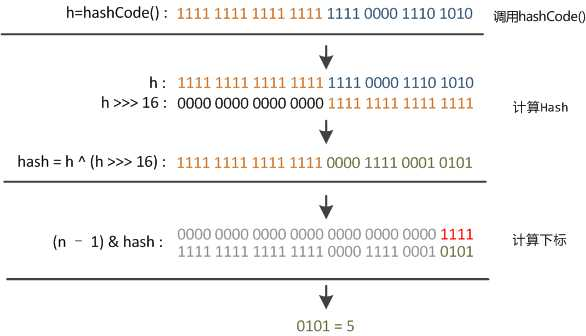

# HashMap 与 ConcurrentHashMap

jdk 1.8

​    

## HashMap

#### 底层原理：

HashMap 中节点是用链表数组来存储的。

用 hash 码计算出 index 后，table[i] 链表中再根据 hash 码进行存储。

​    

HashMap 默认初始（数组的）容量是 16 ，当达到 `16 * 0.75` （负载因子默认为 0.75 ）时，会进行扩容，把原来的节点重新分配。

手动初始化其容量时，数值也必须为 2 的幂。这是为了通过位运算计算出 hash 和 index 等：

​    

#### **计算哈希码 hash 的方法**

```java
static final int hash(Object key) {
	int h; // 32位
	return (key == null) ? 0 : (h = key.hashCode()) ^ (h >>> 16); // key.hashCode()为哈希算法，返回初始哈希值
}
```

h >>> 16 ：h 的高位数



​    

#### **计算下标 index 的方法**

```java
i = hash & (length - 1);
```

length 是 2 的 n 次方， `length - 1` 就是 n 个 1 的二进制数，求出来的 index 值就是 hash 的末尾 n 个数。

只要 hash 足够散列，其末尾 n 个数值也会是散列的，但如果 length 不是 2 的幂，比如 10（1010），计算出的 index 就不能保证是散列的。

​    

#### jdk 1.8 后使用红黑树

当链表长度达到 8 时，该链表会变成红黑树结构，链表头节点变成 HashMap 下的 TreeNode 类型。每次 put 都会先根据头结点类型判断是链表还是红黑树。

同样，桶个数超过 64 个时，也会把桶数组变成红黑树结构。

当扩容后，树节点变成 6 个以下，会再变成链表。

优点：之前的 HashMap 有可能存在某链表长度很长，导致每次要遍历 On 的时间，而使用红黑树就可以只用 Ologn 了。

​    

​    

## ConcurrentHashMap

线程安全的 HashMap。

​    

在 **1.7** 中，ConcurrentHashMap 用的是分段锁，把哈希表分成若干个 Segment（每个 Segment 下有各自的链表数组），put 时就对某 Segment 进行加锁。get 方法没有用锁，而是利用了 `sun.misc.Unsafe.getObjectVolatile()` 方法，它与 volatile 类似，具有可见性和原子性。

计算 size 则先计算两次，第二次与第一次比较时若不一样，再计算一次，如果第三次也跟第二次计算的不一样，就对所有 Segment 进行加锁再计算一次。

​    

而在 **1.8** 中，使用了乐观锁 CAS ，底层还是链表数组（jdk 1.8 后，长度为 8 以上的链表会变成红黑树结构，其节点是 TreeBin 类型）。每个 Node 的 value 和 next 属性都是 volatile 的。

> **CAS：**
>
> 某些 Atomic 类，在执行某项计算时不使用互斥，但在更新时会先把旧值和新值一起提交进行判断（`compareAndSwap()`），如果旧值不一致则更新失败，说明已经在其他地方被修改了。
>
> 比较时不仅比较值，也会比较版本号（改完版本号进行加一）。因为只比较值会发生 **ABA 问题**：
>
> 原值为 A ，当线程 1 和线程 2 分别进行 A->B ，B->A 的操作时，B->A 本该不能修改（修改前原值 A ，与预期原值不一样），但有可能线程 1 刚好结束了，使得线程 2 在比较时通过而修改成功。
>
> **CAS 的原子性：**
>
> CAS 是硬件级别的，在 Java 中是 native 方法。虽然它有读取、比较、写入操作，但 CAS 在大多数 CPU 中其实是一条命令（CMPXCHG 命令），而不是多条命令，所以是具有原子性的。对于不支持 CMPXCHG 的 CPU ，会进行加锁来保证不会被打断。
>
> JAVA多线程里面CAS中比较和更新怎么保证同步？：https://www.zhihu.com/question/64915964/answer/225710737
>
> Java Concurrency代码实例之三原子变量：https://zhuanlan.zhihu.com/p/27338395

​    

### sizeCtl 属性

在 ConcurrentHashMap 中出镜率很高的一个属性，因为它是一个控制标识符，在不同的地方有不同用途（比如初始化时将其他线程挂起），而且它的取值不同，也代表不同的含义。

- 负数代表正在进行初始化或扩容操作


- -1 代表正在初始化


- -N 表示有 N-1 个线程正在进行扩容操作


- 正数或 0 代表 hash 表还没有被初始化，这个数值表示初始化或下一次进行扩容的大小，这一点类似于扩容阈值的概念。还后面可以看到，它的值始终是当前 ConcurrentHashMap 容量的 0.75 倍，这与 loadfactor 是对应的。

```java
/** 
   * Table initialization and resizing control.  When negative, the 
   * table is being initialized or resized: -1 for initialization, 
   * else -(1 + the number of active resizing threads).  Otherwise, 
   * when table is null, holds the initial table size to use upon 
   * creation, or 0 for default. After initialization, holds the 
   * next element count value upon which to resize the table. 
   hash表初始化或扩容时的一个控制位标识量。 
   负数代表正在进行初始化或扩容操作 
   -1代表正在初始化 
   -N 表示有N-1个线程正在进行扩容操作 
   正数或0代表hash表还没有被初始化，这个数值表示初始化或下一次进行扩容的大小 
   */  
  private transient volatile int sizeCtl;
```

​    

### get 方法

利用 Unsafe 的 `getObjectVolatile()` 方法获取头节点，然后再获取相同 key 的节点 value （节点的 value 和 next 属性是 volatile 的，所以具有可见性）。

​    

### put 方法

如果不存在该 key 则用 Unsafe 的方法进行插入，如果插入不成功或者已存在，则对该节点加锁，进行更新。

ConcurrentHashMap 不允许 key 和 value 为空。

​    

### 计算 size

计算 size 时可能正被多个线程操作，而又不可能让他停下来计算，所以只能算出一个估计值。


### 源码分析参考文章

ConcurrentHashMap源码分析（JDK8版本）：http://blog.csdn.net/u010723709/article/details/48007881