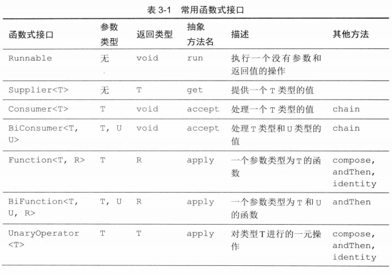
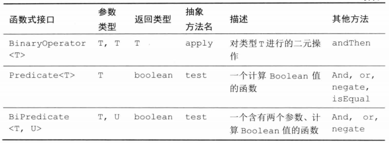

# 写给大忙人看的Java SE 8

​    

## 第1章 lambda 表达式

### 表达式语法

### 函数式接口

@FuntionalInterface

只有一个抽象方法。

### 方法引用

- `对象::实例方法`


- `类::静态方法`


- `类::示例方法`

### 构造器引用

`类::new`

### 变量作用域

### 默认方法

default

类优先

### 接口中的静态方法

​    

​    

## 第2章 Stream API

### 创建 Stream

Collection 接口的 stream 方法（list.stream()）；

Stream.of(数组) 方法；

### filter、map、flatMap 方法

### 提取子流和组合流

limit、skip 方法

peek 方法：创建相同元素的流，并且每次获取一个元素时都会调用一个函数。

### 简单的聚合方法

max、min、count 方法。

聚合方法都是终止操作。

max、min 返回的是 Optional<T> 对象。

### Optional 类型

Optional 对象的 get 方法，如果 value 存在会返回，如果不存在则报异常。

### 聚合操作

### 收集结果

collect 方法

Collections 的 toXXX、summarizing 方法

forEach 方法

### 将结果收集到 Map 中

### 分组和分片

collect 方法

Collections.groupingBy、partitioningBy 方法

### 原始类型流

IntStream、DoubleStream 等类型。不必使用包装。

创建方法：

IntStream.of；

Arrays.stream；

### 并行流

parallel 方法

默认情况下流操作都创建的是一个串行流。

使用并行流需要注意线程安全的问题。

​    

​    

## 第3章 使用 lambda 编程

### 延迟执行

比如：

```java
logger.info("x:" + x + ", y:" + y);
// 会先组成一个字符串后，再根据日志级别判断是否要打印
```

改成：

```java
logger.info(() -> "x:" + x + ", y:" + y);
```

这样，就能在判断后需要打印时才会组成字符串。

### 常用函数式接口





### 返回函数

### 组合

使用 UnaryOperator 实现组合操作：

```java
public static <T> UnaryOperator<T> compose(UnaryOperator<T> op1, UnaryOperator<T> op2) {
    return t -> op2.apply(op1.apply(t));
}
```

### 延迟

### 并行操作

### 处理异常

### lambda 表达式和泛型

不是返回类型的参数类型上加 ? super；不是参数类型的返回类型上加 ? extends。

如：

```java
public static <T> void doSomething(Supplier<? extends T> first, Consumer<? super T> second, Consumer<? super Thorwable> handler);
```

### 一元操作

​    

​    

## 第4章 JavaFX

​    

​    

## 第5章 新的日期和时间 API

### 时间线

Instant 对象表示时间轴上的一个点。

Duration 对象表示两个瞬时点之间的时间量。

```java
Instant start = Instant.now();
// do something..
Instant end = Instant.now();
Duration timeElapsed = Duration.between(start, end);
long millis = timeElapsed.toMillis(); // 还有toDays, toHours, toMinutes等方法

// 判断是否至少快10倍
boolean overTenTimesFaster = timeElapsed.multipliedBy(10).minus(timeElapsed2).isNegative();
// 或者 timeElapsed.toNanos() * 10 < timeElapsed2.toNanos()
```

Instant、Duration 类都是不可变的。例如 multipliedBy、minus 等方法都会返回一个新的实例。

### 本地日期

#### LocalDate 类

now()：当天日期

of(year, month, day)，如 LocalDate.of(2018, Month.APRIL, 1)

与 java.util.Date 不同，1 就代表 1月份。

LocalDate.of(2018, 1, 31).plusMonths(1) 和 LocalDate.of(2018, 3, 31).minusMonths(1) 都会返回实际 2 月份的最后一天，而不会是 2 月 31 日。

localDate.getDayOfWeek().getValue()：星期一返回 1。

（DayOfWeek 枚举与 Calendar 类不同，Calendar 中周日为 1，周六为 7）

#### Period 类

表示两个 LocalDate 对象之间的时间量。

```java
localDate.plus(Period.ofYears(1)); // 1年后的日期
Period p = localDate.until(localDate2, ChronoUnit.DAYS); // 天数距离
```

除了 LocalDate，Java 8 还提供了 MonthDay、YearMonth 和 Year 类来描述部分日期。比如，MonthDay 可以用来表示 12 月 25 日（不指定年份）。

### 日期校正器

TemporalAdjusters 类

提供一些日期校正的静态方法。

```java
localDate.with(TemporalAdjusters.nextOrSame(DayOfWeek.TUESDAY));
// 从 localDate 开始的第一个星期二，会返回一个新的 LocalDate 对象。
```

也可以自定义一个校正器（TemporalAdjuster 对象）：

```java
TemporalAdjuster NEXT_WORKDAY = w -> {
    LocalDate result = (LocalDate) w;
    do {
        result = result.plusDays(1);
    } while (result.getDayOfWeek.getValue() >= 6);
    return result;
};

LocalDate nextWorkDate = today.with(NEXT_WORKDAY);
```

优化上面例子：使用 ofDateAdjuster 方法来避免强制转换

```java
TemporalAdjuster NEXT_WORKDAY = TemporalAdjusters.ofDateAdjuster( w -> {
    LocalDate result = w; // 不需要强制转换
    do {
        result = result.plusDays(1);
    } while (result.getDayOfWeek.getValue() >= 6);
    return result;
});
```

### 本地时间

LocalTime 类

不关心是 AM 还是 PM。

LocalDateTime 类

表示一个日期和时间。

### 带时区的时间

ZonedDateTime 类

可以从 LocalDateTime、Instant 对象转换，或者通过 of 方法创建。

要注意夏令时。如 plus 方法要用 Period 参数，而不是用 Duration。

ZoneId 类

每个时区都有他的 id。ZoneId.of("America/New_York")

### 格式化和解析

DateTimeFormatter 类

```java
String formatted = DateTimeFormatter.ISO_DATE_TIME.format(zonedDateTime);
```

自定义 formatter：

```java
DateTimeFormatter formatter = DateTimeFormatter.ofLocalizedDateTime(FormatStyle.LONG);
String formatted = formatter.format(zonedDateTime);

// 自定义格式：
formatter = DateTimeFormatter.ofPattern("yyyy-MM-dd HH:mm");
```

字符串解析：

```java
LocalDate localDate = LocalDate.parse(str); // 使用了标准的ISO_LOCAL_DATE格式
// 自定义格式：
ZonedDateTime zonedDateTime = 
    ZonedDateTime.parse(str, DateTimeFormatter.ofPattern("yyyy-MM-dd HH:mm"));
```

### 与遗留代码互操作

java 8 提供了一些转换方法。比如：

Instant 类类似于 java.util.Date 类。Date 可以用 toInstant() 转换成 Instant。

ZonedDateTime 类似于 java.util.GregorianCalendar。

也可以将一个 DateTimeFormatter 对象传递到 java.text.Format，以新的方式进行格式化。

​    

​    

## 并发增强

原子值

在 java 8 之前：

```java
public static AtomicLong largest = new AtomicLong();

do {
    oldValue = largest.get();
    newValue = Math.max(oldValue, observed);
} while (!largest.compareAndSet(oldValue, newValue));
```

java 8 以后：用 lambda 表达式

```java
largest.updateAndGet(x -> Math.max(x, observed));
// 或者
largest.accumulateAndGet(observed, Math::max);
```

​    

大量线程访问同一个原子值时，会由于乐观锁更新需要太多次重试，导致性能严重下降。因此，java 8 提供了 LongAdder 和 LongAccumulator。

#### LongAdder

由多个变量组成，这些变量累加的值为当前值。

long total = longAdder.sum();

#### LongAccumulator

类似地，需要提供操作类型和初始化值。

```java
LongAccumulator adder = new LongAccumulator(Long::sum, 0);

adder.accumulate(value); // adder里的所有变量会被更新为x = x op value; 在这个例子里op就是累加操作，即 x = x + value;
// get方法结果就是 x1 op x2 op ... xn 的结果。在这个例子里就是所有变量的总和。
```

除此之外，还有 DoubleAdder、DoubleAccumulator 类。

### ConcurrentHashMap改进

compute

search、forEach、reduce

newKeySet、keySet

### 并行数组操作

Arrays.parallelSort(array);

parallelSetAll

parallelPrefix

### 可完成的Future

#### CompletableFuture 类

thenApply 方法

CompletableFuture completableFuture2 = completableFuture.thenApply(函数)

completableFuture 完成时会传给指定的函数，然后该函数的返回值会成为最终的结果。

supplyAsync 方法

runAsync 方法

thenApplyAsync 方法

​    

​    

## 第7章 JavaScript引擎——Nashorm

​    

​    

## 第8章 杂项改进

### 字符串

String.join：拼接

### 数字类

BYTES 字段；

静态 hashCode 方法；

静态 sum、max、min 方法；

Boolean 类也有了 logicalAnd、logicalOr、logicalXor 静态方法；

Integer 支持无符号数学计算。Byte、Short 类增加了 toUnsignedInt 方法（获取从0到255的值），Integer 类增加了 toUnsignedLong 方法。Integer、Long 增加了无符号值的比较方法：compareUnsigned，和一些操作方法；

Float、Double 类增加静态 isFinite 方法。如果正/负无穷大、NaN 会返回 true；

BigInteger 类增加实例方法 valueExact；

### 新的数字函数

Math 类提供了精确的算数计算方法。这些方法当结果溢出时会抛异常，而不是返回一个错误的结果。

addExact、multiplyExact 等方法（xxxExact）。

转换方法：toIntExact

floorMod、foorDiv：解决整型余数的问题。比如，n%2，如果是负数则结果为 -1。再如，校正时钟时，如果是 (position + adjustment) % 12，adjustment 为负数时结果就可能变为负数了，只能改成 ((position + adjustment) % 12 + 12) % 12。使用新的 floorMod 方法就变得简单了：floorMod(position + adjustment, 12)，总会返回一个 0 到 11 之间的值。然而对于负的除数，floorMod 会返回负数结果。

为 double、float 数字提供的 nextDown 方法：返回比该数值小、但最接近的浮点数字。（对应的，Java 6 中提供了 nextUp 方法）

注：上述介绍的方法在 StrictMath 类中也都存在。

### 集合

