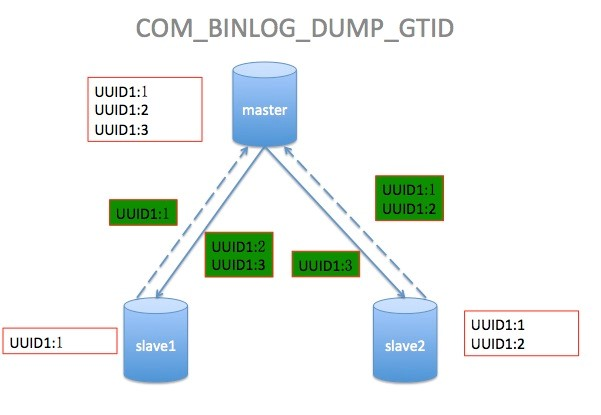
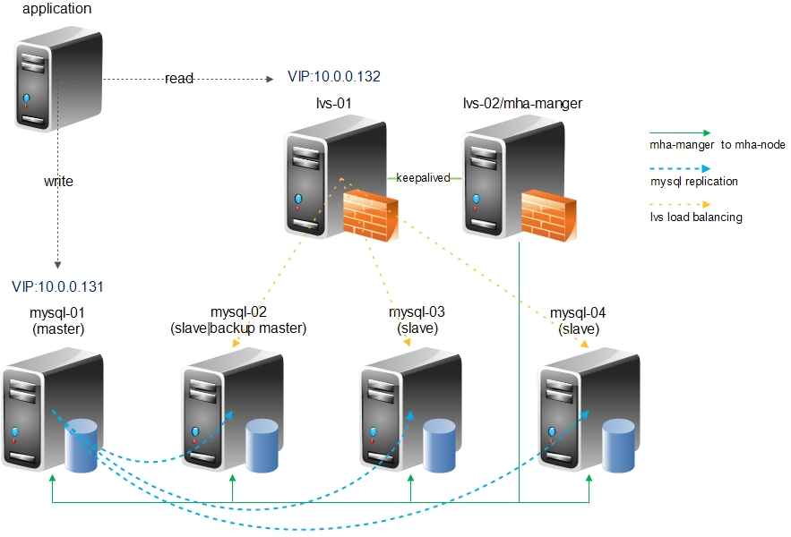
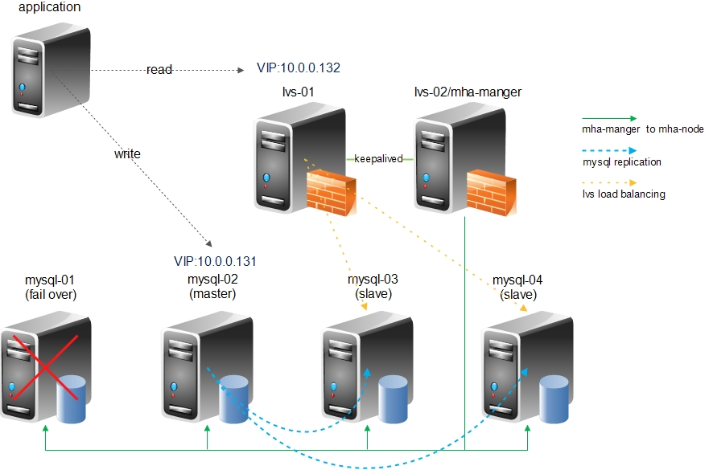
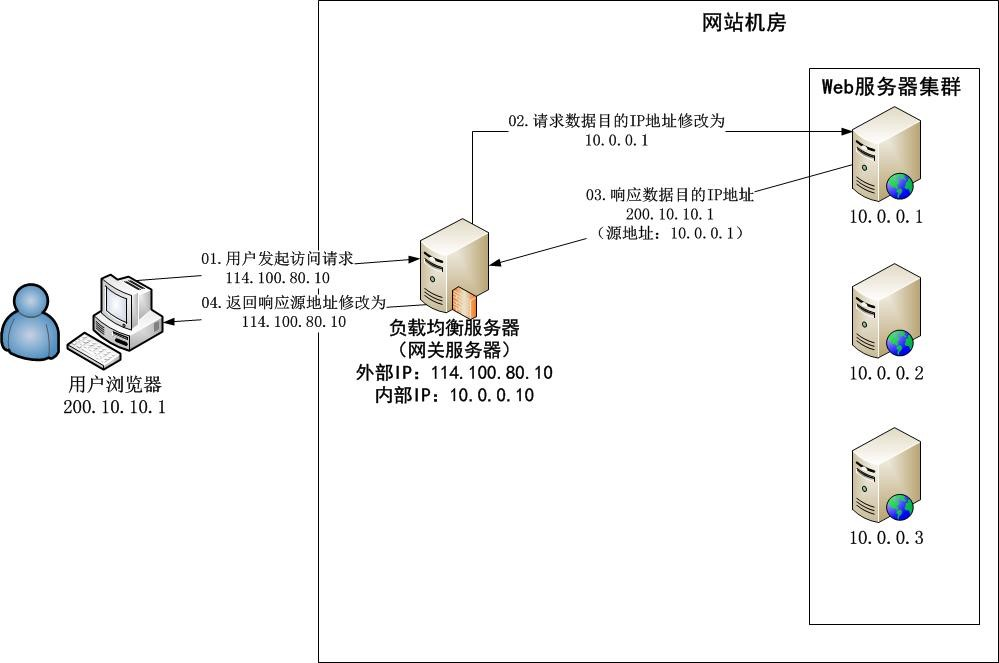
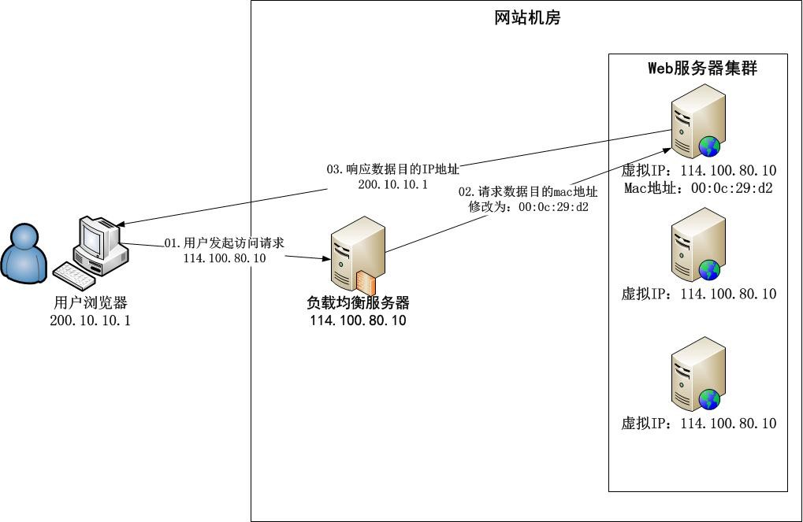

# MySQL 学习笔记


## 版本

MySQL ：5.7.19

MySQL 官网目前已经有了 8.0.3 ，但还是 RC ，没有 GA 版本，所以这里使用 5.7.19 的。

​    

## 下载与安装

### Windows

1. 下载

   https://dev.mysql.com/downloads/mysql/

2. 解压文件

3. 进入根目录，创建 my.ini 文件，内容如下：

   ```ini
   [client]
   port=3306
   default-character-set=utf8 
   [mysqld] 
   basedir=D:\mysql-5.7.19-winx64
   datadir=D:\mysql-5.7.19-winx64\data
   port=3306
   character-set-server=utf8
   character-set-filesystem = utf8
   sql_mode=NO_ENGINE_SUBSTITUTION,NO_AUTO_CREATE_USER
   explicit_defaults_for_timestamp=true
   skip-grant-tables
   ```

4. 创建一个空文件夹，文件夹名为 data ：

   

5. 以管理员身份打开 cmd ，进入 bin 目录

6. 初始化

   ```shell
   mysqld --initialize-insecure
   ```

   可以选择用 --initialize-insecure 或者 --initialize 来初始化，--initialize-insecure 初始化 root 密码为空，如果用 --initialize 来初始化，会生成一个随机密码，该随机密码可以在 data 目录下的 err 文件中查看。

7. 安装 MySQL 服务

   ```shell
   mysqld -install
   ```

8. 启动 MySQL 服务

   ```shell
   net start mysql
   ```

9. 登录 MySQL

   ```shell
   mysql -u root
   ```

10. 退出

  ```shell
  exit
  ```


### Linux（Ubuntu）

1. 下载

   ```shell
   wget http://dev.mysql.com/get/Downloads/MySQL-5.7/mysql-5.7.19-linux-glibc2.12-x86_64.tar.gz
   ```

2. 解压

   ```shell
   tar zxvf mysql-5.7.19-linux-glibc2.12-x86_64.tar.gz
   sudo mv mysql-5.7.19-linux-glibc2.12-x86_64 /usr/local
   sudo ln -s /usr/local/mysql-5.7.19-linux-glibc2.12-x86_64/ /usr/local/mysql
   ```

3. 安装

   ```shell
   #MySQL运行需要libaio1库
   sudo apt-get install libaio1
   #添加用户组
   sudo groupadd mysql
   #添加用户，这个用户是不能登录的
   sudo useradd -r -g mysql -s /bin/false mysql
   #进入文件目录，mysql是链接
   cd /usr/local/mysql
   #新建文件夹
   sudo mkdir mysql-files
   #修改文件夹的权限
   sudo chmod 750 mysql-files
   sudo chown -R mysql .
   sudo chgrp -R mysql .
   #安装初始化，注意：此部最后一行会有一个初始化密码，用于root账号的首次登录
   sudo bin/mysqld --initialize --user=mysql 
   #生成证书
   sudo bin/mysql_ssl_rsa_setup        
   #把权限修改回来      
   sudo chown -R root .
   sudo chown -R mysql data mysql-files
   ```

4. 启动

   ```shell
   sudo bin/mysqld_safe --user=mysql &
   ```

5. 登录 MySQL

   ```
   /usr/local/mysql/bin/mysql -uroot -p
   ```

   需要输入密码，该密码在初始化时输出的最后一行中有显示，如下，可以看到密码是 rwqYv8bdgG)>

   ```shell
   [Note] A temporary password is generated for root@localhost: rwqYv8bdgG)>
   ```


### 一台 Linux 部署多个 MySQL （Ubuntu）

与上面安装单个 MySQL 时类似，但需要手动配置各端口等参数。

1. 关闭防火墙

   ```shell
   ufw disable 
   ```

2. 下载、解压、创建用户组

3. 在 MySQL 二进制包目录中创建 mysql-files 目录（MySQL 数据导入/导出数据专放目录）

   ```shell
   mkdir -v /usr/local/mysql/mysql-files
   ```

4. 创建多实例数据目录

   ```shell
   mkdir -vp /data/mysql_data{1..4}
   ```

5. 修改 MySQL 二进制包目录的所属用户与所属组

   ```shell
   chown root.mysql -R /usr/local/mysql-5.7.19-linux-glibc2.12-x86_64
   ```

6. 修改 MySQL 多实例数据目录与 数据导入/导出专放目录的所属用户与所属组

   ```shell
   chown mysql.mysql -R /usr/local/mysql/mysql-files /data/mysql_data{1..4}
   ```

7.  配置 MySQL 配置文件 /etc/my.cnf

   5.7.18 以后不会有默认的配置文件，所以需要自己去创建一个 my.cnf 并放到 /etc 文件夹里。

   my.cnf 内容：

   ```ini
   [mysqld_multi] 
   mysqld = /usr/local/mysql/bin/mysqld  
   mysqladmin = /usr/local/mysql/bin/mysqladmin
   log = /tmp/mysql_multi.log 
     
   [mysqld1] 
   # 设置数据目录　[多实例中一定要不同] 
   datadir = /data/mysql_data1
   # 设置sock存放文件名　[多实例中一定要不同] 
   socket = /tmp/mysql.sock1 
   # 设置监听开放端口　[多实例中一定要不同] 
   port = 3306 
   # 设置运行用户 
   user = mysql 
   # 关闭监控 
   performance_schema = off 
   # 设置innodb 缓存大小 
   innodb_buffer_pool_size = 32M 
   # 设置监听IP地址 
   bind_address = 0.0.0.0 
   # 关闭DNS 反向解析 
   skip-name-resolve = 0 
     
   [mysqld2] 
   datadir = /data/mysql_data2
   socket = /tmp/mysql.sock2 
   port = 3307 
   user = mysql 
   performance_schema = off 
   innodb_buffer_pool_size = 32M 
   bind_address = 0.0.0.0 
   skip-name-resolve = 0 
     
   [mysqld3] 
   datadir = /data/mysql_data3
   socket = /tmp/mysql.sock3 
   port = 3308 
   user = mysql 
   performance_schema = off 
   innodb_buffer_pool_size = 32M 
   bind_address = 0.0.0.0 
   skip-name-resolve = 0 
     
   [mysqld4] 
   datadir = /data/mysql_data4
   socket = /tmp/mysql.sock4 
   port = 3309 
   user = mysql 
   performance_schema = off 
   innodb_buffer_pool_size = 32M 
   bind_address = 0.0.0.0 
   skip-name-resolve = 0
   ```

   MySQL 读取 my.cnf 配置文件的顺序：

   ```shell
   # /usr/local/mysql/bin/mysql --help 中可以看到如下信息：
   Default options are read from the following files in the given order:
   /etc/my.cnf /etc/mysql/my.cnf /usr/local/mysql/etc/my.cnf ~/.my.cnf
   ```

   如果不使用 mysqld_multi 需要在每个实例根目录下创建 my.cnf 。

8. 初始化各个实例

   初始化完成后会自带随机密码在输出日志中。

   ```shell
   /usr/local/mysql/bin/mysqld --initialize --user=mysql --basedir=/usr/local/mysql --datadir=/data/mysql_data1
   /usr/local/mysql/bin/mysqld --initialize --user=mysql --basedir=/usr/local/mysql --datadir=/data/mysql_data2
   /usr/local/mysql/bin/mysqld --initialize --user=mysql --basedir=/usr/local/mysql --datadir=/data/mysql_data3
   /usr/local/mysql/bin/mysqld --initialize --user=mysql --basedir=/usr/local/mysql --datadir=/data/mysql_data4
   ```

   不推荐使用 --initialize-insecure （不使用密码）来初始化，有可能在登录 MySQL 时还会要求输入其密码（直接 enter 掉也不行）。

9. 各实例开启 SSL 连接

   ```shell
   /usr/local/mysql/bin/mysql_ssl_rsa_setup --user=mysql --basedir=/usr/local/mysql --datadir=/data/mysql_data1
   /usr/local/mysql/bin/mysql_ssl_rsa_setup --user=mysql --basedir=/usr/local/mysql --datadir=/data/mysql_data2
   /usr/local/mysql/bin/mysql_ssl_rsa_setup --user=mysql --basedir=/usr/local/mysql --datadir=/data/mysql_data3
   /usr/local/mysql/bin/mysql_ssl_rsa_setup --user=mysql --basedir=/usr/local/mysql --datadir=/data/mysql_data4
   ```

10. 复制多实例脚本到服务管理目录下

  ```shell
  cp /usr/local/mysql/support-files/mysqld_multi.server /etc/init.d/mysqld_multi
  ```

11. 添加脚本执行权限

    ```shell
    chmod +x /etc/init.d/mysqld_multi
    ```

12. 添加进 service 服务管理

    ```shell
    chkconfig --add mysqld_multi
    ```

    上面是网上找的，如果是 Ubuntu ，需要使用 sysv-rc-conf ：

    ```shell
    sudo apt-get install sysv-rc-conf
    sudo sysv-rc-conf --list mysqld_multi
    ```

13. ​

    ```shell
    export PATH=/usr/local/mysql/bin:$PATH
    ```

14. 启动各实例

    ```shell
    /etc/init.d/mysqld_multi start
    ```

15. 查看状态

    ```shell
    /etc/init.d/mysqld_multi report
    ```

    如果发现没有启动，可以查看 /tmp/mysql_multi.log 其原因。如果报 data 文件夹 xxx 的权限不够（具体不记得），可以给 data 文件夹赋权限：

    ```shell
    sudo chmod 777 -R /data/mysql_data{1..4}
    ```

16. 登录一个 MySQL

    ```shell
    /usr/local/mysql/bin/mysql -S /tmp/mysql.sock1 -uroot -p'+7AvlXwZ/4Wu'
    ```


### 存储引擎

MySQL 的索引是在存储引擎中实现的，不同的存储引擎支持的索引类型以及具体实现方式是有差别的。

存储引擎有 MYISAM，Innodb ， Memory 等。其特点如下：

#### InnoDB

行级锁，并发能力相对强，占用空间是 MYISAM 的 2.5 倍，支持事务，5.6 开始支持全文索引。5.5.8 以后默认存储引擎为 InnoDB 。InnoDB的 AUTOCOMMIT 默认是打开的，即每条SQL语句会默认被封装成一个事务，自动提交，这样会影响速度，所以最好是把多条 SQL 语句显示放在 begin 和 commit 之间，组成一个事务去提交。

基于磁盘存储，并且通过使用缓冲池来提高数据库性能。读取数据时先尝试从缓冲池取出，修改时也先修改缓冲池上的，再以一定的频率刷新到磁盘上（不是每次修改都会去刷新到磁盘）。因此，缓冲池大小直接影响这数据库的整体性能（可以通过 innodb_buffer_pool_size 来设置）。

InnoDB 对缓冲池采用 LRU算法 + midponint位置 方式进行管理。

#### MyISAM

全表锁，拥有较高的执行速度，一个写请求请阻塞另外相同表格的所有读写请求，并发性能差，占用空间相对较小，不支持事务，5.5 以上支持全文索引。

#### Memory

全表锁，存储在内存当中，速度快，但会占用和数据量成正比的内存空间且数据在 mysql 重启时会丢失。有个缺陷是对于变长字段的存储是定长的，从而影响数据库的内存开销和性能。（听说即将抛弃使用 Memory ）

​    

### 分表

#### 纵向分表

常见方式有根据活跃度分表、根据重要性分表等。

主要解决：

- 表与表之间资源争用问题；
- 锁争用机率小；
- 实现核心与非核心的分级存储，如UDB登陆库拆分成一级二级三级库；
- 数据库同步压力问题。

#### 横向分表

根据某些特定的规则来划分大数据量表，如根据时间分表。

主要解决：

- 单表过大造成的性能问题；
- 单表过大造成的单服务器空间问题。

​    

### 索引

不同的存储引擎，对索引实现的细节有所不同。

MySQL 索引类型：

- 主键索引（PRIMARY）
- 唯一索引（UNIQUE）
- 普通索引（INDEX）
- 全文索引（FULLTEXT ，MYISAM 及 5.6 以上的 Innodb）

主键索引、唯一索引、普通索引都是基于 B-Tree 索引算法实现的。主键索引的字段不允许为 null ，且不能重复。唯一索引允许为 null ，但能重复。普通索引允许 null ，重复。

全文索引适用于海量数据的关键字模糊搜索，但功能还是比专业的搜索引擎少。


## 优化

- 不要使用*select \**（涉及到数据字典解析，会降低性能）。
- 删除表所有记录truncate比delete快。

 

### EXPLAIN 语句

EXPLAIN语句可以告诉查询语句有没有使用索引。但部分统计是估算值，分析出来的结果只是一个参考。

```mysql
EXPLAIN SELECT * FROM T_USER
```

 

### 使用索引

1. 索引会加快查询速度，但不是越多越好，因为会增加数据库存储空间，并且插入修改删除数据时需要花额外时间去维护索引（MySQL 5.5 以下的表里只能用一个索引）。

2. 由于索引是根据排序来快速查找的，如果使用索引的字段有很多重复值，会降低其查询的效率，甚至可能不会使用索引来查询。

3. **联合索引**

   联合索引的效率往往比单列索引的效率高。

   联合索引能够满足最左侧查询需求，例如 (a, b, c) 三列的联合索引，能够加速 a | (a, b) | (a, b, c) 三组查询需求。

   比如，`select * from table1 where A=1 order by B asc;` 和`select * from table1 where A=? and B=? order byC asc;` 这两种查询只需要建一个联合 b-tree 索引（A, B, C）。

   如果表中包含 A 和 B 字段，且 A 与 B 建立了联合索引。条件 `A=? and B=?` 和 `B=? and A=?` 都会用到索引，但是 `B=? and A=?` 会经过查询分析器的优化。最好写 where 条件的顺序和联合索引顺序一致，避免查询分析器优化损耗性能。

4.  or 一般比 in 慢。而且不建议频繁用 or，不是所有的 or 都命中索引

    `in (a,b)` 如果满足条件的数据占比非常大，也是有可能不用索引而是全表扫描的。

5. != 负向查询不会命中索引（除非量很小）

6. like %XX% 左边有 % 不能走索引，可以使用 instr() 。

7. 尽量避免在 where 字句中对字段进行 null 值的判断。否则将会导致引擎放弃使用索引而进行全表扫描。

8. 尽量使带索引的字段单独出现：

   ```mysql
   -- 不会使用索引，因为snam使用了函数运算,原理与上面相同
   SELECT `sname` FROM `stu` WHEREconcat(`sname`,'abc') = 'Jaskeyabc'; 
   -- 会使用索引
   SELECT sname FROM stu WHERE sname=concat('Jaskey','abc'); 
   ```

   在5.7中，MySQL提供了**函数索引 Generated Column** ，可以更好的解决这类问题：

   在 MySQL 5.7 中，支持两种 Generated Column ，即 Virtual Generated Column 虚拟列和 Stored Generated Column，前者只将 Generated Column 保存在数据字典中（表的元数据），并不会将这一列数据持久化到磁盘上；后者会将 Generated Column 持久化到磁盘上，而不是每次读取的时候计算所得。很明显，后者存放了可以通过已有数据计算而得的数据，需要更多的磁盘空间，与 Virtual Column 相比并没有优势，因此，MySQL 5.7 中，不指定 Generated Column 的类型，默认就是 Virtual Column 。但虚拟列不能作为主键、外键。

   ```mysql
   -- 添加虚拟列 CREATE_DATE，并给给它加索引
   ALTER TABLE t ADD COLUMN CREATE_DATE  DATE AS (DATE(CREATE_TIME)), ADD KEYidx_CREATE_DATE (CREATE_DATE);
   -- 使用虚拟列索引
   SELECT * FROM t1 WHERE CREATE_DATE ='2017-10-08';
   ```

   注：创建 generated column 时不能使用非确定性的（不可重复的）函数，如 `curtime()` 。

9. 使用索引进行条件查询时比较类型不一样时不会用到索引。如字符型字段为数字时在 where 条件里没有添加引号。

10. not in ，not exist 不会用到索引。

11. 如果 MySQL 认为直接全表扫描更快，则不会使用索引。

12. 如果查询的数据超过大表的 20% ，可能不会使用索引。

13. 到底是否会使用索引没有绝对性的，具体还要根据实际业务进行分析。

 

### 排序 ORDER BY

在某些情况下，MySQL 不能使用索引来解析 ORDER BY，尽管它仍然可以使用索引来查找与该 WHERE 子句匹配的行。例子：

- 使用不同的索引（非联合索引）：

```mysql
SELECT * FROM t1 ORDER BY key1, key2;
```

- （联合索引中的）索引字段非连续：

```mysql
SELECT * FROM t1 WHERE key2=constant ORDER BYkey_part1, key_part3;
```

- 混合ASC和 DESC：

```mysql
SELECT* FROM t1 ORDER BY key_part1 DESC, key_part2 ASC;
```

- WHERE和order by使用不同的索引：

```mysql
 SELECT* FROM t1 WHERE key2 = constant ORDER BY key1; -- 这种可以创建(key2, key1)的联合索引来解决
```

- 使用表达式：

```mysql
SELECT* FROM t1 ORDER BY ABS(key);
SELECT* FROM t1 ORDER BY -key;
```

- 连接许多表，并且所有 ORDER BY 列都不是来自用于检索行的第一个非常量表。

  **常量表**指：

  1. 空表或者只有一行数据的表；


  2. 或者使用的where条件中只有主键和唯一索引，并且这些比较字段非空、与常量作比较。

  ```mysql
  SELECT * FROM t WHERE primary_key=1;
  SELECT * FROM t1,t2 *
  WHERE t1.primary_key=1 ANDt2.primary_key=t1.id;
  ```

- 同时有ORDER BY和GROUP BY。

- 别名：

```mysql
--对别名为a的字段（即ABS(a)）进行排序，所以不会使用到索引a。
SELECT ABS(a) AS a FROM t1 ORDER BY a;
-- 对t1表的a字段进行了排序而不是对别名b，所以会使用索引。
SELECT ABS(a) AS b FROM t1 ORDER BY a;
```

注：由于目前索引是按升序存储的，所以排序时用倒序会相对较慢。

 

### IN与EXISTS

mysql 中的 in 是把外表和内表作 hash 连接，是以 in 子查询驱动外面的表集合，而 exists 是对外表作 loop 循环，每次 loop 循环再对内表进行查询，以外表集合驱动 exists 子查询，这一点上 in 和 exists 是相反的。

所以如果 A 是小表，B 是大表：

```mysql
select * from A where cc in (select cc from B); -- 效率低
select * from A where exists(select cc from Bwhere cc=A.cc); -- 效率高
select * from B where cc in (select cc from A); -- 效率高
select * from B where exists(select cc from Awhere cc=B.cc); -- 效率低
```

即需要以小结果集驱动大结果集。

如果上面 A，B 两个表大小没差，则 in 和 exists 中可以任选一个。

 

### 子查询与连接查询

子查询虽然很灵活，但是执行效率并不高。因为执行子查询时，MYSQL 需要创建临时表，查询完毕后还要删除这些临时表。

所以可以使用连接查询（JOIN）代替子查询，连接查询时不需要建立临时表，其速度比子查询快。

 

### 派生表 DerivedTable

`from (...)` 语句中 from 后面的叫派生表。

MySQL 对派生表的执行策略有两种：

1. 派生表与外部查询部分合并。（Merge the derived table into the outer query block）

   如：

   ```mysql
   SELECT *
   FROM t1 
   JOIN (SELECT t2.f1 FROM t2) AS derived_t2 
   ON t1.f2=derived_t2.f1 WHERE t1.f1 > 0;
   ```

   会变成：

   ```mysql
   SELECT t1.*, t2.f1
   FROM t1 JOIN t2 ON t1.f2=t2.f1
   WHERE t1.f1 > 0;
   ```

2. 对派生表建立临时表，然后利用临时表来协助完成其他父查询的操作（比如 JOIN 等），最后再删除该临时表。

如果合并会导致外部查询块拥有过多的基表（base table），MySQL 会选择第二种方案。

 

### 分组 GROUP BY

默认情况下，MySQL 对所有查询进行排序。group by 假如不能使用索引扫描完成，在使用临时表分组时内部会先进行排序再分组，如果不想排序，可以加 `order by null` 强制取消内部排序操作。

表 t1 有 c1、c2、c3、c4 四个字段，有 (c1,c2,c3) 联合索引时，以下例子都会使用到该索引：

```mysql
SELECT c1, c2 FROM t1 GROUP BY c1, c2;
SELECT DISTINCT c1, c2 FROM t1;
SELECT c1, MIN(c2) FROM t1 GROUP BY c1;
SELECT c1, c2 FROM t1 WHERE c1 < const GROUPBY c1, c2;
SELECT MAX(c3), MIN(c3), c1, c2 FROM t1 WHEREc2 > const GROUP BY c1, c2;
SELECT c2 FROM t1 WHERE c1 < const GROUP BYc1, c2;
SELECT c1, c2 FROM t1 WHERE c3 = const GROUP BYc1, c2;
```

但下面这些不会用到索引：

```mysql
-- 使用min或max以外的聚合函数
SELECT c1, SUM(c2) FROM t1 GROUP BY c1;
-- 联合索引，但是没有从最左边的字段开始用
SELECT c1, c2 FROM t1 GROUP BY c2, c3;
```

如果要使用除 min 或 max 以外的聚合函数，可以使用 distinct ：

```mysql
SELECT COUNT(DISTINCT c1), SUM(DISTINCT c1)FROM t1;
SELECT COUNT(DISTINCT c1, c2), COUNT(DISTINCTc2, c1) FROM t1;
```

 

### InnoDB 表使用 count()

InnoDB 表没有计数器，因为并发事务会在相同时间看到不同的行数。因此，`SELECT COUNT(*)` 语句只计算当前事务可见的行数。

在 5.7.2，InnoDB 引擎每次都通过聚集索引来处理 `count()` ，性能有提高，但是在某些情况下反而会比之前没有使用聚集索引时更差。在 5.7.18 中修复了此 bug，改为如果存在一个更小的二级索引，会使用该索引来进行计数，而且更快（因为只需要读取该字段，I/O 减少了，性能就提高了）。

`count(*)` 函数是先从内存中读取表中的数据到内存缓冲区，然后扫描全表获得行记录数的，如果表的数据量很大而超过缓冲池大小时，性能会变低。这时可以考虑自己创建一个计数器表，但这种方法需要关注并发问题。如果不要求精确的计数，则可以使用 `SHOW TABLE STATUS` 语句。

`count(*)` 与`count(1)` 效果一样，没区别。

 

### 分页 LIMIT

越往后的数据，分页查询的效率越差。即使使用倒序查询后面的数据也会慢。

如果有加 where 条件或者 order by 等语句，使用索引会变快。尤其覆盖索引类型，因为只需要查那个索引字段，不需要再去找该记录的其他数据，速度会更快。

因此，可以先对某字段（比如主键）进行分页查询，然后用返回的主键作为子查询的结果，来检索该表其它字段的值。或者类似地也可以用 inner join 。对大分页的情况，推荐使用 inner join ，速度更快。

```mysql
-- 子查询方式：
SELECT * FROM (SELECT * FROM t WHERE id > (SELECT id FROM t ORDER BY id DESC LIMIT 935510, 1) LIMIT 10) t ORDER BY idDESC;
--inner join方式：
SELECT * FROM t INNER JOIN ( SELECT id FROM tORDER BY id DESC LIMIT 935500,10) t2 USING (id);
```

如果是不带任何条件的分页，对主键或唯一索引采用范围检索的方法更合适，如：

```mysql
select * from t where id <= max_id and id >= min_id limit 10;
```

 

### 强制索引 FORCEINDEX

使用 MySQL force index 强制索引的目的是对目标表添加最关键的索引，使其优先使用该索引筛选数据。

可能有时候因某些原因 SQL 语句没有用到索引，这时候也可以尝试强制使用索引。

```mysql
select * from ws_shop a
force index(create_time)
where date(create_time-interval 6 hour) > '2016-10-0106:00:00';
```

但加了 force index 也不一定真的会用到索引，所以可以先用 explain 检查。

 

### INSERT

插入时如果字段有默认值，除非插入的值与该默认值不同，不要再显示地写到 insert 语句，因为这样 MySQL 会做多余的解析。

插入多条语句建议使用 `values (), (), ()..` 类型，比多次执行插入单条记录的方法更快。

 

### InnoDB 表的主键

InnoDB 引擎表的一些关键特征：

- InnoDB 引擎表是基于 B+ 树的索引组织表；
- 每个表都需要有一个聚集索引；
- 所有的行记录都存储在B+树的叶子节点；
- 基于聚集索引的增、删、改、查的效率相对是最高的；
- 如果我们定义了主键（PRIMARY KEY），那么 InnoDB 会选择其作为聚集索引；
- 如果没有显式定义主键，则 InnoDB 会选择第一个不包含有 NULL 值的唯一索引作为主键索引；
- 如果也没有这样的唯一索引，则 InnoDB 会选择内置6字节长的 ROWID 作为隐含的聚集索引（ROWID 随着行记录的写入而主键递增，这个 ROWID 不像 ORACLE 的 ROWID 那样可引用，是隐含的）。

 

所以，如果 InnoDB 表的数据写入顺序能和 B+ 树索引的叶子节点顺序一致的话，这时候存取效率是最高的，也就是下面这几种情况的存取效率最高：

- 使用自增列（ INT/BIGINT 类型）做主键，这时候写入顺序是自增的，和 B+ 数叶子节点分裂顺序一致；
- 该表不指定自增列做主键，同时也没有可以被选为主键的唯一索引（上面的条件），这时候 InnoDB 会选择内置的 ROWID 作为主键，写入顺序和 ROWID 增长顺序一致；

除此以外，如果一个 InnoDB 表没有显示主键，而有可以被选择为主键的唯一索引，但该唯一索引可能不是递增关系时（例如字符串、UUID、多字段联合唯一索引的情况），该表的存取效率就会比较差。

 

### 慢查询

超过一定时间（long_query_time）的SQL语句。

默认情况下，MySQL 不启动慢查询日志，需要去手动来设置参数。可以在 MySQL 配置文件的 `[mysqld]` 下进行设置：

*slow_query_log*：这个参数设置为ON，MySQL 可以捕获执行时间超过一定数值的SQL语句。

*long_query_time*：当SQL语句执行时间超过此数值时，就会被记录到日志中，建议设置为1或者更短。单位是秒。

*slow_query_log_file*：记录日志的文件名。可以不设置该参数，系统则会默认给一个 host_name-slow.log 文件。5.6之前该参数名为 log-slow-queries。

*log_queries_not_using_indexes*：这个参数设置为 ON，可以捕获到所有未使用索引的 SQL 语句，尽管这个 SQL 语句有可能执行得挺快。

*log_output*：日志存储方式。`log_output='FILE'` 表示将日志存入文件，默认值是 'FILE'。'TABLE' 表示将日志存入数据库，这样日志信息就会被写入到 mysql.slow_log 表中。MySQL 数据库支持同时两种日志存储方式，配置的时候以逗号隔开即可，如：`log_output='FILE,TABLE'` 。

注：开启慢查询日志会或多或少带来一定的性能影响。

 

### 其他

优化部分主要参考了官网和网上一些博客的文章。更多细节可以去看官方文档：

<https://dev.mysql.com/doc/refman/5.7/en/optimization.html>

（没有中文的）


## MySQL 主从复制

有基于日志（binlog 二进制日志）和基于GTID（全局事务标示符）两种复制模式。

### 基于 BinLog 二进制日志

binlog 记录所有更新了数据或者已经潜在更新了数据（例如，没有匹配任何行的一个DELETE）的所有语句。语句以“事件”的形式保存，它描述数据更改，它是以二进制的形式保存在磁盘中。

#### **binlog日志格式**

（1） statement ： 记录每一条更改数据的sql

- 优点：binlog文件较小，节约I/O，性能较高。
- 缺点：不是所有的数据更改都会写入binlog文件中，尤其是使用MySQL中的一些特殊函数（如LOAD_FILE()、UUID()等）和一些不确定的语句操作，从而导致主从数据无法复制的问题。

（2） row ： 不记录sql，只记录每行数据的更改细节

- 优点：详细的记录了每一行数据的更改细节，这也意味着不会由于使用一些特殊函数或其他情况导致不能复制的问题。
- 缺点：由于row格式记录了每一行数据的更改细节，会产生大量的binlog日志内容，性能不佳，并且会增大主从同步延迟出现的几率。

（3） mixed：一般的语句修改使用 statment 格式保存 binlog，如一些函数，statement 无法完成主从复制的操作，则采用 row 格式保存 binlog ，MySQL 会根据执行的每一条具体的 sql 语句来区分对待记录的日志形式，也就是在 Statement 和 Row 之间选择一种。

#### 主从复制过程

mysql主从复制需要三个线程，master（binlog dump thread）、slave（I/O thread 、SQL thread）。

**master**

（1）binlog dump 线程：当主库中有数据更新时，那么主库就会根据按照设置的 binlog 格式，将此次更新的事件类型写入到主库的 binlog 文件中，此时主库会创建 log dump 线程通知 slave 有数据更新，当 I/O 线程请求日志内容时，会将此时的 binlog 名称和当前更新的位置同时传给 slave 的 I/O 线程。

**slave**

（2）I/O 线程：该线程会连接到 master，向 log dump 线程请求一份指定 binlog 文件位置的副本，并将请求回来的 binlog 存到本地的 relay log 中，relay log 和 binlog 日志一样也是记录了数据更新的事件，它也是按照递增后缀名的方式，产生多个 relay log（ host_name-relay-bin.000001）文件，slave 会使用一个 index 文件（ host_name-relay-bin.index）来追踪当前正在使用的 relay log 文件。

（3）SQL 线程：该线程检测到 relay log 有更新后，会读取并在本地做 redo 操作，将发生在主库的事件在本地重新执行一遍，来保证主从数据同步。此外，如果一个 relay log 文件中的全部事件都执行完毕，那么 SQL 线程会自动将该 relay log 文件删除掉。

#### sync_binlog

可以通过 BinLog 的 *sync_binlog* 参数对日志同步的次数/时机做控制。

默认是 `sync_binlog=0`，表示 MySQL 不进行对 binlog 的更新，由文件系统自己控制它的缓存的刷新。这时候的性能是最好的，但是风险也是最大的。因为一旦系统 crash，在 binlog_cache 中的所有 binlog 信息都会被丢失。

如果 `sync_binlog=n>0` ，表示每 n 次事务提交，MySQL 将对 BinLog 进行更新。

最安全的就是 `sync_binlog=1` ，表示每次事务提交 MySQL 都会把 binlog 刷下去，但是也是性能损耗最大的。对于高并发事务的系统来说，*sync_binlog* 设置为 0 和设置为 1 的系统写入性能差距可能高达 5 倍甚至更多。

#### log-slave-updates

默认是关闭的，如果 slave 开启了 *log-slave-updates* 参数，它从 master 复制的数据会写入 log-bin日志文件里。如果一个 MySQL 服务器既是 slave 又是 master ，就需要开启 *log-slave-updates slave* 和 *log-bin* 参数。


### 基于 GTID

GTID(Global Transaction ID) 是MySQL5.6引入的功能，可以在集群全局范围标识事务。支持GTID后，备库启动时不再需要通过位点信息从主库来拉取binlog，而是根据备库本身已执行和拉取的gtid去主库查找第一个未执行的GTID，从此GTID位置开始拉取binlog。

GTID 相对 BinLog 方式简化了复制的使用过程和降低复制集群的维护难度，并且更能保证数据一致性。

#### GTID结构

*GTID* = source_id:transaction_id

*source_id* : MySQL 实例的 sever_uuid。

*transaction_id* : MySQL 实例内部的一个事务顺序号，从 1 开始递增。

#### 主从复制过程

slave 会从 master 获取没有执行过的事务 ID ，然后进行更新。



slave1 : 将自身的UUID1:1 发送给 master，然后接收到了 UUID1:2,UUID1:3 event
slave2 : 将自身的UUID1:1,UUID1:2 发送给 master，然后接收到了UUID1:3 event

#### GTID 的持久化

GTID 可以在 BinLog 或 gtid_executed 系统表中进行持久化。其中 gtid_executed 系统表是 5.7.5 开始支持的，当主库上没有开启 log_bin 或在备库上没有开启 log_slave_updates 时，mysql.gtid_executed 会跟用户事务一起每次更新。否则只在 binlog 日志 rotate 或 shutdown 时更新 mysql.gtid_executed。

#### GTID不支持的语句/事务

1. CREATE TABLE … SELECT（binlog_format=row, gtid_next='automatic' 时可以解决此问题。生成的 binlog 包含两个GTID， 一个是建表语句，一个是包含多个 insert 的事务。）
2. CREATE TEMPORARY TABLE ， DROP TEMPORARY TABLE
3. 事务中同时使用了支持事务和不支持事务的引擎

启用 GTID 前，可以检测系统中是否有 GTID 不支持的语句/事务，提前处理。检测方法：

使用全局系统变量 *enforce-gtid-consistency* 。该参数可以设置为：

OFF    ：不检测是否有 GTID 不支持的语句/事务

WARN   ：当发现不支持的语句/事务时，返回警告，并在日志中记录警告信息。

ON     ：当发现语句/事务不支持 GTID 时，返回错误。


### 主从同步延迟

实际应用中有可能因锁竞争等问题出现 MySQL 主从同步延迟的现象。

对此有几种常见的解决方案：

- 使用 redis 等作为缓存；
- 关闭 slave 的日志功能；


- 负载均衡。


## 高可用+负载均衡方案

### lvs + keepalived + mha

#### 概述

MySQL 建立主从复制环境，MHA 负责 MySQL 的高可用，而 LVS（DR 模式）主要对 MHA 进行负载均衡，防止单个 MHA 节点压力过大以及发生单点故障。Keepalived 主要负责防止 LVS 服务器宕机。



故障后转移：




#### mha

一个 MySQL 的高可用软件。分为 manager 和 node 两个部分：

MHA Manager 会定时探测集群中的 master 节点，当 master 出现故障时，它可以自动将持有最新数据的 slave 提升为新的 master，然后将所有其他的 slave 重新指向新的 master。MHA Manager 可以独立部署在一台独立的机器上管理多个 Master-Slave 集群，也可以部署在一台 Slave 上。

MHA Node 运行在每台 MySQL 服务器上，主要作用是切换时处理二进制日志，确保切换尽量少丢数据。

mha 目前最新版本是 0.57 ，支持 MySQL 5.7 。

缺点：实现了 MySQL 的高可用，但 mha 本身却不是高可用的，所以会存在隐患。


#### lvs

是 Linux 虚拟服务器，主要用于服务器集群的负载均衡。它工作在网络层，可以实现高性能，高可用的服务器集群技术。

LVS 的转发主要通过修改 IP 地址（NAT 模式，分为源地址修改 SNAT 和目标地址修改 DNAT）、修改目标 MAC（DR 模式）来实现。

##### NAT 模式



NAT（Network Address Translation）是一种外网和内网地址映射的技术。NAT 模式下，网络数据报的进出都要经过 LVS 的处理。LVS 需要作为 RS（真实服务器）的网关。当包到达 LVS 时，LVS 做目标地址转换（DNAT），将目标 IP 改为 RS 的 IP。RS 接收到包以后，仿佛是客户端直接发给它的一样。RS 处理完，返回响应时，源 IP 是 RS IP，目标IP是客户端的 IP。这时 RS 的包通过网关（LVS）中转，LVS 会做源地址转换（SNAT），将包的源地址改为 VIP，这样，这个包对客户端看起来就仿佛是 LVS 直接返回给它的。客户端无法感知到后端 RS的存在。

##### DR 模式



DR 模式下需要 LVS 和 RS 集群绑定同一个 VIP（RS通过将VIP绑定在loopback实现），但与 NAT 的不同点在于：请求由 LVS 接受，由真实提供服务的服务器（RealServer, RS）直接返回给用户，返回的时候不经过LVS。详细来看，一个请求过来时，LVS 只需要将网络帧的MAC地址修改为某一台 RS 的 MAC，该包就会被转发到相应的 RS 处理，注意此时的源 IP 和目标 IP 都没变，LVS 只是做了一下移花接木。RS 收到 LVS 转发来的包时，链路层发现 MAC 是自己的，到上面的网络层，发现 IP 也是自己的，于是这个包被合法地接受，RS 感知不到前面有 LVS 的存在。而当 RS 返回响应时，只要直接向源 IP（即用户的 IP）返回即可，不再经过 LVS 。

DR 负载均衡模式数据分发过程中不修改 IP 地址，只修改 mac 地址，由于实际处理请求的真实物理 IP 地址和数据请求目的IP地址一致，所以不需要通过负载均衡服务器进行地址转换，可将响应数据包直接返回给用户浏览器，避免负载均衡服务器网卡带宽成为瓶颈。因此，DR 模式具有较好的性能，也是目前大型网站使用最广泛的一种负载均衡手段。


#### Keepalived

实现服务高可用性的软件方案，避免出现单点故障。Keepalived 一般用来实现轻量级高可用性，且不需要共享存储，一般用于两个节点之间，常见有 LVS+Keepalived、Nginx+Keepalived 以及 HAProxy+Keepalived 组合。

Keepalived 核心功能是心跳检测，如果发现某个服务器节点出现异常，或者工作出现故障，Keepalived 将检测到，并将出现的故障的服务器节点从集群系统中剔除，选出新的 master 。若服务器恢复了，则 keepalived 将其重新加入到集群中。

缺点：只能有一个主机，并且由于不会共享存储数据， 在断路等情况下很可能出现脑裂问题。


### 其他

#### Proxy 中间件

MySQL 有官方的 Proxy 中间件 MySQL Proxy，支持读写分离。最新版本是 0.8.5 ，没有 GA 版本，而且听说被夭折了，去 GitHub 上看最近一次更新时间也是 3 年前，所以并不推荐使用。其他还有 Atlas ，MyCat 等。

Proxy 可以与 lvs 一起用，实现对 Proxy 的负载均衡。


#### zookeeper

与 Keepalived 类似，也是用来实现高可用的，但 Zookeeper 还支持负载均衡、共享数据等功能。Zookeeper 本身是分布式的服务，可以有多个主机。

缺点：复杂，跟业务结合的比较紧密。


#### 负载均衡软件

除了 lvs ，实现负载均衡的常用软件还有 Nginx 和 HAProxy 。LVS 做四层转发，Nginx 做七层转发。一般大型网站用 lvs ，中小型使用 Nginx 。具体区别与特性可以参考 http://blog.csdn.net/gzh0222/article/details/8540604

由于 Nginx 默认不支持 tcp 的负载均衡，要实现对 MySQL 的负载均衡还需要 nginx_tcp_proxy_module 。（或者也可以用 Nginx Plus 。）