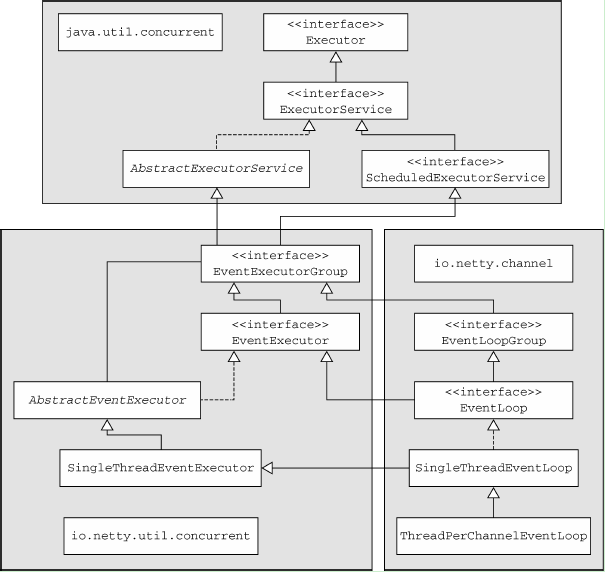
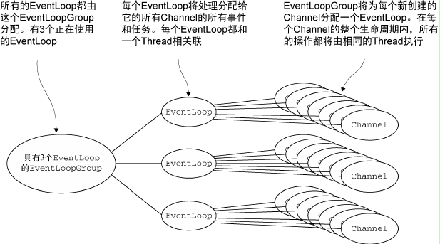
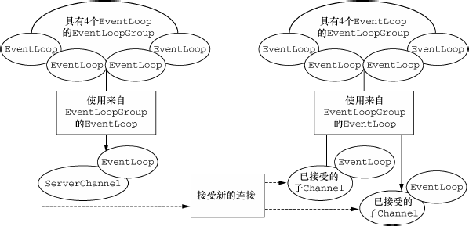
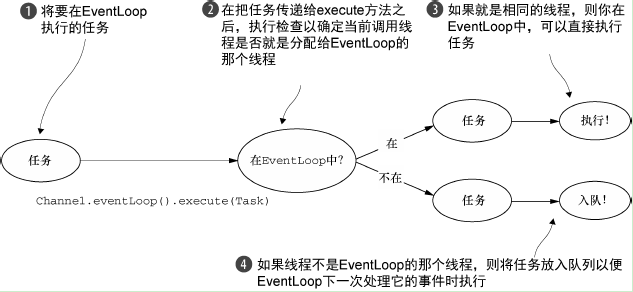
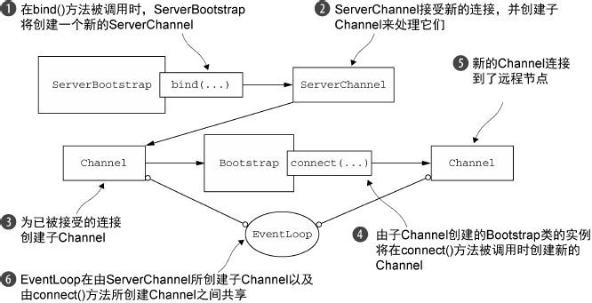

# 版本

netty 版本：4.1.13

jdk 版本：1.7


# 1. Hello World

### 服务端

```java
EventLoopGroup bossGroup = new NioEventLoopGroup();
EventLoopGroup workerGroup = new NioEventLoopGroup();
try {
	ServerBootstrap b = new ServerBootstrap();
	b.group(bossGroup, workerGroup);
	b.channel(NioServerSocketChannel.class);
	b.childHandler(new HelloServerInitializer());

  	int port = 7878;
	// 服务器绑定端口监听
    ChannelFuture f = b.bind(port).sync();
	// 监听服务器关闭监听
    f.channel().closeFuture().sync();

} finally {
	bossGroup.shutdownGracefully();
	workerGroup.shutdownGracefully();
}
```

### HelloServerInitializer

```java
public class HelloServerInitializer extends ChannelInitializer<SocketChannel> {

    @Override
    protected void initChannel(SocketChannel ch) throws Exception {
        ChannelPipeline pipeline = ch.pipeline();

        // 字符串解码和编码
        pipeline.addLast("decoder", new StringDecoder());
        pipeline.addLast("encoder", new StringEncoder());

        // 自定义 Handler
        pipeline.addLast("handler", new HelloServerHandler());
    }
}
```

### HelloServerHandler

```java
public class HelloServerHandler extends SimpleChannelInboundHandler<Object> {
    
    @Override
    protected void channelRead0(ChannelHandlerContext ctx, Object msg) throws Exception {
    	if (msg instanceof String) {
	        // 收到消息直接打印输出
	        System.out.println(ctx.channel().remoteAddress() + " Say : " + (String) msg);
	        // 返回客户端消息
	        ctx.writeAndFlush("Received your message !\n");
    	}
    }
    
    // 当一个新的连接已经被建立时调用
    @Override
    public void channelActive(ChannelHandlerContext ctx) throws Exception {
        System.out.println("RemoteAddress : " + ctx.channel().remoteAddress() + " active !");
        ctx.writeAndFlush( "Welcome to " + 
                          InetAddress.getLocalHost().getHostName() + " service!\n");
        super.channelActive(ctx);
    }
}
```

### 客户端

```java
EventLoopGroup group = new NioEventLoopGroup();
try {
	Bootstrap b = new Bootstrap();
	b.group(group)
	.channel(NioSocketChannel.class)
	.handler(new UserClientInitializer());

	String host = "127.0.0.1";
    int port = 7878;
	// 连接服务端
	Channel ch = b.connect(host, port).sync().channel();
  	// 向服务端发送消息
	ch.writeAndFlush("hello world");
	// 等待连接关闭
	ch.closeFuture().sync();
} finally {
	group.shutdownGracefully();
}
```

### HelloClientInitializer

```java
public class HelloClientInitializer extends ChannelInitializer<SocketChannel> {

    @Override
    protected void initChannel(SocketChannel ch) throws Exception {
        ChannelPipeline pipeline = ch.pipeline();

        // 字符串解码和编码
        pipeline.addLast("decoder", new StringDecoder());
        pipeline.addLast("encoder", new StringEncoder());

        // 自定义 Handler
        pipeline.addLast("handler", new HelloClientHandler());
    }
}
```

### HelloClientHandler

```java
public class HelloClientHandler extends SimpleChannelInboundHandler<Object> {
    
    @Override
    protected void channelRead0(ChannelHandlerContext ctx, Object msg) throws Exception {
    	if (msg instanceof String) {
	        System.out.println("Server say : " + (String) msg);
    	}
    }
    
    @Override
    public void channelActive(ChannelHandlerContext ctx) throws Exception {
        System.out.println("Client active ");
        super.channelActive(ctx);
    }

    @Override
    public void channelInactive(ChannelHandlerContext ctx) throws Exception {
        System.out.println("Client close ");
        super.channelInactive(ctx);
    }
}
```


# 2. Channel

> channel 是 netty 的核心概念之一，它是 netty 网络通信的主体。可以把 channel 看作是传入（入站）或者传出（出站）数据的载体。因此，它可以被打开或者被关闭，连接或者断开连接。
>
> 在基于 Java 的网络编程中，其基本的构造是 Socket 。netty 的 channel 接口所提供的API，大大地降低了直接使用 Socket 类的复杂性。

注：netty 中 channel 所有的操作都是**异步**的，请求将立即返回，但不保证请求完成。

### channel 的状态

注册（Registered）、活跃（Actived）、非活跃（Inactived）和非注册（Unregistered）。


# 3. ByteBuf

> 网络数据的基本单位是字节。Java NIO 提供了 ByteBuffer 作为它的字节容器，但是这个类使用起来过于复杂，而且也有些繁琐。
> Netty 的 ByteBuf 则是 ByteBuffer 的替代品，一个强大的实现，既解决了 JDK API 的局限性，又为网络应用程序的开发者提供了更好的API。


### ByteBuf 是如何工作的

ByteBuf 维护了两个不同的索引，一个用于读取，一个用于写入。当你从 ByteBuf 读取时，它的 readerIndex 将会被递增已经被读取的字节数。同样地，当你写入 ByteBuf 时，它的 writerIndex 也会被递增。名称以 read 或者 write 开头的 ByteBuf 方法，将会推进其对应的索引，而名称以 set 或者 get 开头的操作则不会。

可以指定 ByteBuf 的最大容量。试图移动写索引（即 writerIndex）超过这个值将会触发异常（默认的限制是 Integer.MAX_VALUE）。通过调用 `discardReadBytes` 方法，可以丢弃已读过的字节，但除非内存很紧缺的情况，建议不要频繁使用该方法，因为每次它都会把可读部分移到开始位置。


# 4. ChannelHandler

> ChannelHandler 是一个接口族的父接口，它的实现类负责接收并响应事件通知。在 Netty 中，所有的数据处理逻辑都包含在 ChannelHandler 中。

当 Channel 的状态发生改变时，将会生成对应的事件。这些事件将会被转发给 ChannelHandler ，其可以随后对它们做出响应。


### 入站和出站 Handler

ChannelHandler 分为 ChannelInboundHandler 和 ChannelOutboundHandler（子接口）。前者接收处理入站事件和数据，后者则接受处理入站事件和数据。

在服务端和客户端可以配置多个 ChannelInboundHandler 和 ChannelOutboundHandler ，它们的联系以及执行顺序将在 5. ChannelPipeline 中说明。

- **ChannelInboundHandler 的方法：**

| 方法                        | 说明                                       |
| ------------------------- | :--------------------------------------- |
| channelRegistered         | 当 Channel 已经注册到它的 EventLoop 并且能够处理 I/O 时被调用 |
| channelUnregistered       | 当 Channel 从它的 EventLoop 注销并且无法处理任何 I/O 时被调用 |
| channelActive             | 当 Channel 处于活动状态时被调用                     |
| channelInactive           | 当 Channel 离开活动状态并且不再连接它的远程节点时被调用         |
| channelReadComplete       | 当 Channel 上的一个读操作完成时被调用                  |
| channelRead               | 当从 Channel 读取数据时被调用                      |
| ChannelWritabilityChanged | 当 Channel 的可写状态发生改变时被调用                  |
| userEventTriggered        | 当 `fireUserEventTriggered` 方法被调时被调用      |

当所有可读的字节都已经从 Channel 中读取之后，将会调用 `channelReadComplete` 回调方法。所以，可能在 `channelReadComplete` 被调用之前看到多次调用 `channelRead` 。

- **ChannelOutboundHandler 的方法：**

| 方法         | 说明                                |
| ---------- | :-------------------------------- |
| bind       | 当请求将 Channel 绑定到本地地址时被调用          |
| connect    | 当请求将 Channel 连接到远程节点时被调用          |
| disconnect | 当请求将 Channel 从远程节点断开时被调用          |
| close      | 当请求关闭 Channel 时被调用                |
| deregister | 当请求将 Channel 从它的 EventLoop 注销时被调用 |
| read       | 当请求从 Channel 读取更多的数据时被调用          |
| flush      | 当请求通过 Channel 将入队数据冲刷到远程          |
| write      | 当请求通过 Channel 将数据写到远程节点时被调用       |


### 资源管理

每当通过调用 `ChannelInboundHandler.channelRead()` 或者 `ChannelOutboundHandler.write()` 方法来处理数据时，都需要确保没有任何的资源泄漏。

为了帮助诊断潜在的（资源泄漏）问题，Netty 提供了 `ResourceLeakDetector`  类，它将对缓冲区分配做大约 1% 的采样来检测内存泄露。相关的开销是非常小的。如果检测到了内存泄露，将会产生相关日志消息。Netty 的泄漏检测级别分别有：DISABLED，SIMPLE，ADVANCED，PARANOID。

当某个 ChannelInboundHandler 重写 `channelRead` 方法时，它将负责显式地释放与池化的 ByteBuf 实例相关的内存。Netty 为此提供了一个实用方法  `ReferenceCountUtil.release()` 。但是以这种方式管理资源可能很繁琐。一个更加简单的方式是使用  `SimpleChannelInboundHandler` 的 `channelRead0` 方法，它会自动释放资源，所以不可以存储指向任何消息的引用供将来使用，因为这些引用都将会失效。

在出站这边，如果处理了 `write()`  操作并丢弃了一个消息，那么也应该负责释放它。而且不仅要释放资源，还要通知 ChannelPromise 数据已经被处理了。（ChannelPromise 是 ChannelFuture 的扩展，允许设置 I/O 操作的结果，使 ChannelFutureListener 可以执行相关操作）

（ **`ReferenceCountUtil.retain()`**：一旦消息被编码或者解码，它就会被 `ReferenceCountUtil.release()` 调用而自动释放。如果需要保留引用以便稍后使用，那么可以调用 ReferenceCountUtil.retain() 方法。它将会增加该引用计数，从而防止该消息被释放。）


# 5. ChannelPipeline

> ChannelPipeline 是 ChannelHandler 链的容器，是一些 ChannelHandler 的编排顺序。并且定义了用于在该链上传播入站和出站事件流的 API 。当 Channel 被创建时，它会被自动地分配到它专属的 ChannelPipeline。

在 ChannelInitializer 的 `initChannel` 方法中，可以给 ChannelPipeline 安装一些需要的 ChannelHandler。这些 ChannelHandler 执行它们的处理逻辑后，会将数据传递给 ChannelPipeline 中的下一个 ChannelHandler。


### 修改 ChannelPipeline

除了在 ChannelInitializer 的 `initChannel` 方法中添加 ChannelHandler ，ChannelHandler 也可以实时地修改 ChannelPipeline 的布局（它也可以将它自己从ChannelPipeline 中移除）。


### ChannelHandler 的执行顺序

ChannelPipeline 中 ChannelHandler 的执行顺序由它们被添加时的顺序而决定。

如下图，如果一个数据入站，那么会从第一个添加的 ChannelInboundHandler 开始执行直到到达链的尾端。

数据出站（即正在被写的数据）也一样。将从第一个添加的 ChannelOutboundHandler 开始执行，直到到达链的头部为止。在这之后，出站数据将会到达网络传输层，即 Socket ，并将触发一个写操作。


### ChannelHandlerContext

每当一个 ChannelHandler 被添加到 ChannelPipeline 时，它将会被分配一个 ChannelHandlerContext ，其代表了 ChannelHandler 和 ChannelPipeline 之间的绑定与关联。（注：ChannelHandlerContext 和  ChannelHandler 之间的关联与绑定是永远不会改变的，所以缓存对它的引用是安全的。）

ChannelHandlerContext 有很多的方法，其中一些方法也存在于 Channel 和 ChannelPipeline 上，但是有一点重要的不同。如果调用 Channel 或者 ChannelPipeline 上的这些方法，它们将沿着整个 ChannelPipeline 进行传播。而调用位于 ChannelHandlerContext 上的相同方法，则将从当前所关联的 ChannelHandler 开始，并且只会传播给位于该 ChannelPipeline 中的下一个能够处理该事件的ChannelHandler。

如在 netty 中，有两种发送消息的方式。可以直接写到 Channel 中，也可以写到和 ChannelHandler 相关联的 ChannelHandlerContext 中。前一种方式将会导致消息从 ChannelPipeline 的尾端开始流动，而后者将导致消息从 ChannelPipeline 中的下一个 ChannelHandler 开始流动。


### write 与 writeAndFlush 方法

`write` 方法将数据写到远程节点。这个数据将被传递给 ChannelPipeline ，并且排队直到它被冲刷（调用 `flush`  方法，将之前已写的数据冲刷到底层传输，如一个 Socket ）。

而 `writeAndFlush` 方法，则是调用了 `write` 方法后再调用了 `flush` 方法。


### @Sharable 共享

只应该在确定了你的 ChannelHandler 是线程安全的时才使用 @Sharable 注解。

为何要共享同一个 ChannelHandler ？

在多个 ChannelPipeline 中安装同一个 ChannelHandler 的一个常见的原因是用于收集跨越多个 Channel 的统计信息。比如会用在统计整体的吞吐量的时候用到。


### 异常处理

- **处理入站异常**

如果在处理入站事件的过程中有异常被抛出，那么它将从它在 ChanneHandler 里被触发的那一点开始流经 ChannelPipeline 。要想处理这种类型的入站异常，需要在ChannelHandler 中重写 `exceptionCaught` 方法。

如果当前 ChannelHandler 没有处理该异常，则该异常将被传到下一个 ChannelHandler。

- **处理出站异常**

第一种：

```java
ChannelFuture future = channel.write(someMessage);
future.addListener(new ChannelFutureListener() {
    @Override
    public void operationComplete(ChannelFuture f) {
        if (!f.isSuccess()) {
            f.cause().printStackTrace();
            f.channel().close();
        }
    }
});
```

第二种：

```java
public class OutboundExceptionHandler extends ChannelOutboundHandlerAdapter {
    @Override
    public void write(ChannelHandlerContext ctx, Object msg,
    ChannelPromise promise) {
        promise.addListener(new ChannelFutureListener() {
            @Override
            public void operationComplete(ChannelFuture f) {
                if (!f.isSuccess()) {
                    f.cause().printStackTrace();
                    f.channel().close();
                }
            }
        });
    }
}
```


# 6. EventLoop 与线程模型

Netty 的 EventLoopGroup 扩展了 Java 的 `ScheduledExecutorService` ，一个 EventLoopGroup 线程池可有多个 EventLoop ，而一个 EventLoop 可以操作多个 Channel 。

在 Netty 4 中，所有的 I/O 操作和事件都由已经被分配给了 EventLoop 的那个线程来处理。并把由 I/O 操作触发的事件将流经安装了一个或者多个 ChannelHandler 的 ChannelPipeline 。


### EventLoop 、EventLoopGroup 的层次结构




### EventLoop 与 Channel

- 一个 EventLoopGroup 包含一个或者多个EventLoop；
- 一个 EventLoop 在它的生命周期内只和一个 Thread 绑定；
- 所有由 EventLoop 处理的 I/O 事件都将在它专有的线程上被处理；
- 一个 Channel 在它的生命周期内只注册于一个 EventLoop；
- 一个 EventLoop 可能会被分配给一个或多个 Channel。





### NioEventLoop

NioEventLoop 继承于 `SingleThreadEventLoop` ，而它又继承于 `SingleThreadEventExecutor` 。

`SingleThreadEventExecutor` 是 netty 中对本地线程的抽象，它内部有一个 Thread thread 属性，存储了一个本地 Java 线程. 因此我们可以认为，一个 NioEventLoop 其实和一个特定的线程绑定，并且在其生命周期内, 绑定的线程都不会再改变。

通常来说 NioEventLoop 肩负着两种任务：

1）第一个是作为 IO 线程，执行与 Channel 相关的 IO 操作，包括 调用 select 等待就绪的 IO 事件、读写数据与数据的处理等；

2）而第二个任务是作为任务队列，执行 taskQueue 中的任务，例如用户调用 `eventLoop.schedule` 提交的定时任务也是这个线程执行的。


### BootStrap

如 1. Hello World 中所示，Netty 的 BootStrap 分为客户端用的 BootStrap 和服务端用的 ServerBootStrap 。

- 客户端的 BootStrap 会连接到远程主机和端口，而服务端的 ServerBootStrap 会绑定到一个本地端口。


- 客户端的 BootStrap 使用 1 个 EventLoopGroup ，而服务端的 ServerBootStrap 可以使用 1 个或 2 个 EventLoopGroup （分别为 boss 线程池和 worker 线程池）。

  为什么？

  因为服务器会需要两组不同的 Channel。第一组将只包含一个 ServerChannel ，代表服务器自身的已绑定到某个本地端口的正在监听的 Channel。而第二组将包含所有已创建的、用来处理传入客户端连接（对于每个服务器已经接受的连接都有一个）的 Channel。如下图：

  ​

  

  与 ServerChannel 相关联的 EventLoopGroup 将分配一个负责为传入连接请求创建 Channel 的 EventLoop。一旦连接被接受，第二个 EventLoopGroup 就会给它的 Channel 分配一个 EventLoop。

也就是说，服务器致力于使用一个父 Channel 来接受来自客户端的连接，并创建子Channel 以用于它们之间的通信；而客户端将最可能只需要一个单独的、没有父 Channel 的 Channel 来用于所有的网络交互。


# 7. 解码器与编码器

解码器和编码器其实也是一个 ChannelHandler ，可以在 ChannelInitializer 的 `initChannel` 方法中向 ChannelPipeline 配置需要的解码器和编码器。

Netty 已提供了一些编解码器，但用户也可以自定义实现编解码。

### 自定义 Protocol 解码器与编码器

- MyProtocol

```java
public class MyProtocol {
	/** 
     * 消息的开头的信息标志 
     */  
    private final int headData = 0x11;
    /** 
     * 消息的长度 
     */  
    private int contentLength;  
    /** 
     * 消息的内容 
     */  
    private byte[] content;  
  
    /** 
     * 初始化
     *  
     * @param contentLength 协议里面，消息数据的长度 
     * @param content 协议里面，消息的数据 
     */  
    public MyProtocol(int contentLength, byte[] content) {  
        this.contentLength = contentLength;  
        this.content = content;  
    }  
  
    // getters, setters...
}
```

- MyProtocol 编码器

```java
public class MyProtocolEncoder extends MessageToByteEncoder<MyProtocol> {

  	/*
  	 * encode() 方法调用时将会传入要被该类编码为 ByteBuf 的出站消息。
  	 * 该 ByteBuf 随后将会被转发给 ChannelPipeline 中的下一个 ChannelOutboundHandler。
  	 */
	@Override
	protected void encode(ChannelHandlerContext ctx, MyProtocol msg,
			ByteBuf out) throws Exception {
      
        out.writeInt(msg.getHeadData());  
        out.writeInt(msg.getContentLength());  
        out.writeBytes(msg.getContent());
	}

}
```

- MyProtocol 解码器

```java
public class MyProtocolDecoder extends ByteToMessageDecoder {
	
	private static final int HEAD_DATA = 0x11;
	
	/*
	 * 协议开始的标准headData，int类型，占据4个字节. 
     * 表示数据的长度contentLength，int类型，占据4个字节. 
	 */
	private static final int BASE_LENGTH = 4 + 4;

  	/*
  	 * decode() 方法被调用时将会传入一个包含了传入数据的 ByteBuf，以及一个用来添加解码消息的 List。
  	 * 对这个方法的调用将会重复进行，直到确定没有新的元素被添加到该 List，
  	 * 或者该 ByteBuf 中没有更多可读取的字节时为止。然后，如果该List 不为空，那么它的内容将会被传递给
  	 * ChannelPipeline 中的下一个 ChannelInboundHandler。
  	 */
	@Override
	protected void decode(ChannelHandlerContext ctx, ByteBuf buffer,
			List<Object> out) throws Exception {

		// 可读长度必须大于基本长度
        if (buffer.readableBytes() >= BASE_LENGTH) {
            // 防止socket字节流攻击
            // 防止客户端传来的数据过大，因太大的数据，是不合理的
            if (buffer.readableBytes() > 2048) {
                buffer.skipBytes(buffer.readableBytes());
            }

            // 记录包头开始的index  
            int beginReader;

            while (true) {
                // 获取包头开始的index
                beginReader = buffer.readerIndex();
                // 标记包头开始的index
                buffer.markReaderIndex();
                // 读到了协议的开始标志，结束while循环
                if (buffer.readInt() == HEAD_DATA) {
                    break;
                }

                // 未读到包头，略过一个字节
                // 每次略过，一个字节，去读取，包头信息的开始标记
                buffer.resetReaderIndex();
                buffer.readByte();
  
                // 当略过，一个字节之后，
                // 数据包的长度，又变得不满足
                // 此时，应该结束。等待后面的数据到达
                if (buffer.readableBytes() < BASE_LENGTH) {
                    return;
                }
            }

            // 消息的长度 
            int length = buffer.readInt();
            // 判断请求数据包数据是否到齐 
            if (buffer.readableBytes() < length) {
                // 还原读指针
                buffer.readerIndex(beginReader);
                return;
            }

            // 读取data数据
            byte[] data = new byte[length];
            buffer.readBytes(data);

            MyProtocol protocol = new MyProtocol(data.length, data);
            out.add(protocol);
        }
	}
}
```


### 编解码器中的引用计数

一旦消息被编码或者解码，它就会被 `ReferenceCountUtil.release()` 调用自动释放。如果需要保留引用以便稍后使用，那么可以调用 `ReferenceCountUtil.retain()` 方法。这将会增加该引用计数，从而防止该消息被释放。


# 8. Netty 优化

### 隔离耗时的业务线程

尽量不要在 ChannelHandler 中启动耗时的业务线程，不然会出现阻塞，从而影响并发量。所以需要用专门的线程池来去处理这些业务。

如何实现？

ChannelPipeline 已提供了 `addLast(EventExecutorGroup group, ChannelHandler... handlers)` 方法。在该方法中可以传入业务线程池（即第一个参数 `EventExecutorGroup group` ）。

如果一个事件被传递给一个自定义的 EventExecutorGroup，它将被包含在这个 EventExecutorGroup 中的某个EventExecutor 所处理，从而被从该 Channel 本身的 EventLoop 中移除。对于这种用例，Netty 提供了一个叫DefaultEventExecutorGroup 的默认实现。

ChannelHandler 的 ChannelHandlerContext 会先进行判断，如果添加该 ChannelHandler 时设定了 executor， 则提交给该 executor 执行， 如果没有设置， 则提交给 Channel 的 executor（EventLoop 的线程）执行。

> Netty 线程模型的卓越性能取决于对于当前执行的 Thread 的身份的确定（通过调用EventLoop 的 inEventLoop(Thread) 方法实现判断），也就是说，确定它是否是分配给当前 Channel 以及它的 EventLoop 的那一个线程。（回想一下EventLoop将负责处理一个Channel的整个生命周期内的所有事件。）
> 如果（当前）调用线程正是支撑 EventLoop 的线程，那么所提交的代码块将会被（直接）执行。否则， EventLoop 将调度该任务以便稍后执行，并将它放入到内部队列中。当 EventLoop下次处理它的事件时，它会执行队列中的那些任务/事件。这也就解释了任何的 Thread 是如何与 Channel 直接交互而无需在 ChannelHandler 中进行额外同步的。
> 注意，每个 EventLoop 都有它自已的任务队列，独立于任何其他的 EventLoop。如下图，展示了EventLoop 用于调度任务的执行逻辑。这是Netty 线程模型的关键组成部分。
>
> 

虽然这样会需要上下文切换，但可以避免出现阻塞。所以除非是完全异步、耗时短的业务，需要使用专门的业务线程池。


### 粘包问题

可以使用 Netty 提供的 LengthFieldBasedFrameDecoder 解码器。


### TCP 参数的配置

ChannelOption 提供了一些 TCP 参数。可以通过 ServerBootstrap 的 `option` 、`childOption` 方法进行设置其值。

注：在 `bind` 方法被调用之后，设置或者改变 ChannelOption 都不会有任何的效果。


### 写大型数据

如文件，用 FileResion（零拷贝）、ChunkedWriteHandler。


### 在 Linux

worker 线程池最好用epoll。因为传统的 select 基于轮询的方式来进行事件处理，随着 fd 数量的增加，导致轮询的处理开销增大，实际的事件处理效率就会下降。而 epoll 是基于通知的方式，每当事件准备就绪的时候，epoll 就会通知线程进行处理，这样可以保证及时性的同时也不会随着 fd 的数量的增加而降低效率。


### 从 Channel 引导客户端

假设服务端正在处理一个客户端的请求，这个请求需要它充当第三方系统的客户端。当一个应用程序（如一个代理服务器）必须要和组织现有的系统（如 Web 服务或者数据库）集成时，就可能发生这种情况。在这种情况下，将需要从已经被接受的子 Channel 中引导一个客户端 Channel。

对于此类请求，可以创建新的 Bootstrap ，但是这并不是最高效的解决方案，因为它将要求你为每个新创建的客户端 Channel 定义另一个 EventLoop。这会产生额外的线程，以及在已被接受的子 Channel 和客户端 Channel 之间交换数据时不可避免的上下文切换。

一个更好的解决方案是：通过将已被接受的子 Channel 的 EventLoop 传递给 Bootstrap 的 `group` 方法来共享该 EventLoop。这样分配给 EventLoop 的所有 Channel 都使用同一个线程，从而避免了额外的线程创建，以及前面所提到的相关的上下文切换。如下图所示。




**代码实现：**

在服务端添加一个 SimpleChannelInboundHandler，它重写 `channelActive` 方法。

```java
public void channelActive(ChannelHandlerContext ctx) throws Exception {
    Bootstrap bootstrap = new Bootstrap();
    bootstrap.channel(NioSocketChannel.class).handler(
    	new SimpleChannelInboundHandler<ByteBuf>() {
          @Override
          protected void channelRead0(ChannelHandlerContext ctx, ByteBuf in) 
              throws Exception {
              System.out.println("Received data");
          }
    });
    bootstrap.group(ctx.channel().eventLoop());
    connectFuture = bootstrap.connect(new InetSocketAddress("www.manning.com", 80));
}
```

