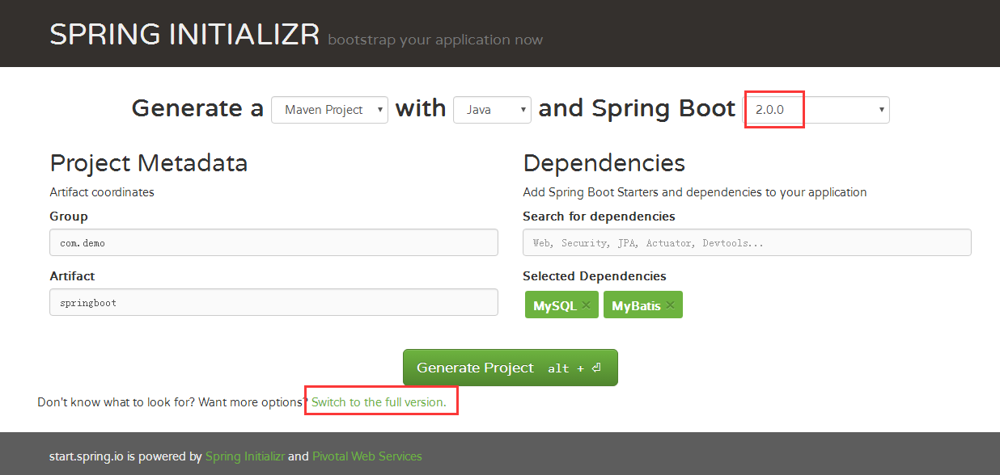
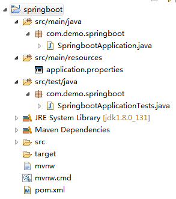

# Spring Boot 快速入门

​    

## 版本

Spring Boot：2.0.0.RELEASE

JDK：1.8

​    

## 官方文档

https://docs.spring.io/spring-boot/docs/current/reference/html/

​    

## 搭建 Spring Boot + MySql + MyBatis 项目

1. 访问 http://start.spring.io/。

   

   Spring Boot 版本选择 2.0.0，其他信息（如 JDK 版本）可通过点击 “Switch to the full version” 来选择，这里我选择添加了 MySql 和 MyBatis。

2. 点击 “Generate Project” 下载项目压缩包。

3. 解压后，使用 MyEclipse，Import -> Existing Maven Projects -> Next -> 选择解压后的文件夹 -> Finsh。

   成功导入后的项目结构：

   

   其中，SpringbootApplication.java 为主程序入口，代码：

   ```java
   @SpringBootApplication
   @MapperScan("com.demo.springboot.dao")
   public class SpringbootApplication {
   	public static void main(String[] args) {
   		SpringApplication.run(SpringbootApplication.class, args);
   	}
   }
   ```

   建议把 Application.java 放在项目的根包中，即该例子中的 com.demo.springboot。详情请看官方文档：

   > 源：https://docs.spring.io/spring-boot/docs/current/reference/html/using-boot-structuring-your-code.html#using-boot-using-the-default-package
   >
   > **14.2 Locating the Main Application Class**
   >
   > We generally recommend that you locate your main application class in a root package above other classes. The `@EnableAutoConfiguration` annotation（注：@SpringBootApplication 已经包含了 @EnableAutoConfiguration） is often placed on your main class, and it implicitly defines a base “search package” for certain items. For example, if you are writing a JPA application, the package of the`@EnableAutoConfiguration` annotated class is used to search for `@Entity` items.
   >
   > Using a root package also lets the `@ComponentScan` annotation be used without needing to specify a `basePackage` attribute. You can also use the `@SpringBootApplication` annotation if your main class is in the root package.

4. 在 pom.xml 中添加：

   ```xml
   <dependency>
       <groupId>org.springframework.boot</groupId>
       <artifactId>spring-boot-starter-web</artifactId>
   </dependency>
   ```

5. 创建 User 实体类：

   ```java
   package com.demo.springboot.entities;

   public class User {
   	private int id;
   	private String userName;
   	// getters and setters...
   }
   ```

6. src/main/resources/mapper 下创建 IUserDao.xml：

   ```xml
   <?xml version="1.0" encoding="UTF-8" ?>
   <!DOCTYPE mapper PUBLIC "-//mybatis.org//DTD Mapper 3.0//EN" "http://mybatis.org/dtd/mybatis-3-mapper.dtd" >
   <mapper namespace="com.demo.springboot.dao.IUserDao">
       <resultMap id="BaseResultMap" type="com.demo.springboot.entities.User">
           <result column="ID" property="id" javaType="int" jdbcType="NUMERIC"/>
           <result column="USER_NAME" property="userName" javaType="String" jdbcType="NVARCHAR"/>
       </resultMap>

       <sql id="Base_Column_List">
           ID, USER_NAME
       </sql>

       <select id="getUserById" resultMap="BaseResultMap">
           SELECT
           <include refid="Base_Column_List" />
           FROM USER
           WHERE ID = #{id,jdbcType=NUMERIC}
       </select>
   </mapper>
   ```

7. IUserDao.java：

   ```java
   package com.demo.springboot.dao;

   import org.apache.ibatis.annotations.Param;
   import com.demo.springboot.entities.User;

   public interface IUserDao {
   	User getUserById(@Param("id") int id);
   }
   ```

8. IUserService.java：

   ```java
   package com.demo.springboot.service;

   import com.demo.springboot.entities.User;

   public interface IUserService {
   	User getById(int id);
   }
   ```

9. UserService.java：

   ```java
   package com.demo.springboot.service.impl;

   import org.springframework.beans.factory.annotation.Autowired;
   import org.springframework.stereotype.Service;

   import com.demo.springboot.dao.IUserDao;
   import com.demo.springboot.entities.User;
   import com.demo.springboot.service.IUserService;

   @Service
   public class UserService implements IUserService {

   	@Autowired
       private IUserDao userDao;
   	
   	@Override
   	public User getById(int id) {
   		return userDao.getUserById(id);
   	}
   }
   ```

10. UserController.java：

    ```java
    package com.demo.springboot.controller;

    import org.springframework.beans.factory.annotation.Autowired;
    import org.springframework.web.bind.annotation.PathVariable;
    import org.springframework.web.bind.annotation.RequestMapping;
    import org.springframework.web.bind.annotation.RequestMethod;
    import org.springframework.web.bind.annotation.RestController;

    import com.demo.springboot.entities.User;
    import com.demo.springboot.service.IUserService;

    @RestController
    @RequestMapping("/user")
    public class UserController {
    	
    	@Autowired
    	private IUserService userService;
    	
        @RequestMapping(value = "/{id}", method = RequestMethod.GET)
        public User get(@PathVariable("id") int id) {
        	User user = userService.getById(id);
            return user;
        }
    }
    ```

11. application.properties：

    ```properties
    spring.datasource.url=jdbc:mysql://localhost:3306/demo?useUnicode=true&characterEncoding=UTF-8
    spring.datasource.username=root
    spring.datasource.password=
    spring.datasource.driver-class-name=com.mysql.jdbc.Driver

    mybatis.typeAliasesPackage=com.demo.springboot.entities
    mybatis.mapperLocations=classpath\:mapper/*.xml
    ```

12. 最后，通过执行 SpringbootApplication.java 的 main 方法启动项目。

    访问 http://localhost:8080/user/1 则可以看到数据库上 id 为 1 的 User 信息：

    ```json
    {"id":1,"userName":"aa"}
    ```

​    

## 单元测试

src/test/java 下的 SpringbootApplicationTests.java：

```java
package com.demo.springboot;

import org.junit.Before;
import org.junit.Test;
import org.junit.runner.RunWith;
import org.springframework.beans.factory.annotation.Autowired;
import org.springframework.boot.test.context.SpringBootTest;
import org.springframework.http.MediaType;
import org.springframework.test.context.junit4.SpringRunner;
import org.springframework.test.web.servlet.MockMvc;
import org.springframework.test.web.servlet.request.MockMvcRequestBuilders;
import org.springframework.test.web.servlet.result.MockMvcResultHandlers;
import org.springframework.test.web.servlet.result.MockMvcResultMatchers;
import org.springframework.test.web.servlet.setup.MockMvcBuilders;
import org.springframework.web.context.WebApplicationContext;

@RunWith(SpringRunner.class)
@SpringBootTest
public class SpringbootApplicationTests {
	
	@Autowired
    private WebApplicationContext wac;
	private MockMvc mvc;
	
    @Before
    public void setUp() throws Exception {
        mvc = MockMvcBuilders.webAppContextSetup(wac).build();
    }
    
    @Test
    public void getUser() throws Exception {
        mvc.perform(MockMvcRequestBuilders.get("/user/1").accept(MediaType.APPLICATION_JSON))
                .andExpect(MockMvcResultMatchers.status().isOk())
                .andDo(MockMvcResultHandlers.print())
                .andReturn();
    }
}
```

运行后可以看到：

```
MockHttpServletRequest:
      HTTP Method = GET
      Request URI = /user/1
       Parameters = {}
          Headers = {Accept=[application/json]}
             Body = <no character encoding set>
    Session Attrs = {}

Handler:
             Type = com.demo.springboot.controller.UserController
           Method = public com.demo.springboot.entities.User com.demo.springboot.controller.UserController.get(int)

Async:
    Async started = false
     Async result = null

Resolved Exception:
             Type = null

ModelAndView:
        View name = null
             View = null
            Model = null

FlashMap:
       Attributes = null

MockHttpServletResponse:
           Status = 200
    Error message = null
          Headers = {Content-Type=[application/json;charset=UTF-8]}
     Content type = application/json;charset=UTF-8
             Body = {"id":1,"userName":"aa"}
    Forwarded URL = null
   Redirected URL = null
          Cookies = []
```

​    

## 异常

1. application.properties 配置无效

   配置文件都正确，但启动项目报没有配置数据源或没有设置 spring.datasource.url 等错误。

   原因：MyEclipse 把 src/main/resources 给排除了。（前几天没问题的，今天改下 pom.xml 后发现被排除掉了..）

   解决方法：项目右键 -> Java Build Path -> Source，把 src/main/resources 下的 Excluded 给 remove 掉。