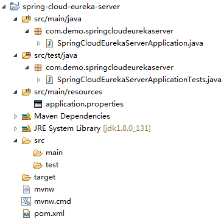
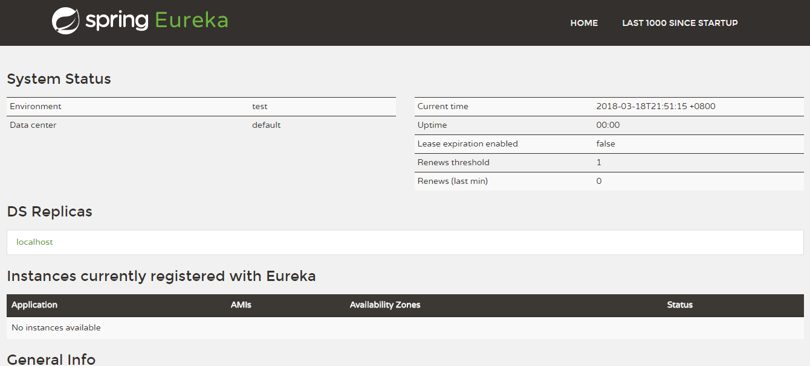
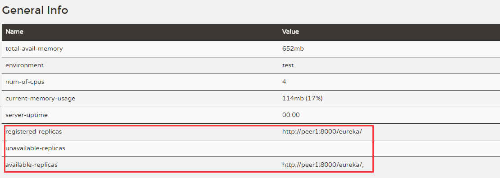

# Spring Cloud 快速入门

​    

## 版本

Spring Cloud：Finchley.M8

Spring Boot：2.0.0.RELEASE

JDK：1.8

​    

## 官方文档

http://cloud.spring.io/spring-cloud-static/Finchley.M8

​    

## Eureka 服务注册中心

### 单个 Eureka

1. 从 http://start.spring.io/ 下载项目并导入到 MyEclipse 中。

   项目结构：

   

2. pom.xml：

   ```xml
   <?xml version="1.0" encoding="UTF-8"?>
   <project xmlns="http://maven.apache.org/POM/4.0.0" xmlns:xsi="http://www.w3.org/2001/XMLSchema-instance"
   	xsi:schemaLocation="http://maven.apache.org/POM/4.0.0 http://maven.apache.org/xsd/maven-4.0.0.xsd">
   	<modelVersion>4.0.0</modelVersion>

   	<groupId>com.demo</groupId>
   	<artifactId>spring-cloud-eureka-server</artifactId>
   	<version>0.0.1-SNAPSHOT</version>
   	<packaging>jar</packaging>

   	<name>spring-cloud-eureka-server</name>
   	<description>Demo project for Spring Boot</description>

   	<parent>
   		<groupId>org.springframework.boot</groupId>
   		<artifactId>spring-boot-starter-parent</artifactId>
   		<version>2.0.0.RELEASE</version>
   		<relativePath/> <!-- lookup parent from repository -->
   	</parent>

   	<properties>
   		<project.build.sourceEncoding>UTF-8</project.build.sourceEncoding>
   		<project.reporting.outputEncoding>UTF-8</project.reporting.outputEncoding>
   		<java.version>1.8</java.version>
   		<spring-cloud.version>Finchley.M8</spring-cloud.version>
   	</properties>

   	<dependencies>
   		<dependency>  
               <groupId>org.springframework.cloud</groupId>  
               <artifactId>spring-cloud-starter-netflix-eureka-server</artifactId>  
           </dependency> 

   		<dependency>
   			<groupId>org.springframework.boot</groupId>
   			<artifactId>spring-boot-starter-test</artifactId>
   			<scope>test</scope>
   		</dependency>
   	</dependencies>
   	
   	<dependencyManagement>  
           <dependencies>  
               <dependency>  
                   <groupId>org.springframework.cloud</groupId>  
                   <artifactId>spring-cloud-dependencies</artifactId>  
                   <version>${spring-cloud.version}</version>  
                   <type>pom</type>  
                   <scope>import</scope>  
               </dependency>  
           </dependencies>  
       </dependencyManagement>

   	<build>
   		<plugins>
   			<plugin>
   				<groupId>org.springframework.boot</groupId>
   				<artifactId>spring-boot-maven-plugin</artifactId>
   			</plugin>
   		</plugins>
   	</build>
   </project>
   ```

3. SpringCloudEurekaServerApplication.java：

   ```java
   @SpringBootApplication
   @EnableEurekaServer
   public class SpringCloudEurekaServerApplication {
   	public static void main(String[] args) {
   		SpringApplication.run(SpringCloudEurekaServerApplication.class, args);
   	}
   }
   ```

4. application.properties：

   ```properties
   spring.application.name=spring-cloud-eureka-server

   server.port=8000

   eureka.client.register-with-eureka=false
   eureka.client.fetch-registry=false
   eureka.client.serviceUrl.defaultZone=http://localhost:${server.port}/eureka/
   ```

   - `eureka.client.register-with-eureka` ：表示是否将自己注册到 Eureka Server，默认为 true，即在默认设置下，服务注册中心会将自己作为客户端来尝试注册它自己。
   - `eureka.client.fetch-registry` ：表示是否从 Eureka Server 获取注册信息，默认为 true。
   - `eureka.client.serviceUrl.defaultZone` ：设置与 Eureka Server 交互的地址，查询服务和注册服务都需要依赖这个地址。默认是 http://localhost:8761/eureka。多个地址可使用 “,”分隔。

5. 运行 SpringCloudEurekaServerApplication.java，访问 http://localhost:8000/ 可以看到：

   

​    

### 集群

搭建服务注册中心 Eureka 集群。

1. 创建两个配置文件，application-peer1.properties、application-peer2.properties。

   application-peer1.properties：

   ```properties
   spring.application.name=spring-cloud-eureka
   server.port=8000
   eureka.instance.hostname=peer1

   # 有多个时用“,”隔开
   eureka.client.serviceUrl.defaultZone=http://peer2\:8001/eureka/
   ```
   application-peer2.properties：

   ```properties
   spring.application.name=spring-cloud-eureka
   server.port=8001
   eureka.instance.hostname=peer2

   eureka.client.serviceUrl.defaultZone=http\://peer1\:8000/eureka/
   ```


2. hosts 上添加：

   ```
   127.0.0.1 peer1  
   127.0.0.1 peer2
   ```

3. 打包项目

   在项目根目录上执行：

   ```shell
   mvn clean package
   ```

   打包成功后 target 目录下可以看到 jar 包。

4. 运行 jar 包

   分别按 application-peer1.properties 和 application.peer2.properties 配置启动项目：

   ```shell
   java -jar spring-cloud-eureka-server-0.0.1-SNAPSHOT.jar --spring.profiles.active=peer1
   java -jar spring-cloud-eureka-server-0.0.1-SNAPSHOT.jar --spring.profiles.active=peer2
   ```

   启动成功后就可以访问 http://peel1:8000/，http://peer2:8001/ 了。

   


​    

## 服务提供与消费

### 服务提供者

1. 创建一个 spring boot 项目作为服务提供者

2. pom.xml：

   ```xml
   <?xml version="1.0" encoding="UTF-8"?>
   <project xmlns="http://maven.apache.org/POM/4.0.0" xmlns:xsi="http://www.w3.org/2001/XMLSchema-instance"
   	xsi:schemaLocation="http://maven.apache.org/POM/4.0.0 http://maven.apache.org/xsd/maven-4.0.0.xsd">
   	<modelVersion>4.0.0</modelVersion>

   	<groupId>com.demo</groupId>
   	<artifactId>spring-cloud-producer</artifactId>
   	<version>0.0.1-SNAPSHOT</version>
   	<packaging>jar</packaging>

   	<name>spring-cloud-producer</name>
   	<description>Demo project for Spring Boot</description>

   	<parent>
   		<groupId>org.springframework.boot</groupId>
   		<artifactId>spring-boot-starter-parent</artifactId>
   		<version>2.0.0.RELEASE</version>
   		<relativePath/> <!-- lookup parent from repository -->
   	</parent>

   	<properties>
   		<project.build.sourceEncoding>UTF-8</project.build.sourceEncoding>
   		<project.reporting.outputEncoding>UTF-8</project.reporting.outputEncoding>
   		<java.version>1.8</java.version>
           <spring-cloud.version>Finchley.M8</spring-cloud.version>  
   	</properties>

   	<dependencies>
   		<dependency>  
               <groupId>org.springframework.cloud</groupId>  
               <artifactId>spring-cloud-starter-netflix-eureka-server</artifactId>  
           </dependency>

   		<dependency>
   			<groupId>org.springframework.boot</groupId>
   			<artifactId>spring-boot-starter-test</artifactId>
   			<scope>test</scope>
   		</dependency>
   	</dependencies>
   	
   	<dependencyManagement>
   		<dependencies>
   			<dependency>
   				<groupId>org.springframework.cloud</groupId>
   				<artifactId>spring-cloud-dependencies</artifactId>
   				<version>${spring-cloud.version}</version>
   				<type>pom</type>
   				<scope>import</scope>
   			</dependency>
   		</dependencies>
   	</dependencyManagement>

   	<build>
   		<plugins>
   			<plugin>
   				<groupId>org.springframework.boot</groupId>
   				<artifactId>spring-boot-maven-plugin</artifactId>
   			</plugin>
   		</plugins>
   	</build>
   </project>
   ```

3. SpringCloudProducerApplication.java：

   ```java
   @SpringBootApplication
   @EnableDiscoveryClient
   public class SpringCloudProducerApplication {

   	public static void main(String[] args) {
   		SpringApplication.run(SpringCloudProducerApplication.class, args);
   	}
   }
   ```

4. HelloController.java：

   提供一个 hello 服务

   ```java
   @RestController
   public class HelloController {
       @RequestMapping(value = "/hello/{name}", method = RequestMethod.GET)
       public String get(@PathVariable("name") String name) {
           return "Hello " + name + "~";
       }
   }
   ```

5. application.properties：

   ```properties
   spring.application.name=spring-cloud-producer
   server.port=8010

   #注册中心地址，高可用的注册发现时这样子用
   eureka.client.serviceUrl.defaultZone=http\://peer1\:8000/eureka/,http\://peer2\:8001/eureka/
   ```

6. 启动后，访问注册中心如 http://peer1:8000/，Instances currently registered with Eureka 下就可以看到 SPRING-CLOUD-PRODUCER。

   访问 http://localhost:8010/hello/a 则可以看到返回了 Hello a~。

​    

### 服务消费者

服务的消费可通过 ribbon 或 feign 来实现。本例子使用 Feign 来实现了服务的消费。（Feign 整合了 Ribbon，所以具有负载均衡的功能，且使用更方便）

1. pom.xml：

   比上面 spring-cloud-producer 多一个 feign 依赖

   ```xml
   <dependency>  
   	<groupId>org.springframework.cloud</groupId>  
   	<artifactId>spring-cloud-starter-openfeign</artifactId>  
   </dependency>
   ```

2. SpringCloudConsumerApplication.java：

   ```java
   @SpringBootApplication
   @EnableDiscoveryClient
   @EnableFeignClients
   public class SpringCloudConsumerApplication {

   	public static void main(String[] args) {
   		SpringApplication.run(SpringCloudConsumerApplication.class, args);
   	}
   }
   ```

3. HelloClient.java：

   ```java
   @FeignClient(name= "spring-cloud-producer") // 服务提供者的spring.application.name
   public interface HelloClient {
       
       @GetMapping(value = "/hello/{name}")
       public String hello(@PathVariable(value = "name") String name);
   }
   ```

4. HelloController.java：

   ```java
   @RestController
   public class HelloController {
   	
   	@Autowired
   	private HelloClient helloClient;

   	@GetMapping("/hello/{name}")
       public String index(@PathVariable("name") String name) {
           return helloClient.hello(name);
       }
   }
   ```

5. application.properties：

   ```properties
   spring.application.name=spring-cloud-consumer
   server.port=8020

   eureka.client.serviceUrl.defaultZone=http\://peer1\:8000/eureka/,http\://peer2\:8001/eureka/
   ```

6. 启动后访问 http://localhost:8020/hello/a，就可以看到返回了 Hello a~，即调用成功。

​    

## Hystrix 熔断器（/ 断路器）

### 特性

Hystrix 具有断路、降级、隔离等特性。

#### 断路机制

Hystrix的断路器就像家庭电路中的保险丝，一旦后端服务不可用，断路器会直接切断请求链, 避免发送大量无效请求影响系统吞吐量，并且断路器有自我检测并恢复的能力：


当请求后端服务失败数量超过一定比例(默认50%)时，断路器会切换到开路状态(Open)。这时所有请求会直接失败而不会发送到后端服务。断路器保持在开路状态一段时间后(默认5秒)，自动切换到半开路状态(HALF-OPEN)。这时会判断下一次请求的返回情况，如果请求成功，断路器切回闭路状态(CLOSED)，否则重新切换到开路状态(OPEN)。

#### fallback 降级

比如对于查询操作，可以实现一个 fallback 方法，当请求后端服务出现异常的时候，可以使用 fallback 方法指定返回的值。fallback 方法的返回值可以是默认值或者从缓存中取的。

#### 隔离

在 Hystrix 中, 主要通过线程池来实现线程隔离. 通常在使用的时候我们会根据调用的远程服务划分出多个线程池。例如调用产品服务的Command放入A线程池，调用账户服务的Command放入B线程池。这样做的主要优点是运行环境被隔离开了，就算调用服务的代码存在bug或者由于其他原因导致自己所在线程池被耗尽时，不会对系统的其他服务造成影响。（但是带来的代价就是维护多个线程池会对系统带来额外的性能开销。如果是对性能有严格要求而且确信自己调用服务的客户端代码不会出问题的话，可以使用Hystrix的信号量(Semaphores)来隔离资源。）

隔离、服务降级在使用时候都是一体化实现的。

### 用例

Feign 已经实现了 Hystrix ,所以不用再引 Hystrix 的 maven 依赖。在 spring-cloud-consumer 的基础上进行修改：

1. application.properties 上增加：

   ```properties
   feign.hystrix.enabled=true
   ```

2.  HelloClientHystrix.java 回调类：

   ```java
   @Component
   public class HelloClientHystrix implements HelloClient {

   	@Override
   	public String hello(String name) {
   		return "hello(name) 服务失败！";
   	}
   }
   ```

3. HelloClient.java 的 @FeignClient 注解上设置 fallback：

   ```java
   @FeignClient(name= "spring-cloud-producer", fallback = HelloClientHystrix.class)
   public interface HelloClient {
   	
       @GetMapping(value = "/hello")
       public String hello(@RequestParam(value = "name") String name);
   }
   ```

4. 启动项目后，关闭服务提供端，访问 http://localhost:8020/hello/a 会返回 “hello(name) 服务失败！”。

​    

## Zuul 路由

Spring Cloud 中使用 Zuul 作为 API Gateway。Zuul 具有路由、降级、重试等功能。

1. pom.xml：

   ```xml
   <?xml version="1.0" encoding="UTF-8"?>
   <project xmlns="http://maven.apache.org/POM/4.0.0" xmlns:xsi="http://www.w3.org/2001/XMLSchema-instance"
   	xsi:schemaLocation="http://maven.apache.org/POM/4.0.0 http://maven.apache.org/xsd/maven-4.0.0.xsd">
   	<modelVersion>4.0.0</modelVersion>

   	<groupId>com.demo</groupId>
   	<artifactId>spring-cloud-zuul</artifactId>
   	<version>0.0.1-SNAPSHOT</version>
   	<packaging>jar</packaging>

   	<name>spring-cloud-zuul</name>
   	<description>Demo project for Spring Boot</description>

   	<parent>
   		<groupId>org.springframework.boot</groupId>
   		<artifactId>spring-boot-starter-parent</artifactId>
   		<version>2.0.0.RELEASE</version>
   		<relativePath/> <!-- lookup parent from repository -->
   	</parent>

   	<properties>
   		<project.build.sourceEncoding>UTF-8</project.build.sourceEncoding>
   		<project.reporting.outputEncoding>UTF-8</project.reporting.outputEncoding>
   		<java.version>1.8</java.version>
           <spring-cloud.version>Finchley.M8</spring-cloud.version>
   	</properties>

   	<dependencies>
   		<dependency>  
               <groupId>org.springframework.cloud</groupId>  
               <artifactId>spring-cloud-starter-netflix-eureka-server</artifactId>  
           </dependency>  
           <dependency>  
               <groupId>org.springframework.cloud</groupId>  
               <artifactId>spring-cloud-starter-netflix-zuul</artifactId>  
           </dependency>

   		<dependency>
   			<groupId>org.springframework.boot</groupId>
   			<artifactId>spring-boot-starter-test</artifactId>
   			<scope>test</scope>
   		</dependency>
   	</dependencies>
   	
   	<dependencyManagement>
   		<dependencies>
   			<dependency>
   				<groupId>org.springframework.cloud</groupId>
   				<artifactId>spring-cloud-dependencies</artifactId>
   				<version>${spring-cloud.version}</version>
   				<type>pom</type>
   				<scope>import</scope>
   			</dependency>
   		</dependencies>
   	</dependencyManagement>

   	<build>
   		<plugins>
   			<plugin>
   				<groupId>org.springframework.boot</groupId>
   				<artifactId>spring-boot-maven-plugin</artifactId>
   			</plugin>
   		</plugins>
   	</build>
   </project>
   ```

2. application.properties：

   ```properties
   spring.application.name=spring-cloud-zuul
   server.port=8030

   eureka.client.serviceUrl.defaultZone=http\://peer1\:8000/eureka/,http\://peer2\:8001/eureka/
   ```

3. SpringCloudZuulApplication.java：

   ```java
   @SpringBootApplication
   @EnableZuulProxy // 该注解整合了@EnableDiscoveryClient
   public class SpringCloudZuulApplication {

   	public static void main(String[] args) {
   		SpringApplication.run(SpringCloudZuulApplication.class, args);
   	}
   }
   ```

4. 因为已经配置了 Eureka 注册中心，启动后访问 http://localhost:8030/spring-cloud-producer/hello/aa（默认就是 http://GATEWAY:GATEWAY_PORT/想要访问的Eureka服务id的小写），就会看到 “Hello aa~”，代表成功转发到了  http://localhost:8010/hello/aa。

5. 如果想配置路由，可以在 application.properties 里写：

   ```properties
   zuul.routes.myproducer.path=/producer/**
   zuul.routes.myproducer.serviceId=spring-cloud-producer
   ```

   重启后，访问 http://localhost:8030/producer/hello/aa?accessToken=123 也可以看到 “Hello aa~” 了。

​    

### 过滤器

在上面例子上增加过滤功能：

1. AccessFilter.java 自定义过滤器：

   ```java
   @Component
   public class AccessFilter extends ZuulFilter  {

       private static Logger log = LoggerFactory.getLogger(AccessFilter.class);

       // 过滤器的类型，它决定过滤器在请求的哪个生命周期中执行。Zuul在各阶段都有自带的过滤器。
       // 这里定义为pre，代表会在请求被路由之前执行。
       // Standard types in Zuul are "pre" for pre-routing filtering,
       // "route" for routing to an origin, 
       // "post" for post-routing filters, 
       // "error" for error handling.
       // We also support a "static" type for static responses see  StaticResponseFilter.
       @Override
       public String filterType() {
           return "pre";
       }

       // 过滤器的执行顺序。当请求在一个阶段中存在多个过滤器时，需要根据该方法返回的值来依次执行。
       @Override
       public int filterOrder() {
           return 0;
       }

       // 判断该过滤器是否需要被执行。
       // 这里我们直接返回了true，因此该过滤器对所有请求都会生效。实际运用中我们可以利用该函数来指定过滤器的有效范围。
       @Override
       public boolean shouldFilter() {
           return true;
       }

       // 过滤器的具体逻辑。
       @Override
       public Object run() {
           RequestContext ctx = RequestContext.getCurrentContext();
           HttpServletRequest request = ctx.getRequest();

         	log.info("send {} request to {}", 
         			request.getMethod(), request.getRequestURL().toString());

           Object accessToken = request.getParameter("accessToken");
           if(accessToken == null) {
               log.warn("access token is empty");
               ctx.setSendZuulResponse(false); // 过滤请求
               ctx.setResponseStatusCode(401); // 返回的错误码
               ctx.getResponse().setCharacterEncoding("GBK");  
               try {  
                   ctx.getResponse().getWriter().write("缺少 accessToken!");  
               } catch (Exception e) {
               	e.printStackTrace();
               }
               return null;
           }
           log.info("access token ok");
           return null;
       }
   }
   ```

2. 启动项目，访问 http://localhost:8030/spring-cloud-producer/hello/aa 会返回 “缺少 accessToken!”，如果加 accessToken参数，如 http://localhost:8030/spring-cloud-producer/hello/aa?accessToken=123，就可以成功返回数据。


​    

### 路由熔断

1. ProducerFallback.java：

   ```java
   @Component
   public class ProducerFallback implements FallbackProvider {

       //指定要处理的服务
       @Override
       public String getRoute() {
           return "spring-cloud-producer";
       }

       public ClientHttpResponse fallbackResponse() {
           return new ClientHttpResponse() {
               @Override
               public HttpStatus getStatusCode() throws IOException {
                   return HttpStatus.OK;
               }

               @Override
               public int getRawStatusCode() throws IOException {
                   return 200;
               }

               @Override
               public String getStatusText() throws IOException {
                   return "OK";
               }

               @Override
               public void close() {}

               @Override
               public InputStream getBody() throws IOException {
                   return new ByteArrayInputStream("The service is unavailable.".getBytes());
               }

               @Override
               public HttpHeaders getHeaders() {
                   HttpHeaders headers = new HttpHeaders();
                   headers.setContentType(MediaType.APPLICATION_JSON);
                   return headers;
               }
           };
       }

       @Override
       public ClientHttpResponse fallbackResponse(String route, Throwable cause) {
           if (cause != null && cause.getCause() != null) {
               String reason = cause.getCause().getMessage();
               System.out.println(reason);
           }
           return fallbackResponse();
       }
   }
   ```

2. 复制 spring-cloud-producer，修改项目名为 spring-cloud-producer-2，并修改端口为 8011。

3. 启动两个 producer 和 zuul 后，关掉其中一个 producer，然后访问 http://localhost:8030/producer/hello/aa?accessToken=123 可以发现有时候会返回 “The service is unavailable.”。


