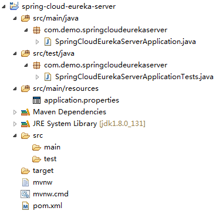
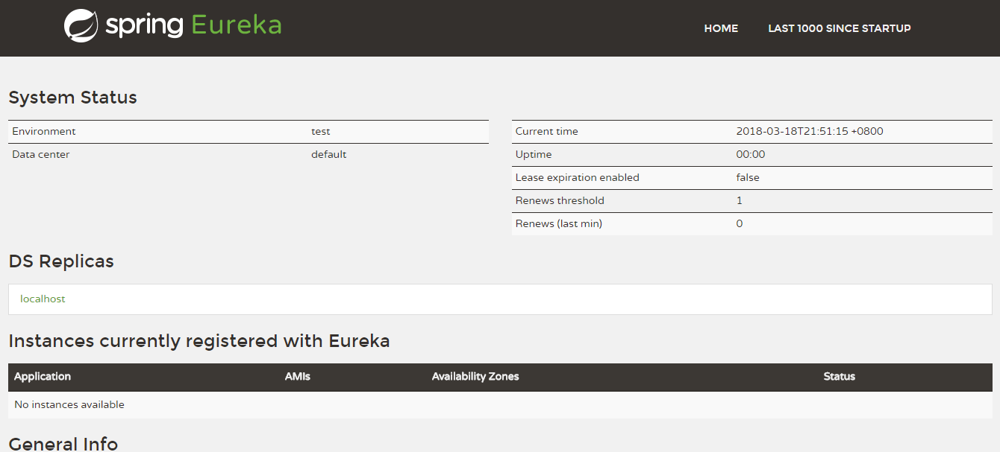

# Spring Cloud 快速入门

​    

## 版本

Spring Cloud：Finchley.M8

Spring Boot：2.0.0.RELEASE

JDK：1.8

​    

## 官方文档

http://cloud.spring.io/spring-cloud-static/Finchley.M8/multi/multi_spring-cloud.html

​    

## Eureka 服务注册中心

### 单个 Eureka

1. 从 http://start.spring.io/ 下载项目并导入到 MyEclipse 中。

   项目结构：

   

2. pom.xml：

   ```xml
   <?xml version="1.0" encoding="UTF-8"?>
   <project xmlns="http://maven.apache.org/POM/4.0.0" xmlns:xsi="http://www.w3.org/2001/XMLSchema-instance"
   	xsi:schemaLocation="http://maven.apache.org/POM/4.0.0 http://maven.apache.org/xsd/maven-4.0.0.xsd">
   	<modelVersion>4.0.0</modelVersion>

   	<groupId>com.demo</groupId>
   	<artifactId>spring-cloud-eureka-server</artifactId>
   	<version>0.0.1-SNAPSHOT</version>
   	<packaging>jar</packaging>

   	<name>spring-cloud-eureka-server</name>
   	<description>Demo project for Spring Boot</description>

   	<parent>
   		<groupId>org.springframework.boot</groupId>
   		<artifactId>spring-boot-starter-parent</artifactId>
   		<version>2.0.0.RELEASE</version>
   		<relativePath/> <!-- lookup parent from repository -->
   	</parent>

   	<properties>
   		<project.build.sourceEncoding>UTF-8</project.build.sourceEncoding>
   		<project.reporting.outputEncoding>UTF-8</project.reporting.outputEncoding>
   		<java.version>1.8</java.version>
   		<spring-cloud.version>Finchley.M8</spring-cloud.version>
   	</properties>

   	<dependencies>
   		<dependency>  
               <groupId>org.springframework.cloud</groupId>  
               <artifactId>spring-cloud-starter-netflix-eureka-server</artifactId>  
           </dependency> 

   		<dependency>
   			<groupId>org.springframework.boot</groupId>
   			<artifactId>spring-boot-starter-test</artifactId>
   			<scope>test</scope>
   		</dependency>
   	</dependencies>
   	
   	<dependencyManagement>  
           <dependencies>  
               <dependency>  
                   <groupId>org.springframework.cloud</groupId>  
                   <artifactId>spring-cloud-dependencies</artifactId>  
                   <version>${spring-cloud.version}</version>  
                   <type>pom</type>  
                   <scope>import</scope>  
               </dependency>  
           </dependencies>  
       </dependencyManagement>

   	<build>
   		<plugins>
   			<plugin>
   				<groupId>org.springframework.boot</groupId>
   				<artifactId>spring-boot-maven-plugin</artifactId>
   			</plugin>
   		</plugins>
   	</build>
   </project>
   ```

3. SpringCloudEurekaServerApplication.java：

   ```java
   @SpringBootApplication
   @EnableEurekaServer
   public class SpringCloudEurekaServerApplication {
   	public static void main(String[] args) {
   		SpringApplication.run(SpringCloudEurekaServerApplication.class, args);
   	}
   }
   ```

4. application.properties：

   ```properties
   spring.application.name=spring-cloud-eureka-server

   server.port=8000

   eureka.client.register-with-eureka=false
   eureka.client.fetch-registry=false
   eureka.client.serviceUrl.defaultZone=http://localhost:${server.port}/eureka/
   ```

   - `eureka.client.register-with-eureka` ：表示是否将自己注册到 Eureka Server，默认为 true，即在默认设置下，服务注册中心会将自己作为客户端来尝试注册它自己。
   - `eureka.client.fetch-registry` ：表示是否从 Eureka Server 获取注册信息，默认为 true。
   - `eureka.client.serviceUrl.defaultZone` ：设置与 Eureka Server 交互的地址，查询服务和注册服务都需要依赖这个地址。默认是 http://localhost:8761/eureka。多个地址可使用 “,”分隔。

5. 运行 SpringCloudEurekaServerApplication.java，访问 http://localhost:8000/ 可以看到：

   

​    

### 集群

搭建服务注册中心 Eureka 集群。

1. 创建两个配置文件，application-peer1.properties、application-peer2.properties。

   application-peer1.properties：

   ```properties
   spring.application.name=spring-cloud-eureka
   server.port=8000
   eureka.instance.hostname=peer1

   eureka.client.serviceUrl.defaultZone=http://peer2\:8001/eureka/
   ```

   application-peer2.properties：

   ```properties
   spring.application.name=spring-cloud-eureka
   server.port=8001
   eureka.instance.hostname=peer2

   eureka.client.serviceUrl.defaultZone=http\://peer1\:8000/eureka/
   ```

2. hosts 上添加：

   ```
   127.0.0.1 peer1  
   127.0.0.1 peer2
   ```

3. 打包项目

   在项目根目录上执行：

   ```shell
   mvn clean package
   ```

   打包成功后 target 目录下可以看到 jar 包。

4. 运行 jar 包

   分别按 application-peer1.properties 和 application.peer2.properties 启动项目：

   ```shell
   java -jar spring-cloud-eureka-server-0.0.1-SNAPSHOT.jar --spring.profiles.active=peer1
   java -jar spring-cloud-eureka-server-0.0.1-SNAPSHOT.jar --spring.profiles.active=peer2
   ```

   启动成功后就可以访问 http://peel1:8000/，http://peer2:8001/ 了。

   

   ​