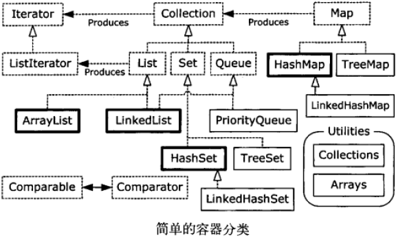

# 第11章 持有对象

### 容器类

Collection：有 List，Set，Queue

Map：有 HashMap，TreeMap

​    



​    

### 添加一组元素

**Arrays.asList()：**相对慢；底层是数组，所以不能添加或删除其中某元素；不灵活（可以用 `Arrays.<T>asList()` 手动指定类型）

**collection.addAll()：**只接受一个 Collection 对象作为参数

**Collections.addAll() ：**灵活，使用可变参数列表

​    

### Iterator 迭代器

只能单向移动。有 `next()`，`hasNext()`，`remove()` 方法。

##### ListIterator

可以双向移动（ `next()` 和 `previos()` ）。

​    

### Iterable 接口

foreach 语句可以用于任何 Iterable，其子类需要实现 `Iterator<T> iterator()` 方法：

```java
public class IterableClass {
    private Pet[] pets = Pets.createArray(8);
    public Iterator<Pet> iterator() {
        return new Iterator<Pet>() {
            private int index = 0;
            public boolean hasNext() {
                return index < pets.length;
            }
            public Pet next() { return pets[index++]; }
            public void remove() {
                throw new UnsupportedOperationException();
            }
        }
    }
    public static void main(String[] args) {
        for(Pet pet : new IterableClass()) {
            System.out.println(pet);
        }
    }
}
```

Collection 类都是 Iterable ，但数组不是，不能自动转换成 Iterable，所以需要使用 `Arrays.asList(数组)` 。

​    

