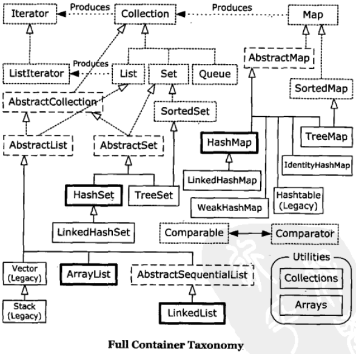

# 第17章 容器深入研究

​    



​    

## Set

- 每个元素都必须是唯一的。所以加入 Set 的元素必须定义 `equals()` 方法以确保对象的唯一性；


- 不保证维护元素的次序。

#### HashSet

为快速查找而设计的 Set。元素必须定义 `hashCode()` 。

#### TreeSet

保持次序的 Set，底层为树结构。可以从 TreeSet 中提取有序的序列。元素必须实现 Comparable 接口（`compareTo()` 方法）。

##### compareTo()

比如判断两个 int 类型 i 与 j 时，不能直接 `return i-j;` 。因为 int 不够大，如果 i 是很大的正整数，而 j 是很大的负整数，i-j 就会溢出而返回负值。解决方法：`return (i < j ? -1 : (i == j ? 0 : 1));` 。

#### LinkedHashSet

具有 HashSet 的查询速度，且内部使用链表维护元素的顺序（按插入的次序）。元素必须定义 `hashCode()` 。

​     

​     

## 队列 Queue

有 LinkedList（双向队列），PriorityQueue（优先级队列）。

​    

​     

## Map

使用对象的 `hashCode()` 进行快速查询。

#### HashMap

比其他 Map 速度快。

#### LinkedHashMap

遍历时它的顺序是按插入次序或是按最近最少使用（LRU）的次序。由于使用链表维护次序，迭代访问时会比 HashMap 更快。

#### TreeMap

基于红黑树的实现（具有 `subMap()` 返回一个子树的方法）。元素会被排序（次序由 Comparable 或 Comparator 决定）。

#### ConcurrentHashMap

线程安全的 Map。

#### WeakHashMap

弱键映射。允许释放映射所指向的对象。

#### IdentityHashMap

使用 == 代替 `equals()` 对键进行比较的散列映射。

​    

​     

## hashCode()

默认的 Object 的 hashCode() 使用对象地址来计算散列码。（`equals()` 也是默认比较对象的地址）

#### Map 的存储方式

（其实思路就是数据结构中散列表的实现。）

Map 的存储是由一个 List 数组来实现的，它利用了数组快速查询的优点和 List 的不限制容量的特性。

比如 `List<Map<K, V>>[] array` ，在实现 Map 的 `put(K key, V value)` 方法时，会根据散列码和该数组长度计算出的一个下标值 index（小于数组长度），然后会在 array[index] 的 List 中插入 value 。插入前会先遍历该 List 来检查键是否已存在，如果有则覆盖，没有就进行 add() 。

即使 List 的遍历会比较慢，但只要散列函数足够好（计算出的下标值的冲突情况少），每个位置上的 List 中就会只有较少的值，从而可以大大提高 Map 的效率。这就是 HashMap 速度快的原因。

​    

​     

## 优化

- **容量**：表中的桶位数。
- **初始容量**：表在创建时拥有的桶位数。
- **尺寸**：表中当前存储的项的数量。
- **负载因子**：尺寸 / 容量。负载因子越小冲突的可能性就越小，从而使插入和查找效率提高，但会减慢遍历速度，并且所占空间也会大。

HashMap 和 HashSet 允许通过构造器设置其负载因子。设置后，当负载因子达到该值时，容器将自动增加其容量（桶位数）。实现方式是使容量大致加倍，并重新将现有对象分布到新的桶位集中（即再次进行散列）。

HashMap 的默认负载因子是 0.75 。

​    

## 实用方法

#### 设置 Collection 和 Map 为不可修改

```java
List<String> list = Collections.unmodifiableList(new ArrayList<String>(listData));
Map<String, Object> map = Collections.unmodifiableMap(new HashMap<String, Object>(mapData));
```

初始化后就不能再进行添加、删除等操作。

但此方法允许保留一份可修改的容器，作为类的 private 成员，然后通过调用某方法返回对该容器的「只读」的引用，这样只能自己修改，而别人只能读取。

#### Collection 和 Map 的同步

与上面 `Collections.unmodifiableXxx()` 方法类似，可以在初始化时使用 `Collections.synchronizedXxx()` 方法来设置为同步的。

设置后，为了保持同步，如果获取该容器的迭代器后，又进行对该容器的添加等操作，会报错。

​    

​     

## Reference 持有引用

对象为可获得的（reachable）：指某个引用在指向该对象。不可获得的对象会被垃圾回收器释放，而可获得的则不会被释放。

而 Reference 类，可以允许垃圾回收器释放可获得的 Reference 对象。

SoftReference，WeakReference，PhantomReference 由强到弱，对应不同级别的「可获得性」。

#### WeakHashMap

用来保存 WeakReference 。在 WeakHashMap 中键没有被引用指向时（即不可获得、不再需要该键时），可以被垃圾回收器释放它的 value。

优点：节约存储空间。