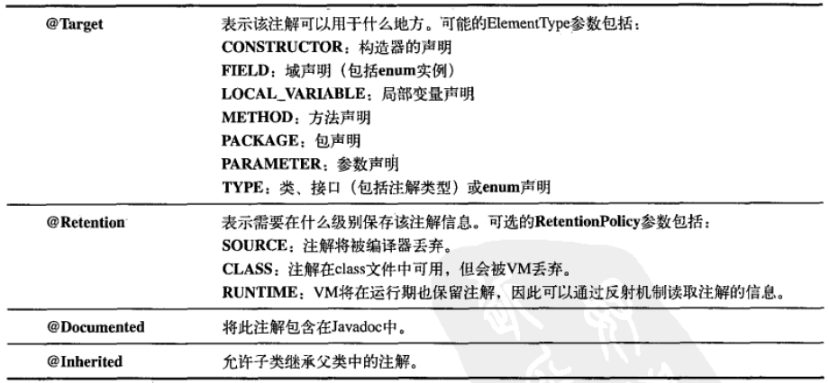

# 第20章 注解

​    

### 定义注解

注解也将会编译成 class 文件。

定义一个 @Test 注解：

```java
@Target(ElementType.METHOD) // 元注解
@Retention(RetentionPolicy.RUNTIME) // 元注解
public @interface Test {}
```

像 @Test 一样，没有元素的注解成为**标记注解**（marker annotation）。

**定义元素：**

```java
@Target(ElementType.METHOD)
@Retention(RetentionPolicy.RUNTIME)
public @interface UseCase {
  public int id();
  public String description() default "no description";
}
```

元素类型可以有：基本类型，String，Class，enum，Annotation，及以上类型的数组。

元素值不能是 null 。（因为这样会很难判断一个元素是否存在）

**使用注解：**

```java
public class PasswordUtils {
  @UseCase(id = 47, description = "Passwords must contain at least one numeric")
  public boolean validatePassword(String password) {
    return (password.matches("\\w*\\d\\w*"));
  }
  @UseCase(id = 48)
  public String encryptPassword(String password) {
   return new StringBuilder(password).reverse().toString();
  }
}
```

​    

### 元注解



​    

### 注解处理器

```java
public class UseCaseTracker {
  public static void trackUseCases(List<Integer> useCases, Class<?> cl) {
    for(Method m : cl.getDeclaredMethods()) {
      UseCase uc = m.getAnnotation(UseCase.class);
      if(uc != null) {
        System.out.println("Found Use Case:" + uc.id() +
          " " + uc.description());
        useCases.remove(new Integer(uc.id()));
      }
    }
    for(int i : useCases) {
      System.out.println("Warning: Missing use case-" + i);
    }
  }
  public static void main(String[] args) {
    List<Integer> useCases = new ArrayList<Integer>();
    Collections.addAll(useCases, 47, 48, 49, 50);
    trackUseCases(useCases, PasswordUtils.class);
  }
}
```

