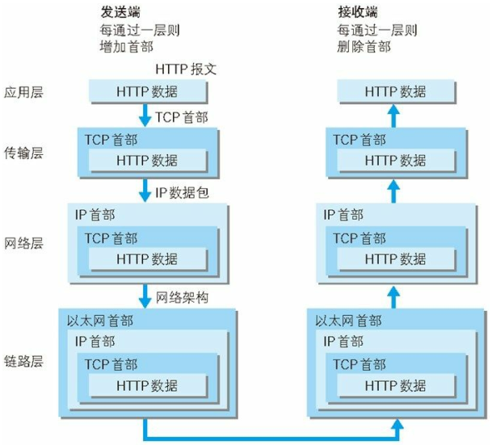
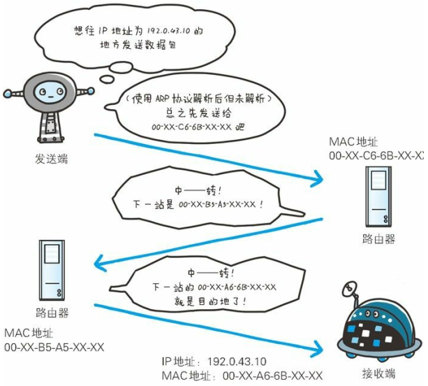
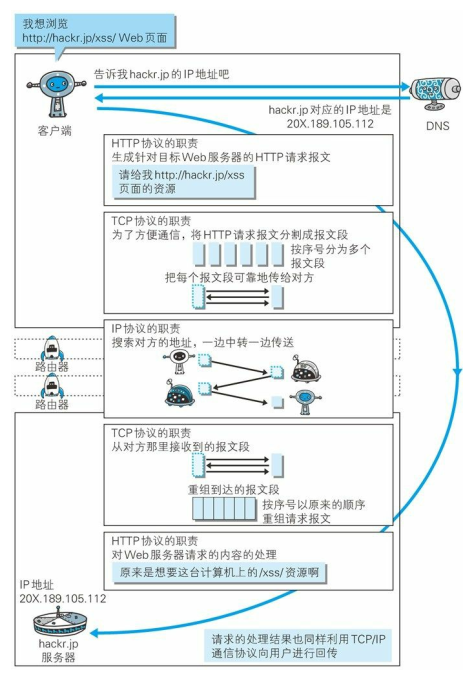

# 第1章 了解Web及网络基础

Web 是建立在何种技术之上；HTTP 协议的诞生、发展；

​    

## 使用 HTTP 协议访问 Web

​    

## HTTP 的诞生

​    

## 网络基础 TCP/IP

互联网相关联的协议集总称。

### TCP/IP 的分层管理

TCP/IP 协议族分 4 层：应用层、传输层、网络层、数据链路层。

**应用层：**

决定向用户提供应用服务时通信的活动。如 FTP、DNS、HTTP。

**传输层：**

给应用层提供网络连接中的两台计算机之间的数据传输。TCP、UDP。

**网络层：**

用来处理网络上流动的数据包（数据包是网络传输的最小数据单位）。规定了通过怎样的路径（所谓的传输路线）到达对方计算机，并把数据包传送给对方。

**数据链路层：**

用来处理连接网络的硬件部分。

### TCP/IP 通信传输流

客户端：HTTP（应用层）-> TCP（传输层）-> IP（网络层）-> 链路层

1. 发送端在**应用层**（HTTP 协议）发出一个想看某个 Web 页面的 HTTP 请求。
2. **传输层**（TCP 协议）把从应用层收到的数据（HTTP 请求报文）进行分割，并在各个报文上打上标记序号、端口号后转发给网络层。
3. **网络层**（IP 协议），增加通信目的地的 MAC 地址后转发给**链路层**。

​    

## 与 HTTP 关系密切的协议：IP、TCP 和 DNS

### 负责传输的 IP 协议

IP 协议的作用是把各种数据包传送给对方。要保证确实传送到对方那里， 需要满足各类条件。其中两个重要的条件是 IP 地址和 MAC 地址（Media Access Control Address）。

**IP 地址**：节点被分配到的地址；**MAC 地址**：网卡所属的固定地址。

IP 地址可以和 MAC 地址进行配对。IP 地址可变换，但 MAC 地址基本上不会更改。

#### 使用 ARP 协议凭借 MAC 地址进行通信

IP 间的通信依赖 MAC 地址。网络上，通信的双方在同一局域网（LAN）内的情况是很少的，通常是经过多台计算机和网络设备中转才能连接到对方。而在进行中转时， 会利用下一站中转设备的 MAC 地址来搜索下一个中转目标。 这时，会采用 **ARP 协议**（Address Resolution Protocol）。ARP 是一种用以解析地址的协议，根据通信方的 IP 地址就可以反查出对应的 MAC 地址。

#### 没有人能够全面掌握互联网中的传输状况

在到达通信目标前的中转过程中，那些计算机和路由器等网络设备只能获悉很粗略的传输路线。

这种机制称为**路由选择**（routing），有点像快递公司的送货过程。要寄快递的人，只要将自己的货物送到集散中心，就可以知道快递公司是否肯收件发货，该快递公司的集散中心检查货物的送达地址，明确下站该送往哪个区域的集散中心。接着，那个区域的集散中心自会判断是否能送到对方的家中。

### 确保可靠性的 TCP 协议

提供可靠的字节流服务。

**字节流服务**（Byte Stream Service）：为了方便传输， 将大块数据分割成以报文段（segment）为单位的数据包进行管理。**可靠的传输服务**：能够把数据准确可靠地传给对方。

总之，TCP 协议为了更容易传送大数据，把数据进行了分割，而且 TCP 协议能够确认数据最终是否送达到对方。

#### 确保数据能到达目标

为了准确送达目标处，TCP 协议采用了**三次握手** （three-way handshaking） 策略。把数据包送出去后，TCP 会会向对方确认是否成功送达。握手过程中使用了 TCP 的标志（flag）—— SYN（synchronize）和 ACK（acknowledgement）。

发送端首先发送一个带 SYN 标志的数据包给对方。接收端收到后，回传一个带有 SYN/ACK 标志的数据包以示传达确认信息。最后，发送端再回传一个带 ACK 标志的数据包，代表“握手”结束。

若在握手过程中某个阶段莫名中断，TCP 协议会再次以相同的顺序发 送相同的数据包。

除了上述三次握手，TCP 协议还有其他各种手段来保证通信的可靠性。

​    

## 负责域名解析的 DNS 服务

提供通过域名查找 IP 地址，或逆向从 IP 地址反查域名的服务。

​    

## 各种协议与 HTTP 协议的关系

​    

## URI 和 URL

### 统一资源标识符 URI

URI 是 Uniform Resource Identifier 的缩写。

就是由某个协议方案表示的资源的定位标识符。

**协议方案**是指访问资源所使用的协议类型名称。采用 HTTP 协议时，协议方案就是 http。除此之外，还有 ftp、 25 mailto、telnet、file 等。标准的 URI 协议方案有 30 种左右， 由隶属于国际互联网资源管理的非营利社团 ICANN（Internet Corporation for Assigned Names and Numbers， 互联网名称与数字地址分配机构） 的 IANA（Internet Assigned Numbers Authority， 互联网号码分配局） 管理颁布。

URI 用字符串标识某一互联网资源，而 URL 表示资源的地点（互联网上所处的位置）。可见 URL 是 URI 的子集。

### URI 格式

表示指定的 URI，要使用涵盖全部必要信息的绝对 URI、绝对 URL 以 及相对 URL。相对 URL，是指从浏览器中基本 URI 处指定的 URL，形如 /image/logo.gif。

绝对 URI 的格式：

