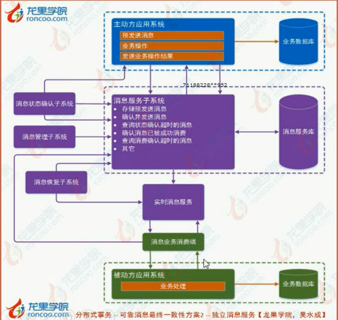
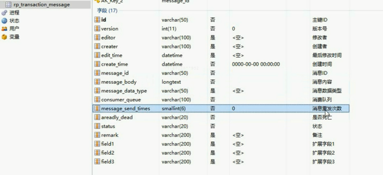

# 分布式事务解决方案

​    

## 可靠消息最终一致性方案

适用场景广

对应支付系统的会计异步记账业务；

银行通知结果信息存储于驱动订单处理等。

​    

## TCC事务补偿型方案

属于两阶段型的一种实现

场景：订单处理、积分账号处理、资金账户处理等。

​    

## 最大努力通知型方案

场景：对应支付系统的商户通知业务场景。

​    

分布式事务解决方案分：

刚醒事务（如全局事务），柔性事务。

​    

## DTP全局事务（不推荐）

XA协议：包含两阶段提交（2PC）和三阶段提交（3PC）两种实现。

2PC：事务管理器（TM）先确认各资源管理器（RM）全部准备完后，让他们执行任务并提交，如果有一个失败了就全部回滚。

2PC的局限性：需要一直持有资源（数据库锁）直到整个分布式事务结束。

3PC：在2PC的基础上增加了CanCommit阶段，并且引入了超时机制。

​    

## BASE理论

​    

## CAP定理

C：Consistency一致性。所有用户看到一致的数据。

A：Availability可用性。总能找到可用的数据副本。

P：Tolerance to Network Partition分区容错性。容忍网络中断。

定理：最多只能同时拥有CAP中的两个，没法三者兼顾。

​    

## 柔性事务

四种服务模式：

1. 可查询操作
2. 幂等操作
3. TCC操作（Try、Confirm、Cancel）
4. 可补偿操作

几种解决方案：

1. 可靠消息最终一致性方案（异步确认型）
2. TCC（两阶段型；补偿型）
3. 最大努力通知（非可靠消息；定期校对）

​    

## 消息发送一致性（可靠消息的前提保障）

流程：

1. 主动方向消息中间件发送”待确认“消息。
2. 消息中间件存储该消息，并向主动方返回存储结果（成功/失败）。
3. 主动方收到后，如果存储结果为成功则执行业务操作，否则不执行。
4. 主动方执行业务后，向消息中间件发送业务处理结果。
5. 消息中间件收到消息后，如果业务处理结果为成功，则更新”待确认“消息状态为”待发送“。如果是失败，则删除那个”待确认“消息，且不会向被动方发送消息。
6. 向被动方发送”待发送“消息。

​    

对于消息发送异常的处理：

主动方提供一个查询业务操作结果的API，使消息中间件可以（反复）查询“待确认”消息对应的业务操作的结果。如果结果是成功则更新为“待发送”，否则删除消息。

​    

对于消息投递（消费）的异常处理：

被动方向消息中间件发送消费消息的结果；

避免异常情况下的重复调用问题：

接口需要具有幂等性；

限制重复次数；

​    

现成的MQ中间件不支持消息发送一致性流程。而且直接改造或开发MQ中间件的难度大。

​    

实现方案

### 方案一：本地消息服务

主动方直接执行业务后向MQ发送消息，而不进行确认。

缺点：

耦合性强，与具体业务场景绑定；

消息数据与业务数据同库，占用业务系统资源；

消息服务受关系型数据库的并发性能的局限。

### 方案二：独立消息服务

消息服务系统：

1. 主动方预发送。消息服务系统存储预发送消息。
2. 主动方执行业务操作。
3. 主动方发送业务操作结果。消息服务系统确认后向被动方发送消息。
4. 被动方消费后向消息服务系统发送结果。
5. 消息服务系统确认消息被成功消费。（删除）

消息状态确认系统：定期查询发送超时的消息，并调用主动方接口来确认是否已完成相关的业务流程。如果是，则删除消息。由于每个业务系统（主动方）提供的接口和判断逻辑等可能都不一样，所以消息状态确认系统会需要独立出来。

消息恢复系统：定期查询消费确认超时的消息，并调用被动方接口来消费。

消息管理系统：比如提供可视化界面，可以对消息进行监控、管理等。

优点：

消息服务是独立的，不在本地；

消息公用，其他系统也可用该消息服务；

#### 消息服务系统的设计

消息状态确认系统：分页查询超时消息，并调用主动方的接口来处理。

消息恢复系统：超过最大重试次数时修改消息状态而不再重试。

实时消息服务：消息队列。

优化：

1. 主动方业务完成后发送消息时，使用异步发送（即不管超时等）。如果是同步，在出现异常时（如返回超时）会发生消息已经发出去了，而业务操作被回滚的情况。
2. 使用Redis等存储消息（需要持久化以防数据丢失）。
3. 分布式任务调度

 

​    