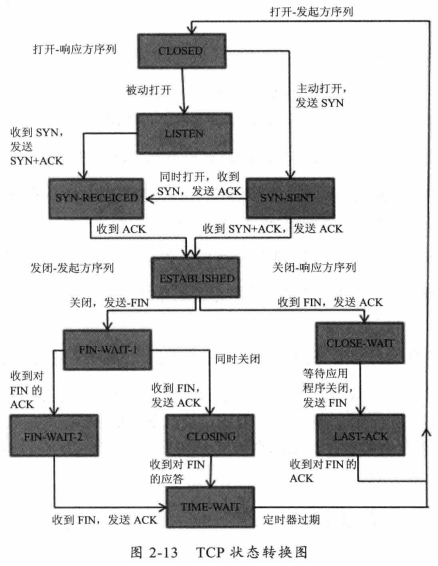

# 第2章 深入分析Java I/O的工作机制

​    

### Java 的 I/O 类库的基本架构

- 基于字节操作：InputStream、OutputStream
- 基于字符操作：Writer、Reader
- 基于磁盘操作：File
- 基于网络操作：Socket

I/O 操作最小的存储单元是字节。

#### 字节与字符的转化接口

读操作相关的类：Reader、InputStreamReader、StreamDecoder、Charset、InputStream。

InputStream 到 Reader 的过程需要指定编码字符集，否则默认采用操作系统默认的字符集。StreamDecoder 是完成从字节到字符解码的实现类。

​    

### 磁盘 I/O 工作机制

操作系统为了安全把内核程序运行使用的内存空间，和用户程序运行的内存空间进行了隔离。而应用程序要访问物理设备只能通过系统调用来工作，所以会导致内核空间地址和用户空间地址切换的问题（比如空间复制导致的效率问题（磁盘 I/O，数据从磁盘复制到内核空间，从内核空间再复制到用户空间））。

操作系统为了加速 I/O 访问，在内核空间里使用了缓存机制。这样用户要访问磁盘时，如果是同一段磁盘地址的空间数据，会从内核缓存中直接取出返回给用户程序。

#### 访问文件的方式

##### 标准访问文件的方式

读：检查内核的高速缓存中有没有数据，如果有就直接返回，没有则从磁盘中读取，然后存到缓存中。

写：将数据从用户地址空间复制到缓存里。至于什么时候再写到磁盘中是由操作系统决定的。

##### 直接 I/O 的方式

直接访问磁盘，不经过缓存。

##### 同步访问文件的方式

数据的读写都是同步操作。数据成功写到磁盘才会返回给应用程序。

##### 异步访问文件的方式

应用程序发出请求后，它会接着做其他事情，而不是等待。

##### 内存映射的方式

内存中某一块区域与磁盘中的文件关联起来。当访问内存中一段数据时，转为直接访问文件的某一段数据。从而减少复制操作。

#### Java 访问磁盘文件

数据在磁盘中的最小描述是文件，上层应用程序只能通过文件来操作磁盘上的数据。

而 Java 里通常的 File 并不代表一个真实存在的文件对象，它只是代表某个路径的虚拟对象，可能是真实存在的文件，也可能是一个目录。

只有真正读取这个文件时才会检查是否真正存在。比如 FileInputStream 对象创建时会创建一个 FileDescriptor 对象，这个对象就是真正代表一个存在的文件对象的描述。

读取磁盘某一段文本字符的流程：

根据文件路径创建 File 对象来标识这个文件。根据 File 对象创建真正读取文件的操作对象，这是会真正创建一个关联了真实存在的磁盘文件的文件描述符 FileDescriptor。要读取字符格式，需要通过 StreamDecoder 类把 byte 解码为 char 格式。操作系统会完成从磁盘读取数据。

#### Java 序列化技术

把对象（必须继承 java.io.Serializable 接口）转换成一串二进制表示的字节数组。

该二进制数据并不像 class 文件那样会保存类的完整结构信息。

在多语言环境下用 Java 序列化存储后很难用其他语言还原。所以这种情况下，尽量用通用的数据结构，如 JSON、XML 结构。

​    

### 网络 I/O 工作机制

#### TCP 状态转化

1. CLOSED：起始点。超时或连接关闭时进入此状态。
2. LISTEN：Server 端在等待连接时的状态。（等待客户端来连接）。Server 端调用 Socket、bind、listen 函数，就能进入此状态。
3. SYN-SENT：客户端发起连接，发送 SYN 给服务器端。如果不能连接到服务器端，会进入 CLOSED 状态。
4. SYN-RCVD：与 SYN-SENT 对应，服务器端接收客户端的 SYN 请求后，由 LISTEN 转为 SYN-RCVD，然后向客户端返回 ACK，再发送一个 SYN 给客户端。客户端收到 SYN 状态后会由 SYN-SENT 转为 SYN-RCVD。
5. ESTABLISHED：完成 3 次握手后进入此状态，说明可以开始传输数据了。
6. FIN-WAIT-1：主动关闭的一方，由 ESTABLISED 进入此状态，此时会向对方发送 FIN。
7. FIN-WAIT-2：主动关闭的一方，接收到对方的 FIN ACK 后进入此状态。之后就不能再接收对方的数据，但是能够给对方发送数据。
8. CLOSE-WAIT：被动关闭的一方，接收到 FIN 后进入此状态，此时会向对方发送 ACK。
9. LAST-ACK：被动关闭的一方，发起关闭请求后由 CLOSE-WAIT 进入此状态，此时会向对方发送 FIN。接收到 ACK 后会转为 CLOSED。
10. CLOSING：两边同时发起关闭请求后，会由 FIN-WAIT-1 进入此状态，并返回 ACK。
11. TIME-WAIT：三种情况。

有时候可能会发现由于网络连接的并发数不够，导致连接都处于 TIME-WAIT 状态（这样可能出现在压测时 CPU、网卡、带宽等都不是瓶颈，但性能一直压不上去的问题）。这时就要做 TCP 网络参数调优了。

#### 影响网络传输的因素

影响响应时间的因素：

- 网络带宽：一条物理链路在 1s 内能够传输的最大 bit 数，即 b/s。
- 传输距离：数据在光纤中要走的距离。
- TCP 拥塞控制：TCP 传输方和接收方的步调要一致，所以 TCP 在传输时会设定一个“窗口”（BDP）。它的大小由带宽、RTT（Round-Trip Time，数据在两端来回的时间，即响应时间）来决定。公式为 带宽(b/s)xRTT(s)，可以得出理论上最优的 TCP 缓冲区大小。

#### Java Socket 的工作机制

Socket 其实描述计算机之间完成通信的一种抽象功能，并不对应一个具体的实体。Socket 就如两个城市间的交通工具，交通工具有多种，每种交通工具都有相应的交通规则。Socket 也一样，有多种。大部分情况下我们使用的都是基于 TCP/IP 的流套接字，它是一种稳定的通信协议。

通过 Socket 建立连接需要由底层 TCP/IP 来建立 TCP 连接。建立 TCP 连接需要底层 IP 层来寻址目标主机。然后再根据 TCP 或 UDP 的地址，即端口号来指定地址，这样就可以通过一个 Socket 实例来唯一代表一个主机上的应用程序的通信链路了。

#### 建立通信链路

**客户端：**

客户端创建一个 Socket 实例时，操作系统会为这个 Socket 实例分配一个没有被使用的本地端口号，并创建一个包含本地地址、远程地址、端口号的数据结构。这个数据结构将一直保存在系统中，直到这个连接关闭。

在创建 Socket 实例的构造函数正确返回之前，会进行 TCP 的 3 次握手。握手完成后，Socket 实例对象将创建完成，否则抛出 IOException 异常。

**服务器端：**

会创建一个 ServerSocket 实例。一般只要端口号没有被占用，就可以创建成功。同时系统会为该实例创建一个数据结构，包含了监听的端口号、监听地址的通配符（* 代表所有地址）。

当调用 accept() 方法时，将进入阻塞状态，等待客户端的请求。新的请求到来时，将为这个连接创建一个套接字数据结构，包含请求源地址、端口。这个数据结构会关联到 ServerSocket 实例的一个未完成的连接数据结构列表中。

注，这时服务端的 Socket 实例还没有创建完成，需要等到与客户端的 3 次握手后，服务端的 Socket 实例才会返回，并将该 Socket 实例对应的数据结构从未完成列表中移到已完成列表中。所以，与 ServerSocket 所关联的列表中的每个数据结构，都代表与一个客户端建立的 TCP 连接。

#### 数据传输（如何通过 Socket 传输数据）

连接建立成功后，服务端、客户端都会有一个 Socket 实例，每个 Socket 实例都有一个 InputStream、OutputStream，并通过这两个对象来交换数据。（网络 I/O 都以字节流传输的，当创建 Socket 实例时，操作系统会为 InputStream、OutputStream 分配一定大小的缓存区，用来完成数据的读写。）

写入端将数据写到 OutputStream 对应的 SendQ 队列中，当队列满时，数据将被移到读取端 InputStream 的 RecvQ 队列中，如果这个 RecvQ 队列满了，那么 OutputStream 的 write() 方法将会被阻塞，直到 RecvQ 队列有足够空间容纳 SendQ 发送的数据。

注，这个缓存区的大小、写入端的速度、读取端的速度，非常影响这个连接的传输效率。由于可能会发生阻塞，网络 I/O 与 磁盘 I/O 不同的数据的读写还要有一个协调过程：如果两边同时传送数据时可能会发生死锁，将通过 NIO 避免这种情况。

​    

### NIO 的工作方式

