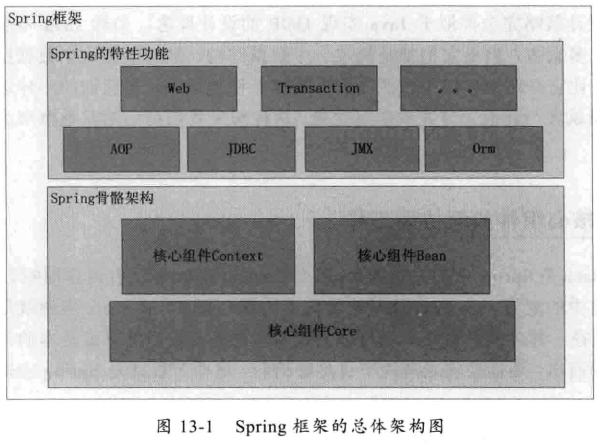

# 第13章 Spring框架的设计理念与设计模式分析

Spring 框架的骨骼架构的设计理念；

有哪几个核心组件？为什么需要这些组件？它们如何结合在一起构成 Spring 的骨骼架构？

Spring 的 AOP 特性是如何利用这些架构来工作的？

Spring 中的设计模式

​    

## Spring 的骨骼架构

### Spring 的设计理念

依赖注入机制。

### 核心组件如何协同工作

Context：就是一个 Bean 关系的集合，这个关系集合又叫 Ioc 容器。一旦建立起这个 Ioc 容器，Spring 就可以为你工作了。

Core：发现、建立、维护每个 Bean 之间的关系所需要的一系列工具。可以理解为 Util。

​    

## 核心组件详解

### Bean 组件

Bean 组件在 Spring 的 org.springframework.beans 包下。这个包主要解决：Bean 的定义、创建、解析。

Bean 的创建是典型的工厂模式。它的顶级接口是 BeanFactory。

BeanFactory 有 3 个子类：ListableBeanFactory、HierarchicalBeanFactory、AutowireCapableBeanFactory。

最终的默认实现类是 DefaultListableBeanFactory。

区别：ListableBeanFactory 接口表示这些 Bean 是可列表的；HierarchicalBeanFactory 表示这些 Bean 是有继承关系的，也就是每个 Bean 有可能有父 Bean；AutowireCapableBeanFactory 接口定义 Bean 的自动装配规则。

Bean 的定义主要由 BeanDefinition 描述。当成功解析 `<bean/>` 节点后，Spring 内部中会转换成 BeanDefinition 对象，以后所有操作都是对这个对象进行的。

### Context 组件

在 org.springframework.context 包下。就是给 Spring 提供一个运行时的环境，用以保存各个对象的状态。

ApplicationContext 是 Context 的顶级父类。它有继承 BeanFactory。

ApplicationContext 主要完成：标识一个应用环境；利用 BeanFactory 创建 Bean 对象；保存对象关系表；捕获各种事件。

ApplicationContext 的子类：

- ConfigurableApplicationContext：表示该 Context 是可修改的。也就是构建 Context 时，用户可以动态添加、修改已有的配置信息。
- WebApplicationContext：为 Web 准备的 Context。可以直接访问 ServletContext。一般用得很少。

### Core 组件

Resource 接口。

Context 把资源的加载、解析、描述工作委托给了 ResourcePatternResolver 类来完成。

### Ioc 容器如何工作

**如何创建 BeanFactory 工厂**

Ioc 容器就是 Context 结合其他两个组件共同构建了一个 Bean 关系网。其构建入口在 AbstractApplicationContext 类的 refresh 方法中。

该方法的大致步骤：

构建 BeanFactory，以便于产生所需的 Bean；注册可能感兴趣的事件；创建 Bean 实例对象；触发被监听的事件。

**如何创建 Bean 实例并构建 Bean 的关系网**

FactoryBean：可以产生 Bean 实例的 Bean。

如果一个类继承 FactoryBean，用户可以自己定义产生实例对象的方法，只需要实现它的 getObject 方法即可。然而在 Spring 内部，这个 Bean 对象是 FactoryBean，通过调用这个对象的 getObject 方法就能获取用户自定义产生的对象，从而为 Spring 提供了很好的扩展性。

**Ioc 容器的扩展点**

**Ioc 如何为我所用**

​    

## Spring 中 AOP 的特性详解

### 动态代理的实现原理

Spring 的 AOP 就是基于动态代理实现的。

JDK 的 java.lang.reflect 包下的 Proxy 类，是构造代理类的入口。

### Spring AOP 如何实现

​    

## 设计模式解析之代理模式

抽象 Subject、RealSubject、ProxySubject。

JDK 的动态代理。

​    

## 设计模式解析之策略模式

Spring 的代理方式有 JDK 动态代理、CGLIB 代理。对这两种代理方式的使用使用了策略模式。