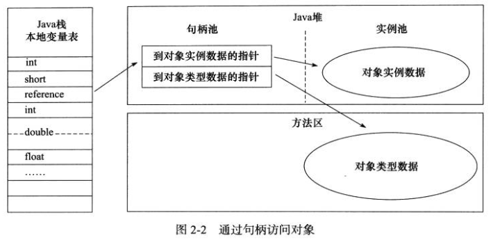
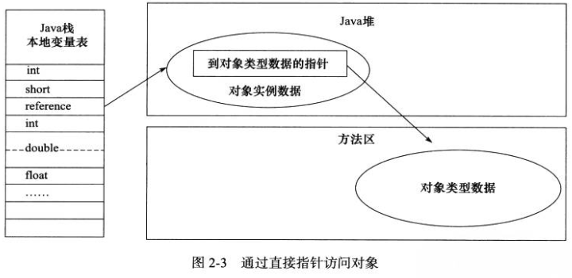

# 第2章 Java内存区域与内存溢出异常

​    

## 运行时数据区域

方法区、虚拟机栈、本地方法栈、堆、程序计数器。

方法区、堆为所有线程共享的数据区，其他都是线程隔离的数据区。

### 程序计数器 Program Counter Register

当前线程所执行的字节码指令的行号指示器。通过改变计数器的值来选取下一条指令。

Java 多线程会轮流切换线程，由于一个处理器在同一时刻只执行一条线程中的指令，所以为了每个线程在切换后可以恢复到正确的执行位置，每个线程都需要有自己独立的计数器。

### Java 虚拟机栈 Java Virtual Machine Stacks

每个方法在执行的同时都会创建一个栈帧，用于存储局部变量表、操作数栈、动态链接、方法出口等信息。一个方法从开始到执行完成的过程，就是一个栈帧在虚拟机栈中入栈到出栈的过程。

通常所指的“栈”就是指这个虚拟机栈，或者说是虚拟机栈中的局部变量表部分。

> 经常有人把 Java 内存分为堆内存（Heap）、栈内存（Stack），但这种分法比较粗糙，Java 内存区域的划分实际上远比这复杂。这种划分方式的流行只能说明大多数程序员最关注的、与对象内存分配关系最密切的内存区域是这两个。

局部变量表存放了编译期可知的各种基本类型（boolean、byte、char、short、int、float、long、double）、对象引用（reference 类型，它不同于对象本身，可能是一个指向对象起始地址的一个引用指针，也可能是指向一个代表对象的句柄或其他与此对象相关的位置）、returnAddress 类型（指向了一条字节码指令的地址）。

64 位长度的 long 和 double 类型数据会占用 2 个局部变量空间（Slot），其他只占 1 个。

在编译期间会分配局部变量表所需的内存空间，当进入一个方法时，这个方法需要在帧中分配多大的局部变量空间是完全确定的，在运行期间不会改变其大小。

异常：

在虚拟机规范中，对这个区域规定了两种异常情况：

如果线程请求的栈深度大于虚拟机所允许的深度，将抛出 StackOverflowError 异常；

如果虚拟机栈可以动态扩展（当前大部分 Java 虚拟机都可以动态扩展，只不过在 Java 虚拟机规范中也允许固定长度的虚拟机栈），且如果扩展时无法申请到足够的内存，就会抛出 OutOfMemoryError 异常；

### 本地方法栈 Native Method Stack

与虚拟机栈的区别是，本地方法栈是为 native 方法服务的。

在虚拟机规范中没有对本地方法栈中方法使用的语言、使用方式、数据结构强制规定，所以有的虚拟机（Sun HotSpot 虚拟机）直接把本地方法栈和虚拟机栈合二为一。

同样地，也会抛出 StackOverflowError 和 OutOfMemoryError 异常。

### Java 堆 Heap

在虚拟机启动时创建。存放对象实例及数组，但并不绝对是所有。

是垃圾收集器管理的主要区域，因此也被称作“GC 堆”。

由于现在收集器基本都采用分代收集算法，所以 Java 堆还可以细分为：新生代、老年代。再细一点的有 Eden 空间、From Survivor 空间、To Survivor 空间等。

根据 Java 虚拟机规范，Java 堆可以处于物理上不连续的内存空间中，只要逻辑上是连续的即可。在实现时，既可以实现成固定大小的，也可以是拓展的，当前主流的虚拟机都是按照可拓展来海鲜的（通过 -Xmx、-Xms 配置）。

如果没有内存可以分配实例，并且堆也无法再扩展时，将会抛出 OutOfMemoryError 异常。

### 方法区 Method Area

存储已被虚拟机加载的类信息、常量、静态变量、即时编译器编译后的代码等数据。（虽然 Java 虚拟机规范把方法区描述为堆的一个逻辑部分，但是它却有一个别名叫做 Non-Heap（非堆），目的应该是与 Java 堆区分开来。）

> 关于永久代：
>
> 习惯在 HotSpot 虚拟机上开发的程序员来说，经常把方法区成为“永久代”（Permanent Generation），但本质上并不等价，仅仅是因为 HotSpot 虚拟机团队选择把 GC 分代收集扩展至方法区而已。这样 HotSpot 的垃圾收集器可以像管理 Java 堆一样管理这部分内存，能够省去专门为方法区编写内存管理代码的工作。对于其他虚拟机如 BEA JRockit 等来说是不存在永久代概念的。
>
> 原则上，如何实现方法区属于虚拟机实现细节，不受虚拟机规范约束。但使用永久代来实现方法区并不是一个好主意，因为这样更容易遇到内存溢出的问题（永久代有 -XX:MaxPermSize 的上限，而 JRockit 等虚拟机只要没有达到进程可用内存的上限，例如 32 位系统中的 4GB，就不会出现问题）。而且会有极少数方法（比如 String.intern()）会因这个原因导致不同虚拟机下有不同的表现。
>
> 注：在 Java 8 以后去掉了永久代。在 Java 7 中把原本放在永久代的字符串常量池移出来了。

除了和 Java 堆一样不需要连续的内存、可以选择固定大小或者可拓展外，还可以选择不实现垃圾收集。相对而言，垃圾收集在这个区域是比较少出现的，但并非就是永远都存在的。

这区域的内存回收目的主要是针对常量池的回收和对类型的卸载。

根据 Java 虚拟机规范，当方法区无法满足内存分配时，会抛出 OutOfMemoryError 异常。

### 运行时常量池 Runtime Constant Pool

是方法区的一部分。

Class 文件中除了有类的版本、字段、方法、接口等描述信息外，还有一个是常量池，用于存放编译期生成的各种字面量和符号引用，这部分内容将在类加载后存放于方法区的运行时常量池中。

与 Class 文件中常量池不同的重要特征是具有动态性。也就是，运行期间的新的常量也可以放入池中，而不仅是编译期。这种特性被开发人员利用得比较多的就是 String 的 intern() 方法。

既然是方法区的一部分，同样地，当无法满足内存分配时，会抛出 OutOfMemoryError 异常。

### 直接内存 Direct Memory

并不是虚拟机运行时数据区的一部分，但这部分内存也被频繁地使用。

在 NIO 中，可以使用 Native 函数库直接分配堆外内存，然后通过一个存储在 Java 堆中的 DirectByteBuffer 对象作为这块内存的引用而进行操作（这样避免了在 Java 堆和 Native 堆中来回复制数据）。

直接内存不会受到 Java 堆大小的限制，但设置 -Xmx 等参数时，经常忽略直接内存，使得各个内存区域总和大于物理内存，从而导致出现 OutOfMemoryError 异常。

​    

​    

## HotSpot 虚拟机对象探秘

HotSpot 虚拟机在 Java 堆中对象分配、布局、访问的全过程。

### 对象的创建

（只讲普通对象，不包括数组和 Class 对象等）

虚拟机遇到一条 new 指令时的操作流程：

1. 检查这个指令的参数是否能在常量池中找到一个类的符号引用，并且检查这个符号引用代表的类是否已被加载、解析、初始化过。如果没有，必须先执行相应的类加载过程。

2. 分配内存。对象所需内存的大小在类加载完成后便可完全确定。分配方法由 Java 堆是否规整而决定的。（由垃圾收集器是否具有压缩整理的功能来判断 Java 堆是不是规整的）

   如果是规整的，就会把用过的内存放一边，空闲的放另一半，中间放着一个指针作为指示器，分配时只要把指针从空间那边挪一段与对象大小相等的距离就行。这种分配方式叫“指针碰撞”。在使用 Serial、ParNew 等带 Compact 过程的收集器时，系统会采用该方法。

   而如果是不规整的，虚拟机就会维护一个列表，用来记录哪些内存块是可用的。在分配时，从列表中找到一块足够大的空间划分给对象，并更新列表。这种方式叫“空闲列表”。使用 CMS 这种基于 Mark-Sweep 算法的收集器时，通常采用空闲列表。

   注：分配时都需要考虑（修改指针、列表时的）并发问题。实际上，虚拟机采用 CAS + 失败重试的方式来保证原子性。另一种解决方法是，每个线程在 Java 堆中预先分配一小块内存（称为本地线程分配缓存 TLAB），当 TLAB 用完而分配新的 TLAB 时才同步。虚拟机是否使用 TLAB，可以通过 -XX:+/-UseTLAB 参数来设置。

3. 将分配到的内存空间都初始化为零值（除了对象头）。如果使用 TLAB，可以在 TLAB 分配时进行。这一步操作为对象的实例字段在 Java 代码中可以不赋初始值就可以直接使用。

4. 设置这个对象是哪个类的实例、对象的哈希码、对象的 GC 分代年龄等信息。这些信息存放在对象头中。

5. 将对象的引用入栈。

执行 new 指令之后会接着执行 <init> 方法，把对象按照程序员的意愿进行初始化（比如各字段值）。

### 对象的内存布局

在 HotSpot 中，对象在内存中存储的布局分为：对象头、实例数据（Instance Data）、对齐填充（Padding）。

1. 对象头包括两部分信息：

   第一部分用于存储对象自身运行时的数据（与对象自身定义的数据无关的），如哈希码、GC 分代年龄、锁状态标志、线程持有的锁、偏向线程 ID、偏向时间戳等。这部分数据的长度在 32 位、64 位虚拟机中分别为（未开启压缩指针）32 bit、64 bit，官方称之为“Mark Word”。为了空间效率，Mark Word 被设计成一个非固定的数据结构，以便存储更多的信息。

   另一部分是类型指针，即对象指向它的类元数据的指针。虚拟机通过这个指针来确定这个对象是哪个类的实例。

   另外，如果对象是数组，那在对象头中还必须有一块用于记录数组长度的数据。因为虚拟机可以通过普通对象的元数据信息确定对象的大小，但是从数组的元数据中却无法确定数组的大小。

2. 实例数据部分是对象真正存储的有效信息。父类继承下来的还是子类定义的，都会记录。

3. 对齐填充并不是必须存在的，只是起占位符的作用。由于 HotSpot 的自动内存管理系统要求对象其实地址必须是 8 字节的整数倍，即对象的大小必须是 8 字节的整数倍，而对象头部分又正好是 8 字节的倍数（1 或 2 倍），因此，当实例数据部分没有对齐时，就需要通过对齐填充来补全。

### 对象的访问定位

Java 中需要通过栈上的 reference 数据来操作堆上的具体对象。Java 虚拟机规范只规定了 reference 类型为一个指向对象的引用，并没有定义这个引用应该如何去定位、访问堆中的对象的具体位置，所以对象的访问方式也取决于虚拟机的实现。目前主流的方式有：句柄和直接指针两种。

1. 句柄

   如果使用句柄访问，那么 Java 堆会划分出一块内存来作为句柄池。reference 中存储的就是对象的句柄地址，而句柄中包含了对象示例数据、类型数据各自的具体地址信息。

   好处：对象被移动（垃圾收集时可能会移动对象）时，只会改变句柄中的实例数据指针，而 reference 就不需要修改。

   

2. 直接指针

   Java 堆对象的布局中必须考虑如何放置类型数据的相关信息。reference 直接存储的是对象地址。

   好处：速度更快。对象的访问在 Java 中非常频繁，因此指针定位的开销积少成多后也是一项客观的执行成本。

   


HotSpot 中用的就是第二种方式，但其他语言和框架也很多是使用句柄的方式来访问的。

​    

​    

## OutOfMemoryError 异常（OOM）

如何判断以及处理 OOM。

### Java 堆溢出

-XX:+HeapDumpOnOutOfMemoryError：出现 OOM 时 Dump 出当前内存堆转储快照。

一般的手段是先通过内存映像分析工具（如 Eclipse Memory Analyzer）对 dump 出来的堆转储快照进行分析。重点是先分清楚到底是出现了内存泄漏（Memory Leak）还是内存溢出（Memory Overflow）。

如果是内存泄漏，可以进一步通过工具查看泄漏对象的类型信息以及 GC Roots 引用链的信息，就能比较准确地定位出代码位置。

如果不是内存泄漏，就应该先检查虚拟机的堆参数（-Xmx 和 -Xms），看是否还可以调大，且从代码上检查对象的生命周期是否有过长的情况。

### 虚拟机栈和本地方法栈溢出

HotSpot 中不区分虚拟机栈和本地方法栈，所以对于 HotSpot，-Xoss 参数（本地方法栈大小）是无效的，栈容量只由 -Xss 参数设置。

在这两个区域，Java 虚拟机规范中描述了两种异常：

1. 如果线程请求的栈深度大于虚拟机允许的最大深度：抛 StackOverflowError 异常。
2. 如果虚拟机在扩展栈时，无法申请到足够的内存空间：抛 OutOfMemoryError 异常。

但两种其实存在着一些互相重叠的地方：当栈空间无法继续分配时，到底是内存太小，还是已使用的栈空间太大，本质上只是对同一件事情的两种描述而已。

每个方法压入栈的帧大小是不一样的，但大多数情况下，对于正常的方法调用（包括递归），栈深度达到 1000~2000 是完全没问题的。

但如果是建立过多线程等导致的内存溢出，在不能减少线程数或者更换 64 位虚拟机的情况下，就只能通过减少最大堆和栈容量（-Xss）来换取更多的线程。

### 方法区和运行时常量池溢出

可通过 -XX:PermSize、-XX:MaxPermSize 控制方法区大小。

对于 String.intern() 方法：

```java
String str = new StringBuilder("计算机").append("软件").toString();
System.out.println(str.intern() == str1);
```

如果是在 jdk 1.7：常量池中会记录首次出现的实例引用。比如，如果“计算机软件”是首次出现的，常量池中它的引用就是这个 str，所以会输出 true；而如果是第二次出现的实例（重新 new StringBuilder...），就是不同的引用了，则输出 false。

如果是在 jdk 1.6：intern() 会把首次遇到的字符串实例复制到永久代中，且每次都返回永久代中的字符串实例的引用（而不是 StringBuilder 创建的在 Java 堆上的实例引用）。所以就算是首次还是其他，都会输出 false。

方法区用于存放 Class 的相关信息，如类名、访问修饰符、常量池、字段描述、方法描述等。比如动态生成的类过多（如使用 Spring 时，或 JSP 过多等情况），会造成方法区内存溢出。

### 本机直接内存溢出

可通过 -XX:MaxDirectMemorySize 控制，该参数值默认等于 Java 堆最大值（-Xmx）。

由直接内存导致的内存溢出，会发现在 Dump 文件中不会看见明显的异常，且 Dump 文件很小。


