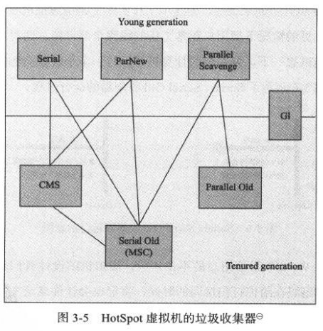
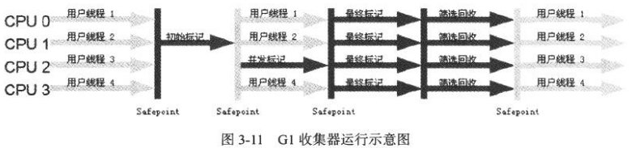

# 第3章 垃圾收集器与内存分配策略

​    

程序计数器、虚拟机栈、本地方法栈随线程而生，随线程而灭。栈中的栈帧随着方法的进入、退出进行出栈、入栈操作。每个栈帧中分配多少内存基本上在类结构确定下来时就已知的（尽管在运行期 JIT 编译期会进行一些优化，但在本章基于概念模型的讨论中，大体上可以认为是编译期可知的），因此这几个区域的内存分配、回收都具备确定性，即不需要过多考虑回收的问题，因为方法结束或者线程结束时，内存自然就跟着回收了。

而 **Java 堆和方法区**则不一样，只有在运行期才能知道会创建哪些对象，这部分的内存和回收都是动态的，垃圾收集器所关注的是这部分的内存。本章讨论中的“内存”分配、回收也仅指这一部分的内存。

​    

## 对象已死吗

如何判断哪些对象是不再使用的对象。

### 引用计数算法 Reference Counting（不使用）

给对象加个引用计数器，每当有一个地方引用它，就加 1；当引用失效时，减 1。计数器为 0 的对象就是不再使用的对象。

缺陷：

很难解决对象之间的循环引用的问题。

如，objA.instance = objB，且 objB.instance = objA。就算两个对象实例都不会再被访问，但他们两个互相引用着对方，计数器就不会变零了。

所以虚拟机没有使用该算法。

### 可达性分析算法 Reachability Analysis

“GC Roots” 为根节点，当一个对象到 GC Roots 根节点不可达时，被判定为可回收对象。

从 GC Roots 开始向下搜索，所走过的路径称为引用链（Reference Chain）。

在 Java 中，可作为 GC Roots 的对象包括以下几种：

- 虚拟机栈（栈帧中的本地变量表）中引用的对象
- 方法区中类静态属性引用的对象
- 方法区中常量引用的对象
- 本地方法栈中 JNI（即本地方法）引用的对象

### 再谈引用

Java 中引用分为：强引用、软引用、弱引用、虚引用。这四种引用强度一次主键减弱。

#### 强引用

代码中普遍存在的，类似 obj = new Object() 这类的引用。

只要强引用还存在，GC 永远不会回收被引用的对象。

#### 软引用

还有用单并非必须的对象。在内存即将溢出时，会进行回收。

可以用 SoftReference 类实现软引用。

#### 弱引用

也是非必须的对象。但不管内存是否足够，在回收时都会回收掉只被弱引用关联的对象。

可以用 WeakReference 类实现弱引用。

#### 虚引用

一个对象是否有虚引用是不会对它的生存时间造成影响，也无法通过虚引用获取一个对象实例。

为一个对象设置虚引用关联的唯一目的：能在这个对象被回收时收到一个系统通知。

可以用 PhantomReference 类实现虚引用。

### 生存还是死亡

可达性算法中不可达的对象，并不是肯定被回收的。要真正被回收，至少要经历两次标记过程：

1. 不可达时第一次标记。如果该对象有覆盖 finalize() 方法，或者没有被虚拟机调用过 finalize() 方法，则会被放到 F-Queue 的队列中，并在稍后由一个虚拟机建立的、**低优先级**的 Finalizer 线程去执行 finalize()。
2. 稍后 GC 将对 F-Queue 中的对象进行第二次标记。如果对象在 finalize() 方法中重新与引用链上的某对象建立关联，标记时就会把它移除“即将回收”的集合；反之则基本上就真的被回收了。

总之，对象不可达，且 finalize() 方法中也处于不可达状态，就会被回收了。但这种通过 finalize() 方法自救的机会只有一次，因为 finalize() 方法**最多**只会被调用一次。

### 回收方法区

注：Java 虚拟机规范中并不强制要求虚拟机在方法区中实现垃圾收集。而且方法区中垃圾收集的效率远低于堆中尤其新生代中的垃圾收集（一般一次可回收 70%~95% 的空间）。

永久代的垃圾收集主要回收两部分内容：废弃常量和无用的类。

废弃常量指没有被引用的常量。

无用的类则需要满足以下三个条件：

- 该类所有的实例都已经被回收，即 Java 堆中不存在该类的任何实例；
- 加载该类的 ClassLoader 已经被回收；
- 该类对应的 java.lang.Class 对象没有被引用，没有在任何地方通过反射访问该类的方法；

然而虚拟机并不是绝对回收无用类。是否对类进行回收，HotSpot 提供了 -Xnoclassgc 参数进行控制，还可以使用 -verbose:class 以及 -XX:+TraceClassLoading、-XX:+TraceClassUnLoading 查看类加载和卸载信息。其中， -verbose:class、-XX:+TraceClassLoading 可以在 Product 版的虚拟机中使用，-XX:+TraceClassUnLoading 参数需要 FastDebug 版的虚拟机支持。

在大量使用反射、动态代理、CGLib 等 ByteCode 框架、动态生成 JSP 以及 OSGi 这类频繁自定义 ClassLoader 的场景都需要虚拟机具备类卸载的功能，以保证永久代不会溢出。

​    

## 垃圾收集算法

介绍几种垃圾收集算法。

### 标记-清除算法 Mark-Sweep

标记所有需要回收的对象，标记后统一回收所有被标记的对象。

不足：

1. 效率问题。标记、清除这两个过程的效率并不高。
2. 空间问题。标记清除后会产生大量不连续的内存碎片。碎片太多可能会导致以后分配较大对象时无法找到足够的连续的内存，而可能触发一次垃圾收集操作。

### 复制算法 Copying

将内存分为大小相等的两块。每次只使用其中一块，当这一块的内存用完了，将还存活着的对象复制到另外一块上面（按顺序分配），然后把这一块已使用的内存一次清理掉。

很多商业虚拟机采用这种方式来回收新生代。有研究表明，一般在新生代中，98% 的对象是“朝生夕死”的，所以并不需要 1:1 来划分，而是将内存分为一块较大的 Eden 空间和两块较小的 Survivor 空间，每次使用 Eden 和其中一个 Survivor，当回收时将这两块中还存活的对象一次性地复制到另一个 Survivor。

HotSpot 默认 Eden 和 Survivor 大小比例是 8:1。

但也有可能超出 10% 的对象会存活。当 Survivor 空间不够时，需要依赖老年代进行分配担保。

所以缺陷是：存活对象多时复制效率低，且有可能需要有额外的空间进行分配担保。

由于这个缺陷（存活对象多的情况），老年代一般不会使用复制算法。

### 标记-整理方法 Mark-Compact

标记后，整理所有存活的对象向一端移动，使他们按序存放，然后直接清理掉这一端之外的内存。

对于老年代可使用该方法。

### 分代收集算法 Generational Collection

根据对象存活周期将内存划分为几块。一般是把 Java 堆分为新生代和老年代。然后对各年代采取适当的收集算法。

新生代每次有大批对象被回收，可以选用复制算法；老年代因为对象存活率高、没有额外的空间对它进行分配担保，就必须选用“标记-清理”或者“标记-整理”算法来回收。

​    

## HotSpot 的算法实现

### 枚举根节点

可达性分析算法中的 GC Roots 节点主要在全局性的引用（如常量或类静态属性）和执行上下文（如栈帧中的本地变量表）中。

现在很多应用仅仅是方法区就有数百兆，如果要逐个检查这里面的引用，那肯定会消耗很多时间。而且，在分析期间不可以出现对象引用关系不断变化，因为这样的话分析结果就不能保证准确性了。所以，在 GC 进行时（枚举根节点时）必须停顿所有 Java 执行线程（Sun 将这件事情称为 “Stop The World”）。

目前主流的 Java 虚拟机都可以得知哪些地方存放着对象引用，所以不需要在停顿之后检查所有的执行上下文和全局的引用位置。在 HotSpot，使用叫 OopMap 的数据结构来记录对象内哪个位置上是什么类型的数据，而且 JIT 编译过程中也会记录栈和寄存器中哪些位置是引用。这样，GC 在扫描时就可以直接快速得知这些信息了。

### 安全点 Safepoint

HotSpot 只是在特定的位置上生成 OopMap，而不是每个指令都生成，这些特定位置称为安全点。即到达安全点时才能停顿。

安全点太少会让 GC 等待时间长，反之会增加运行时的负担。

选定安全点的条件：让程序长时间执行的指令。

“长时间执行”的最明显特征就是指令序列复用，比如方法调用、循环跳转、异常跳转等。所以具有这些功能的指令才会产生安全点。

如何在 GC 时让线程在最近的安全点上停顿？

有两种方案：抢先式中断、主动式中断。

抢先式中断：先中断线程，如果线程中断的地方不在安全点上，就恢复线程，让它到安全点上。（现在一般都不采用该方法）

主动式中断：对线程设置标志，各线程执行时主动去轮询这个标志，发现中断位置为真就自己中断挂起。轮询标志的地方也是安全点。

### 安全区域 Safe Region

对于安全点，如果某个线程处于不执行的状态时（如 Sleep、Blocked 状态），就无法响应 JVM 的中断请求。这时候就需要安全区域来解决。

安全区域指在一段代码中，引用关系不会变化。在这个区域中任何地方开始 GC 都是安全的。（可以把安全区域当成被扩展了的安全点。）

当线程要离开安全区域时，要检查系统是否已经完成根节点枚举过程（或整个 GC 过程）。如果没完成就必须等待直到可以离开为止。

​    

## 垃圾收集器

一般虚拟机往往不止有一种 GC 收集器。

Java 虚拟机规范中并没有规定如何实现垃圾收集器，因此各垃圾收集器会有很大差别。垃圾收集器就是具体内存回收的具体实现，而收集算法是内存回收的方法论。

这里讨论的收集器基于 JDK 1.7 Update 14 之后的 HotSpot 虚拟机（这个版本中正式提供了商用的 G1 收集器）。

图中的连线表示两个收集器之间搭配使用。

接下来会介绍这些收集器的特性、基本原理、使用场景，并重点分析 CMS、G1 这两个相对复杂的收集器。

### Serial 收集器

### Parnew 收集器

### Parallel Scavenge 收集器

### Serial Old 收集器

### Parallel Old 收集器

### CMS 收集器 Concurrent Mark Sweep

### G1 收集器 Garbage-First

一个面向服务端应用的垃圾收集器。

#### 特点

- 并行与并发。使用多个 CPU 来缩短 Stop-The-World 停顿的时间。可以通过并发的方式让 Java 程序继续执行。
- 分代收集。
- 空间整合（压缩）。整体上基于“标记-整理”算法实现，局部（两个 Region 之间）基于“复制”算法实现。这两种算法都意味着 G1 运行期间不会产生内存空间碎片。
- 可预测的停顿。与 CMS 相比，G1 除了追求低停顿外，还能预测停顿，可以指定一个长度为 M 毫秒的时间内，消耗在 GC 上的时间不得超过 N 毫秒。

#### 区域 Region

其他一些收集器进行收集的范围都是整个新生代或者老年代，而 G1 将整个 Java 堆分为多个大小相同的独立区域（Region）。

虽然还保留新生代、老年代的概念，但它们都是一部分 Region（不需要连续）的集合。即有的 Region 是 Eden 区，也可以是 Survivor 或 Old 区。

#### 为何可以设置停顿时间

G1 跟踪每个 Region 里面的垃圾堆积的价值大小（回收所获得的空间大小和回收所需时间的经验值），在后台维护一个优先列表。每次根据允许的 GC 时间，优先回收价值最大的 Region（这就是 Garbage-First 名称的来由）。

这种划分方式以及按优先级回收的方式，保证了 G1 在有限时间内获取尽可能高的收集效率。

#### Region 的 Remembered Set

Region 并不是真正孤立的。Region 中的对象可以任意与其他 Region 上的对象发生引用关系。

那在可达性判断对象是否存活的时候，岂不是还得扫描整个 Java 堆？

其实其他收集器也有此问题（新生代和老年代），只是 G1 中更加突出而已。对于此问题，虚拟机都是用 Remembered Set 来避免全堆扫描的。

G1 中每个 Region 都有一个对应的 Remembered Set，虚拟机发现程序对 Reference 类型的数据进行写操作时，会产生一个 Write Barrier 暂时中断写操作，如果 Reference 引用的对象是在不同**收集区域**的 Region 之中，便通过 CardTable 把相关引用信息记录到被引用对象所属的 Region 的 Remembered Set 之中。当 GC 时，枚举 GC Roots 时扫描 Remembered Set 就可保证不对全堆扫描。

#### G1 运作步骤

如果不包括维护 Remembered Set 的操作，G1 运作大致可分为以下几个步骤：

（全局并发标记步骤：）

- 初始标记 Initial Marking
- 并发标记 Concurrent Marking
- 最终标记 Final Marking / Remark
- 筛选回收 Live Data Counting / Cleanup

初始标记：停顿线程（但耗时很短），找出 GC Roots，并标记所有从 GC Root 可直接到达的对象。

并发标记：从被初始标记对象开始，在整个堆中找出所有可访问的、存活的对象。耗时较长，但可与用户程序并发执行。

最终标记：修正在并发标记期间因用户程序继续运作而导致标记产生变动的那一部分标记记录。虚拟机将并发标记期间的对象的变化记录在 Remembered Set Logs（在并发期间由一个线程来记录）里面，然后以此进行 Remark。这阶段需要停顿线程，但可以并行执行。

筛选回收：清除没有存活对象的空 Region。

> 以下 G1 部分的内容参考了：
>
> http://hllvm.group.iteye.com/group/topic/44381#post-272188
>
> https://tech.meituan.com/g1.html

**复制**

之后，会进行复制。该阶段也需要暂停。会把一部分 Region（CSet）里的存活对象拷贝到空 Region 里，然后回收原 Region 空间。

#### G1 的两种模式

（都是 Stop The World 的）

- Young GC（/ Minor GC）：选定所有新生代 Region。通过控制其 Region 个数（即新生代内存大小）来控制 GC 的开销；
- Mixed GC：选定所有新生代 Region，外加根据全局并发标记过程中得出的收集收益高的若干个老年代 Region（在用户指定的范围内尽可能地选择）。

Mixed GC 由于会获取收集收益高的老年代，复制过程与全局并发标记阶段有关（即全局并发标记主要为 Mixed GC 提供标记服务，并不是一次 GC 的一个必须环节）；但 Young GC 不是，两个阶段是独立的。

在初始标记阶段用的是 Young GC 模式。

纯 G1（非分代式 G1）里，只有 Young GC。

可通过一些参数控制会 Mixed GC 的情况。

注：由于每次都必定收集新生代 Region，所以新生代 Region 的 Remembered Set 只需记录其中哪些对象被老年代 Region 对象引用了。老年代的 Region 就记录哪些对象被老年代的 Region 对象引用了。

#### 为何 G1 不能并发复制

要实现并发复制，需要使用 Read Barrier 来安全地实现一边移动对象一边修改指向这些对象的引用。

而 G1 坚持只使用 Write Barrier 不用 Read Barrier，所以就无法实现并发复制。

#### SATB（Snapshot-at-the-beginning）

是维持并发 GC 的正确性的一个手段。G1 GC 的并发理论基础就是 SATB。

SATB 就是在一次 GC 开始的时候是活的对象就被认为是活的，此时的对象图形成一个逻辑“快照”（snapshot）；然后在 GC 过程中新分配的对象都当作是活的。其它不可到达的对象就认为是死的了。

其中，为了 SATB 的准确性、完整性，使用了 Write Barrier，它不允许并发标记过程中引用被替换而导致标记错误：Write Barrier 会记录旧引用来避免丢失，而且如果是新创建的白对象会直接当成活的。（在 CMS 是允许的，所以需要重新扫描整个堆）

缺陷：如果记录的旧引用就是需要被收集的垃圾，会让它躲过 GC，这就叫 Float Garbage。

#### 总结

G1 之所以是低延迟的 GC，是因为复制时并不对所有的 Region 进行复制。（而且还能控制暂停时间）

可通过 -XX:MaxGCPauseMillis 设置暂停时间。注意如果设置得太小，会导致垃圾堆积而引发 Full GC，从而使性能降低。一般设到 100ms、250ms 可能是合理的，但 50ms 就不太靠谱，G1 跑的时间一长就会开始乱来了。

### 理解 GC 日志

### 垃圾收集器参数总结

​    

## 内存分配与回收策略

对象的分配并不是百分百固定的，其细节取决于当前使用的是哪一种垃圾收集器组合，以及虚拟机内存相关的参数配置。

以下验证的是在使用 Serial / Serial Old 收集器下的内存分配和回收的策略。

（虚拟机提供 -XX:+PrintGCDetails 收集器日志参数，在发生 GC 行为时会打印回收日志，并在进程退出的时候输出当前的内存各区域分配情况。）

### 对象优先在 Eden 分配

大多数情况下，对象在新生代 Eden 区中分配。

当 Eden 区没有足够空间进行分配时，虚拟机将发起一次 Minor GC。

### 大对象直接进入老年代

大对象指那种很长的字符串以及数组。

使用大对象会容易导致内存不够而提前触发 GC 来获取足够的连续空间来存放大对象。

所以，写程序时最好避免“短命”的大对象。

虚拟机提供了 -XX:PretenureSizeThreshold 参数，让大雨这个参数值的对象直接在老年代分配。目的是避免在 Eden 区和两个 Survivor 区之间发生大量的内存复制（新生代使用复制算法）。

### 长期存活的对象将进入老年代

虚拟机给每个对象定义了一个对象年龄计数器。

1. 如果对象在 Eden 出生并经过第一次 Minor GC 后仍然存活，并且能被 Survivor 容纳的话，将被移到 Survivor 中，并且年龄设为 1。
2. 对象在 Survivor 区中每熬过一次 Minor GC，年龄就增加 1 岁。
3. 当达到一定程度（默认 15 岁），就会被移到老年代中。其阈值可以通过 -XX:MaxTenuringThreshold 参数设置。

### 动态对象年龄判定

为了能更好地适应不同程序的内存情况，虚拟机并不是永远在达到 MaxTenuringThreshold 时才放到老年代。

如果在 Survivor 中相同年龄对象的总大小大于 Survivor 空间的一半，年龄大于等于该年龄的对象就会被移到老年代。

### 空间分配担保

在发生 Minor GC 前，如果老年代中最大可用的连续空间不大于新生代中所有对象的总空间，会检查 HandlePromotionFailure 是否允许担保失败的参数值。如果允许，在老年代最大可用的连续空间大于历次被移到老年代中的对象的平均大小时，会尝试进行一次 Minor GC（尽管这时是有风险的）；如果不允许，在小于的情况下会改为进行一次 Full GC。

上面风险指：新生代在回收后大量对象还存活的情况，就需要老年代进行分配担保（把 Survivor 无法容纳的对象直接进入老年代）。老年代本身需要有足够容纳这些对象的空间，而且一共有多少对象会存活下来在实际完成 GC 之前是无法明确知道的，所以只好取之前每一次回收被移到老年代对象的平均大小值作为参考，与老年代的剩余空间进行比较，进而决定是否进行 Full GC 来让老年代腾出更多的空间。

如果担保失败而远高于平均值（比如某次 Minor GC 存活的对象突增的情况），会进行 Full GC。

