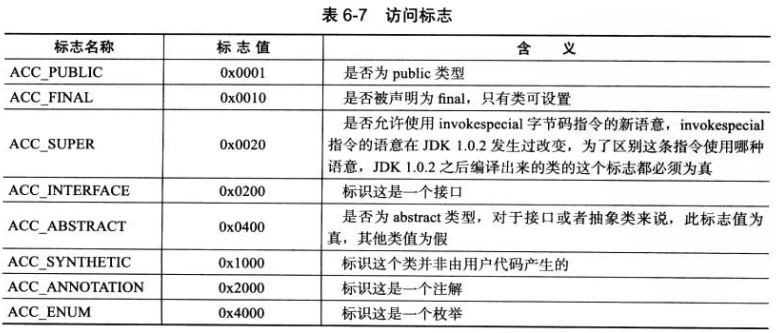

# 第6章 类文件结构

​    

Java 代码编译后都会变成字节码（class 文件）。由虚拟机来执行这些字节码，实现跨平台。

JDK 有提供用于分析 Class 文件字节码的工具：javap。

​    

## Class 类文件的结构

注：并不一定类或接口都会定义在文件里，它们也可以通过类加载器直接生成。

Class 文件是一组以 8 位字节为基础单位的二进制流，各个数据项严格按照顺序紧凑地排列在 Class 文件之中，中间没有分隔符，且顺序是固定的。当遇到需要 8 位字节以上的数据项时，会按照高位在前（最高位字节在地址最低位）的方式分割成若干个 8 位字节进行存储。

根据 Java 虚拟机规范，Class 文件格式采用一种类似于 C 语言结构体的伪结构来存储数据。这种伪结构中只有两种数据类型：无符号数、表。

无符号数：属于基本的数据类型。以 u1、u2、u4、u8 来分别代表 1 个字节、2 个字节、4 个字节、8 个字节的无符号数。无符号数可以用来描述数字、索引引用、数量值或者按照 UTF-8 编码构成字符串值。

表：由多个无符号数或其他表作为数据项构成的复合数据类型。所有表以习惯性地以“_info”结尾。表用于描述有层次关系的复合结构的数据。整个 Class 文件本质上就是一张表，它由以下数据项构成：

### 魔数与 Class 文件的版本

Class 文件的头 4 个字节为魔数（Magic Number）。作用是确定这个文件是否为一个可以被虚拟机接收的 Class 文件。Class 文件的魔数值是：0xCAFEBABE（咖啡宝贝..?）。

魔数后面的 4 个字节是 Class 文件的版本号。其中前两个字节是次版本号（Minor Version），后两个字节是主版本号（Major Version）。Java 的版本号是从 45 开始的，JDK 1.1 之后每个 JDK 大版本都会加上 1。虚拟机不会执行比当前版本高的 Class 文件。

可以使用 16 进制编辑器 WinHex 打开一个 Class 文件看看里面的字节。

### 常量池

版本号之后是常量池。是与其他项关联最多的数据类型。占用 Class 文件的空间最大。是表类型数据项。

#### 常量池容量计数

由于常量的数量是不固定的，在开头放一个 u2 类型数据，表示常量池容量计数值（constant_pool_count）。它的初始值是 1 而不是 0，所以如果是 0x0016，即十进制的 22，代表着常量池有 21 个常量，索引值范围为 1~21。这样做的目的是，为了满足后面某些指向常量池的索引值的数据，在特定情况下需要表达“不引用任何一个常量池项目”的含义，这种情况就可以把索引值设为 0 来表示。在 Class 文件结构中只有这个常量池容量计数是从 1 开始的，其他都是从 0 开始。

#### 字面量和符号引用

常量池主要存放两类常量：字面量（Literal）、符号引用（Symbolic References）。

字面量较接近于 Java 语言上的常量概念，比如字符串、final 常量值等。

符号引用则属于编译原理方面的概念。它包括了以下三种常量：

- 类和接口的全限定名（Fully Qualified Name）
- 字段的名称和描述符（Descriptor）
- 方法的名称和描述符

概念：

- 类和接口的全限定名：如 com/demo/DemoClass;
- 方法、字段的简单名称：没有类型和参数修饰的方法或者字段名称，如 void myFunc(..) 方法的简单名称就是 myFunc。
- 方法、字段的描述符：基本类型和 void 都用一个大写字符来表示，如 I 代表 int，D 代表 double，V 代表 void，L 代表对象类型（如 Ljava/lang/Object）等；对于数组类型，如 [I 代表 int[]，[[Ljava/lang/String; 代表 `String[][]` 二维数组；对于方法，顺序是按参数列表、返回值，参数列表放在一组小括号里，如 ()V 代表 void inc()，()Ljava/lang/String; 代表 String 类的 toString()，([CII[CIII)I 代表 int indexOf(char[] source, int sourceOffset, int sourceCount, char[] target, int targetOffset, int targetCount, int fromIndex)。

虚拟机在加载 Class 文件的时候进行的是动态连接，即 Class 文件中不会存储方法、字段的最终内存布局信息。因此这些方法、字段的符号引用不经过运行期转换的话，无法得到真正的内存入口地址，也就无法直接被虚拟机使用。当虚拟机运行时，需要从常量池获得对应的符号引用，然后在类创建时或运行时解析、翻译到具体的内存地址之中。

#### 常量类型

常量池的每一个常量都是一个表，在 JDK 1.7 中常量池的项目共有 14 种类型：

每个类型都各有自己的结构。但有一个共同点是：开始的第一位都是一个 u1 类型的标志位（tag），代表当前这个常量属于哪种常量类型。

### 访问标志 access_flags

在常量池后面。两个字节。用于标识一些类或者接口层次的访问信息，包括：这个 Class 是类还是接口、是否为 public 类型、是否为 abstract 类型、如果是类的话是否为 final 等。

### 类索引、父类索引与接口索引集合

Class 文件中用这三个数据来确定这个类的继承关系。

- 类索引：确定这个类的全限定名。
- 父类索引：确定这个类的父类的全限定名。
- 接口索引集合：描述这个类实现了哪些接口。按 implements 语句后的接口顺序排列。

类索引（this_class）、父类索引（super_class）都是一个 u2 类型的数据，都指向一个类型为 CONSTANT_Class_info 的类描述符常量。

而接口索引集合（interfaces）是一组 u2 类型的数据的集合。它的第一项就是 u2 类型的接口计数器。

### 字段表集合 field_info

描述接口或者类中声明的变量（不包括方法局部变量）。

利用了标志位来表示字段是否为静态的、final 的、作用域等。而简单名称、描述符这些用常量池中的常量来描述。

字段表中不包含从父类中继承下来的字段，但有可能会有原 Java 代码中不存在的字段，比如内部类会自动添加指向外部类的字段（为了对外部类的访问性）。

#### 字段重载

Java 语言中字段是不能重载的，名称必须都不一样。但对于字节码来说，如果两个字段的描述符不一样，那字段名可以是一样的。

### 方法表集合

与字段表类似。

方法内的 Java 代码，经过编译成字节码后，存放在方法属性表集合中一个名为 “Code” 的属性里面。

#### 方法重载

需要特征签名不同。

在 Java 语言里，特征签名就是方法的参数在常量池中的字段符号引用的集合。因为返回值不包含在特征签名中，因此 Java 语言里无法只根据返回值不同来进行重载。

但是在 Class 文件格式中，特征签名指的是描述符，也就是说可以只根据返回值不同来进行重载。

### 属性表集合

在字段表的最后，即 descriptor_index 之后还有一个属性表集合，用于存储一些字段的额外信息。比如，final static int a = 123;，就会有一个 “ConstantValue” 属性，其值指向常量 123。

在方法表中也有。比如存方法里的代码经过编译后的字节码（叫 “Code” 属性）。

类文件里也有。比如存被声明为 deprecated 的方法、字段（叫 “Deprecated” 属性）。

对属性表没有严格要求顺序、长度等，只要属性名不重复就行。任何编译器都可以向属性表中写入自己定义的属性信息。但 Java 虚拟机运行时会忽略掉它不认识的属性（JDK 1.7 中共有 21 个属性名）。

每个属性名，都需要从常量池中引用一个 CONSTANT_Utf8_info 类型的常量来表示。而属性值的结构则是完全自定义的，只需要通过一个 u4 的长度属性说明属性值所占的位数即可。

​    

## 字节码指令简介

Java 虚拟机的指令由一个字节长度的操作码（Opcode）和操作数（Operands）而构成。（操作码没有限制字节大小）

### 字节码与数据类型

大多数指令包含了其操作对应的数据类型信息，如 iload 指令从局部变量表中加载 int 数据到操作数栈中，fload 指令则指 float 数据。即使两个操作在虚拟机内部会是由同一段代码实现的，但在 Class 文件中必须拥有不同的字节码。

由于虚拟机中操作码长度只有 1 个字节，所以虚拟机并没有为每个指令和每种数据类型都有对应不同的指令（如 load 指令由 iload，但没有对 byte 类型的同类指令）。

有一些指令可以将一些不支持的类型转换为可支持的类型。编译器会在编译期把 byte、short 类型带符号扩展为 int，将 boolean、char 零位扩展为 int。

### 加载和存储指令

加载和存储指令用于在栈帧中的局部变量表、操作数栈之间来回传输数据。

这类指令包括：

- 局部变量加载到操作数栈：iload 等
- 从操作数栈存储到局部变量表：istore 等
- 把常量加载到操作数栈：bipush 等
- 扩充局部变量表的访问索引的指令：wide

除此之外，还有少量指令如访问对象的字段、数组元素的指令也会向操作数栈传输数据。

#### 指令助记符

如 `iload_<n>` 代表一组指令：iload_0、iload_1、iload_2、ilaod_3。

iload_0 就表示操作数为 0 的 iload。操作数隐藏在指令中，从而不需要进行取操作数的操作。

### 运算指令

把两个操作数栈上的值进行运算，并把结果存到操作数栈顶。

数据运算结果可能会溢出，比如两个大正整数相加，结果可能会是负数。

Java 虚拟机规范没有明确定义整形数据溢出的具体运算结果，只规定了在除法、求余指令中当除数为 0 时虚拟机会抛出 ArithmeticException 异常，其余任何整型数运算都不会抛出运行时异常。

Java 虚拟机规范要求处理浮点数时，必须严格遵循规定的行为和限制。即非正规浮点数值、诸暨下溢的运算规则。并要求运算结果都必须舍入到适当的精度，默认舍入模式为：两种数接近程度一样时优先选择最低有效位为零的接近值。

浮点数转换为整数时，Java 虚拟机使用 IEEE 754 标准中的向零舍入模式（舍弃小数部分，转为最接近且不大于原值的数字）。

另外，虚拟机对浮点数进行运算时，不会抛出任何（Java 语言中的）运行时异常。当溢出时会使用有符号的无穷大来表示。如果某个操作没有明确的数学定义，会用 NaN 值来表示。NaN 之间的运算，结果都是 NaN。

### 类型转换指令

一般用于用户代码中的显式类型转换的操作，或者用来处理字节码指令集中数据类型相关指令无法与数据类型一一对应的问题。

大范围类型转小范围类型时（即窄化转换，如 double 转 int 等），必须显式地使用转换指令（包括 i2b、i2c、i2s、l2i、f2i 等）。这种情况可能会出现转换结果产生不同的正负号（因为最高位和符号位不同）、数量级的情况。

### 对象创建访问指令

类实例和数组都是对象，但虚拟机堆这两种的创建、操作使用了不同的字节码指令。

### 操作数栈管理指令

pop、swap 等。

### 控制器转移指令

条件分支、符合条件分支、无条件分支（如 goto、ret 等）

### 符号调用和返回指令

比如：

- invokevirtual：调用对象的实例方法。
- invokeinterface：调用接口方法。
- invokespecial：调用一些需要特殊处理的实例方法，包括对象初始化方法、私有方法、父类方法。
- invokestatic：调用 static 方法。
- invokedynamic：调用运行时动态解析出调用点限定符所引用的方法。上面 4 条指令的分派逻辑都在 Java 虚拟机内部，而该指令由用户所设定的引导方法决定的。

返回指令根据返回值的类型区分。如 ireturn、dreturn 等。

### 异常处理指令

athrow 来实现 throw 语句。

catch 语句没有用字节码指令实现，而是用异常表来完成的。

### 同步指令

虚拟机支持方法级的同步和方法内部一段指令序列的同步。这两种都是使用 Monitor（管程）来支持的。

方法级的同步：是隐式的，不用通过字节码指令来控制。会根据方法表结构中的标志来判断是否为同步方法。如果是，则去持有 Monitor，执行完成或者抛出异常时会释放 Monitor。

同步一段指令集序列：虚拟机有 monitorenter、monitorexit 指令来支持 synchronized 代码块关键字的语义。

​    

## 公有设计和私有实现

虚拟机实现的方式主要有两种：

- 将 Java 虚拟机代码在加载或执行时，翻译成另一种虚拟机的指令集。
- 将 Java 虚拟机代码在加载或执行时，翻译成宿主机 CPU 的本地指令集（即 JIT 代码生成技术）。

​    

## Class 文件结构的发展