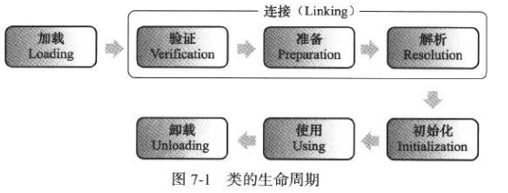
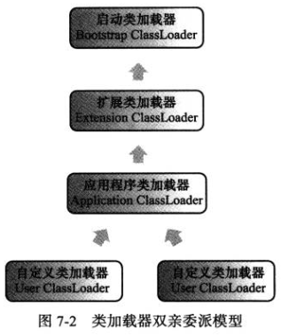

# 第7章 虚拟机类加载机制

​    

虚拟机把 Class 文件的数据加载到内存，对数据进行校验、解析、初始化，最后形成可以被虚拟机直接使用的 Java 类型。

在 Java 语言里，类型的加载、连接、初始化都是在运行期完成的。这样，就可以在运行时动态指定对象的实际类型等。

下文中的“类”指的是类或接口。

​    

## 类加载的时机

类的生命周期：加载、验证、准备、解析、初始化、使用、卸载。

注意，解析阶段在某些情况下可以在初始化之后开始。这是为了支持 Java 语言的运行时绑定（也称为动态绑定或晚期绑定）。

其他都是按这个顺序开始的。（注：按顺序“开始”而不是按顺序“完成”。）

虚拟机规范中没有规定什么情况下开始加载类。但对于初始化阶段，有严格规定**有且只有**以下 5 种情况必须进行初始化：

- 遇到 new、getstatic、putstatic、invokestatic 字节码指令。如果没有初始化，则需要先初始化。生成这些指令的最常见的 Java 代码场景为：使用 new 实例化一个对象（不包括数组对象）；读取、设置一个类的静态字段（final 且已在编译期把结果放入常量池的静态字段除外）（如果是子类直接读取父类的静态字段，只会初始化父类）；调用一个类的静态方法；
- 使用 java.lang.reflect 包的方法进行反射。如果没有初始化，则需要先初始化。
- 初始化类时，父类还没有进行初始化时，初始化该父类。注：但接口不会，只有真正用到父接口（如父接口的常量）时才会初始化。
- 启动虚拟机时，用户指定的主类（main 方法的那个类），需要先初始化。
- 使用 JDK 1.7 的动态语言支持时，如果一个 java.lang.invoke.MethodHandle 实例最后的解析结果 REF_getStatic、REF_putStatic、REF_invokeStatic 的方法句柄，并且这个方法句柄所对应的类没有初始化，则需要先初始化。

以上 5 种场景中的行为称为对一个类进行主动引用，除此之外的所有引用类的方式都称为被动引用。

​    

## 类加载的过程 Class Loading

### 加载

是类加载过程的一个阶段。

在这阶段，虚拟机完成 3 件事情：

- 通过类的全限定名来获取该类的二进制字节流。
- 把该字节流代表的静态存储结构转化为方法区的运行时数据结构。
- 在内存中生成一个代表这个类的 java.lang.Class 对象，作为在方法区这个类的各种数据的访问入口。

具体由虚拟机来实现，如上面第一条中的二进制字节流，并没有指明是从 Class 文件获取的。所以也可以自定义实现一个类加载器去控制字节流的获取方式（即重写类加载器的 loadClass() 方法）。

加载完成后，二进制字节流就会按照虚拟机所需的格式存储在方法区中。然后在内存中（没有明确规定是在 Java 堆里。对 HotSpot 而言，Class 对象虽然是对象，但会存放在方法区里面）实例化一个 java.lang.Class 对象，这个对象将作为程序访问方法区中这些数据的入口。

对数组类，不会通过类加载器创建，而是由虚拟机直接创建的。但是它的元素类型最终要靠类加载器创建。数组类创建过程规则：

- 如果数组的组件类型为引用类型，就递归采用加载过程去加载这个组件类型。
- 如果组件类型不是引用类型（如 int[] 数组），虚拟机会把数组标记为与引导类加载器关联。
- 数组类的可见性与它的组件类型可见性一致。如果组件类型不是引用类型，那它的可见性默认为 public。

### 验证

验证 Class 文件的字节流包含的信息是否符合虚拟机的要求。

从整体上讲，大概有 4 个阶段：文件格式验证、元数据验证、字节码验证、符号引用验证。

#### 文件格式验证

检查魔数、版本号、常量池的常量类型等，会检查 Class 文件格式及内容。

保证能正确地解析。只有通过这个阶段，字节流才会存储到方法区。后面三个验证都是基于方法区的存储结构进行的，而不是直接操作字节流。

#### 元数据验证

对元数据进行语义分析，保证符合 Java 语言规范的元数据信息。

如是否有父类（除了 Object 外都应该有父类），是否继承了 final 类，是否覆盖了父类的 final 字段、是否重载有错误等。

#### 字节码验证

对类的方法体进行校验分析，检查方法在运行时是否出现不安全的事件。

例如是否把 long 数据放到 int 类型的数据上，跳转指令位置是否正确，类型转换是否安全等。

#### 符号引用验证

检查常量池中的各种符号引用的信息。

如全限定名所对应的类是否存在，字段是否可以被访问等。

### 准备

在方法区为类变量（static 变量）分配内存，并设置其初始值（一般是 0）。

如果是 final static 变量，编译时就会给变量生成 ConstantValue 属性，并在准备阶段，虚拟机会根据 ConstantValue 属性的值进行赋值。

### 解析

将常量池内的符号引用（CONSTANT_Class_info 等类型的常量）替换为直接引用。

### 初始化

真正开始执行程序中的 Java 代码，也是执行类构造器 `<clinit>()` 方法的过程。

 `<clinit>()` 方法是由编译器收集类中的所有类变量（static 变量）的赋值动作、静态代码块合并产生的。其收集顺序按代码中出现的顺序而决定的。

虚拟机会保证子类的 `<clinit>()` 方法执行之前，父类的 `<clinit>()` 方法已经执行完毕。

 `<clinit>()` 方法在多线程环境中能被正确地加锁、同步。而且不会执行第二次。

​    

## 类加载器

实现在加载过程中的“通过类的全限定名来获取该类的二进制字节流”步骤的模块称为类加载器。

### 类与类加载器

比较两个类是否相等（即 Class 对象的 equals() 方法，或 isAssignableFrom()、instanceof 也是），前提必须是被同一个类加载器加载。如果两个类都是同一个 Class 文件，而被不同的类加载器加载，就会必须不相等。

### 双亲委派模型

对虚拟机来讲，只有两种类加载器：

- 启动类加载器（Bootstrap ClassLoader），是虚拟机的一部分。由 C++ 实现。
- 其他类加载器，由 Java 语言实现。独立于虚拟机外部。继承自抽象类 java.lang.ClassLoader。

如果用户想用启动类加载器，可以通过实现 ClassLoader 的 getClassLoader() 方法时，让该方法返回 null 即可。 

对 Java 开发人员，类加载器可以划分为 3 种：

- 启动类加载器。就是上面提到的那个。负责把 JAVA_HOME\lib 目录中的，或被 -Xbootclasspath 参数指定的，并且是虚拟机识别（仅根据文件名识别）的类库加载到虚拟机内存中。

- 扩展类加载器（Extension ClassLoader）。负责加载 JAVA_HOME\lib\ext 目录中的，或被 java.ext.dirs 系统变量所指定路径下的类库。开发人员可以直接使用（由 sun.misc.Launcer$ExtClassLoader 实现）。

- 应用程序类加载器（Application ClassLoader）。由 sun.misc.Launcer$AppClassLoader 实现。是 ClassLoader 中的 getSystemClassLoader() 方法的返回值，所以也称为系统类加载器。负责加载用户类路径（ClassPath）上所指定的类库。

  如果应用程序没有自定义的类加载器，一般情况下这个就是程序中默认的类加载器。

这些类加载器之间的关系一般为：

类加载器之间的这种层次关系，称为类加载器的**双亲委派模型（Parents Delegation Model）**。这里类加载器之间的父子关系一般不会以继承的关系来实现，而是使用**组合**的关系来复用父加载器的代码。（注：并不是强制性的要求，而是推荐的一种实现方式。）

该模型的工作过程：如果一个类加载器收到类加载的请求，它会先把这个请求委派给父类加载器完成。只有当父加载器反馈无法完成这个请求时（它的搜索范围中没有找到所需的类），子加载器才会自己去加载。

使用该模型的好处：具有了有优先级的层次关系。比如 Object 类，它存放在 rt.jar 中，无论哪种类加载器要加载这个类，最终都是委派给最顶端的启动类加载器。因此 Object 类在程序的各种类加载器环境中都是同一个类。

该模型的代码都集中在 java.lang.ClassLoader 的 loadClass() 方法中。

注：如果自己写了 rt.jar 里的同名类，如 java.lang.System，并且让自己定义的类加载器而强行去加载该类，虚拟机会抛出 java.lang.SecurityException: Prohibited package name:java.lang 异常。

### 破坏双亲委派模型

覆盖 loadClass() 方法；

父类请求子类加载器去完成类加载；如线程的上下文类加载器（通过 Thread 的 setContextClassLoader() 设置），如果创建线程时还没设置，就会从父线程中继承一个，如果在应用程序全局范围内都没有设置过的话，那这个类加载器默认就是应用程序类加载器。

代码热替换（HotSwap）、模块热部署（Hot Deployment）的实现；