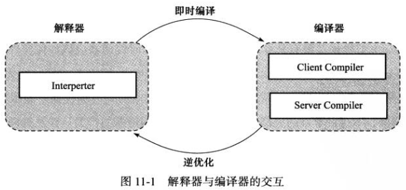

# 第11章 晚期（运行期）优化

​    

JIT 编译期不是虚拟机必须的部分，虚拟机规范里并没有规定必须有，也没有规定如何实现。

本章讲的是 HotSpot 内的即时编译器。

​    

## HotSpot 虚拟机内的即时编译器

### 解释器与编译器

HotSpot 同时拥有解释器、编译器。

当程序需要迅速启动执行时，解释器可以首先发挥作用，省去编译的时间，立即执行；

当运行后随着时间的推移，编译期逐渐发挥作用，把越来越多的代码编译成本地代码后，可以获取更高的执行效率；



HotSpot 内置了两个即时编译器，其中 Client Compiler 称 C1 编译器，Server Compiler 称 C2 编译器。

JDK 1.7 及之前的 HotSpot 默认采用解释器与其中一个编译器直接配合的方式（混合模式）工作。HotSpot 会根据自身版本与宿主机器的硬件性能自动选择运行模式（选择哪个编译器）。用户也可以使用 “-client”、“-server” 参数去强制指定。“-Xint” 为只使用解释器（解释模式）。

#### 分层编译

- 第 0 层：程序解释执行，解释器不开启性能监控功能，可触发第 1 层编译。
- 第 1 层：也称为 C1 编译，将字节码编译为本地代码，进行简单、可靠的优化。如有必要将加入性能监控的逻辑。
- 第 2 层（或以上）：也称为 C2 编译，也是将字节码编译为本地代码，但是会启用一些编译耗时较长的优化，甚至会根据性能监控信息进行一些不可靠的激进优化。

### 编译对象与触发条件

被即时编译器编译的热点代码：1. 多次调用的方法 2. 多次执行的循环体（但编译期任然会以整个方法作为编译对象）

热点代码判定方法：

- 基于采样的热点探测：虚拟机周期性地检查各个线程的栈顶，如果发现某个方法经常出现在栈顶，就是热点方法。
- 基于计数器的热点探测：为每个方法建计数器而统计。

HotSpot 使用的就是第二种方法。它有两种计数器：方法调用计数器、回边计数器。两种计数器当超过某个阈值，会触发 JIT 编译。

方法调用计数器：统计一段时间内方法被调用次数。方法被调用时，如果没有编译过，会加一并判断是否超出阈值，反之直接使用编译后的本地代码。

回边计数器：统计方法中循环体执行的次数，如果没有编译过，会加一并判断是否超出阈值，反之直接使用编译后的本地代码。

### 编译过程

### 查看及分析即时编译结果

​    

## 编译优化技术

HotSpot 的即时编译器在生成代码（机器码）时采用的代码优化技术。

### 优化技术概览

以下几项是最有代表性的优化技术。

### 公共子表达式消除

如果一个表达式 E 已经计算过了，并且 E 中所有变量值都没有发生变化，那就会成为了公共子表达式。下次会直接用前面计算过的表达式 E 的值来代替。

### 数组边界检查消除

使用循环变量访问数组时，如果编译器可以判定该循环变量会一直在 [0, array.length) 之间，那么在循环时不会每次检查循环变量大小。

类似防止异常情况时做的优化：隐式异常处理。Java 空指针检查、除数为零的检查等都用了此方式。比如获取某个对象的值 foo.value 时，不会每次都先判断 foo 是否为 null，而是：

``` java
try {
    return foo.value;
} catch (segment_fault) {
    uncommon_trap(); // 处理异常
}
```

虽然处理异常时还需要做跳转、返回等过程，但如果是出现空指针异常的情况较小的时候，这种做法会得到优化。反之则会使程序更慢。（庆幸的是 HotSpot 会自动根据运行期收集到的 Profile 信息自动选择最优方案。）

### 方法内联

把目标方法的代码“复制”到发起调用的方法之中，避免发生真实的方法调用。

但由于虚方法在编译期无法确定应该使用哪个方法版本，所以该优化方案对于非虚方法（即使用 invokespecial 指令调用的私有方法、实例构造器、父类方法，使用 invokestatic 指令调用的静态方法，使用 invokevirtual 指令调用的 final 方法）会直接进行内联。

而对于虚方法，编译器会查询该虚方法在当前程序下，是否有多个目标版本可供选择，如果只有一个就会进行内联，并且把该内联缓存下来。但如果程序后续执行过程中，加载了导致继承关系发生变化的新类，那就需要抛弃已经编译的代码，退回到解释状态执行，或者重新进行编译。所以，这种称为守护内联。

### 逃逸分析

如果一个对象不会逃逸到方法或线程之外，也就是别的方法、线程无法通过任何途径访问到这个对象，则可能为这个变量进行一些优化，如：

#### 栈上分配

每次 GC 时回收和筛选可回收对象动作都会耗时，如果发现对象不会逃逸出方法外，那么会在栈上分配该对象，对象所占的空间会随栈帧出栈而销毁。常见的是局部对象。

#### 同步消除

如果对象不会逃逸出线程之外，那么不会对该对象进行同步措施。

#### 标量替换

标量指一个数据无法再分解成更小的数据。Java 虚拟机中的原始数据类型 int、long、reference 等都是标量。

相反的，如果可以继续分解，则称作聚合量。Java 中的对象就是聚合量。

标量替换就是指，将一个对象拆散开，根据程序访问的情况，将其使用到的成员变量恢复原始类型来访问。

如果逃逸分析证明对象不会被外部访问，并且该对象可以被拆散，那程序真正执行的时候可能不会创建这个对象，而是改为直接创建它的若干个成员变量来代替。拆分后，可以将其成员变量放到栈上（栈上存储的数据，很大概率会被虚拟机分配至物理机器的高速寄存器中存储）。

