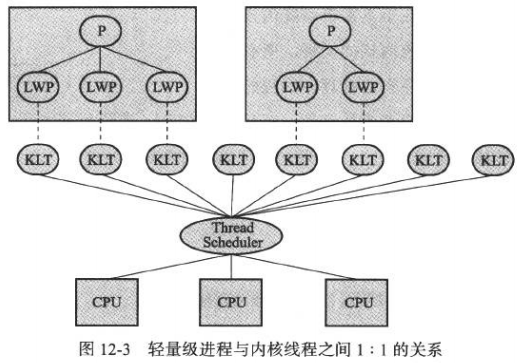
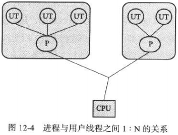
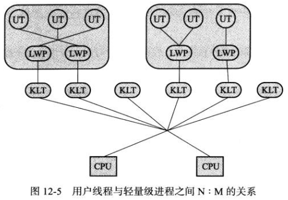
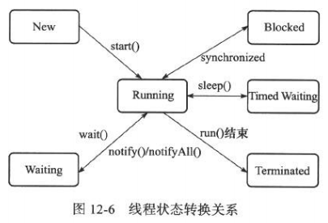

# 第12章 Java内存模型与线程

​    

## 硬件的效率与一致性

高速缓存 Cache：由于计算机的存储设备与处理器的运算速度有几个数量级的差距，所以就加入了一层读写速度尽可能接近处理器运算速度的高速缓存，来作为内存与处理器之间的缓冲（将运算需要使用到的数据先复制到缓存中，运算结束后再从缓存同步到内存中）。

但这样会引入一个问题：**缓存一致性**。每个处理器都有自己的高速缓存，而它们又共享同一个主内存（Main Memory），这样会导致各自的缓存数据不一致。

​    

## Java 内存模型 JMM

Java 虚拟机规范定义了一种 Java 内存模型来屏蔽掉内存访问的差异，以实现 Java 程序在各种平台下都能达到一致的内存访问结果。

这个 Java 内存模型需要定义得足够严谨，才能让 Java 并发访问内存的操作不好产生歧义；但也必须定义得足够宽松，使得虚拟机的实现有足够的自由空间去优化。

所以，Java 内存模型的主要目标，就是定义**程序中各个变量的访问规则**。

### 主内存与工作内存

Java 内存模型规定了所有的变量都存储在虚拟机的**主内存**中。

每个线程都有自己的**工作内存**（Working Memory），保存了线程使用到的变量的主内存副本拷贝（拷贝对象的引用、某个字段，而不是整个对象都拷贝一次）。线程对变量的所有操作都必须在工作内存中进行，不能直接读写主内存。而且，不同的线程之间也不能直接访问对方工作内存，只能先通过主内存。

这里的主内存，与 Java 内存区域中的 Java 堆、栈、方法区等并不是同一个层次的内存划分，但如果硬要讲，那主内存主要对应于 Java 堆中的对象实例部分（除了实例，堆还有其他数据。对于 HotSpot，还有 Mark Word（对象的哈希码、GC 标志、GC 年龄、同步锁等）、Klass Point（指向存储类型元数据的指针）及一些用于字节对齐补白的填充数据）。而工作内存则对应于虚拟机栈中的部分区域。

从更低的层次上说，主内存就直接对应于物理硬件的内存。而为了更好的运行速度，虚拟机可能会让工作内存先存储于寄存器、高速缓存中。

### 内存间交互操作

Java 内存模型中定义了以下 8 种操作，它们都具有原子性：

- lock：作用于主内存的变量。锁住变量。
- unlock：作用于主内存的变量。把一个锁定状态的变量释放出来，其他线程可以拿来锁定。
- read：作用于主内存的变量。把一个变量的值传输到工作内存，以便随后的 load 动作使用。
- load：作用于工作内存中的变量。把 read 操作得到的变量值放入工作内存的变量副本中。
- use：作用于工作内存中的变量。把变量的值传递给执行引擎。每当字节码指令需要使用到变量的值时虚拟机会执行该操作。
- assign（赋值）：作用于工作内存中的变量。从执行引擎接收到的值赋给工作内存的变量。每当字节码指令给变量赋值时虚拟机会执行该操作。
- store（存储）：作用于工作内存中的变量。把工作内存中的变量的值传到主内存中。
- write：作用于主内存中的变量。把 store 操作从工作内存中得到的变量的值放入主内存的变量中。

read -> load：从主内存复制到工作内存

store -> write：从工作内存同步到主内存

上面两组操作，每组的两个动作都必须是按顺序执行（但并是非连续执行，中间可插入其他指令）。

这 8 中基本操作必须满足如下规则：

- 不允许 read 和 load、store 和 write 操作之一单独出现。即不允许从主内存读取了但工作内存不接受，或者从工作内存发起回写了但主内存不接受的情况。
- 不允许一个线程丢弃它的最近的 assign 操作。即变量在工作内存中改变了之后必须同步到主内存。
- 不允许一个线程在没有发生过任何 assign 操作时无原因地把数据同步到主内存中。
- 一个新的变量只能在主内存中“诞生”，不允许在工作内存中直接使用一个未被初始化（load 或 assign）的变量。也就是说，对变量执行 use、store 之前，必须先执行过了 assign 和 load 操作。
- 如果对一个变量执行 lock，将会清空工作内存中此变量的值，在执行引擎使用这个变量前，需要重新执行 load 或 assign 对变量的值进行初始化。
- 如果变量事先没有被 lock 锁住，那就不允许对它进行 unlock。也不允许去 unlock 一个被其他线程锁住的变量。
- unlock 变量之前，必须先把变量同步到主内存中（执行 store、write）。

### 对于 volatile 型变量的特殊规则

Java 虚拟机提供的最轻量级的同步机制。

1. 保证可见性。

   但对 i++ 这种运算并不是安全的。该操作在 Class 文件中是由多条指令构成的（而一条指令又可能由多个机器码指令构成），当 getstatic 指令把变量值取到操作数栈顶时，volatile 才保证有可见性。

2. 禁止（机器码）指令重排序。

   通过机器码上加 lock 前缀实现一个内存屏障（Memory Barrier 或 Memory Fence）。该 lock 前缀会让本 CPU 的 Cache 写入内存，且让其他 CPU 的 Cache 上的数据过期，这种操作相当于对 Cache 中的变量做了一次前面介绍 Java 内存模式中所说的 “store 和 write” 操作。

性能

volatile 变量的读操作与普通变量在性能上几乎没什么差别，但写操作可能会慢一些。不过在大多数情境下还是比锁的消耗低。

### 对于 long 和 double 型变量的特殊规则

虽然上面 8 种操作都具有原子性，但是对于 64 位数据类型如 long、double，在内存模型中特别定义了一条相对宽的规定：允许虚拟机将没有被 volatile 修饰的 64 位数据的读写操作划分为 2 次 32 位的操作来进行。即允许不保证 64 位数据类型的 load、store、read、write 操作的原子性。（然而实际上大部分虚拟机都对 64 位数据类型实现了原子性）

### 原子性、可见性与有序性

### 先行并发原则 happens-before

Java 内存模型中规定了 happens-before 原则，用来说明一些操作无需任何同步器协助就已经存在了 happens-before 关系。如果两个操作之间没有 happens-before 的关系，则不能保证他们的实际执行顺序（即使执行时间上有顺序），虚拟机可能对他们随意地进行重排序。

​    

## Java 与线程

### 线程的实现

主要有 3 种实现方式。

#### 使用内核线程实现

内核线程（Kernel-Level Thread，KLT）就是直接由操作系统内核支持的线程，由内核来完成线程切换。内核通过操纵调度器（Scheduler）来对线程进行调度，并负责把线程的任务映射到各个处理器上。

程序一般不会直接去使用内核线程，而是会使用内核线程的一种高级接口：轻量级进程（Light Weight Process，LWP），就是通常意义上所讲的线程。这种轻量级进程与内核线程之间的 1:1 的关系称为**一对一的线程模型**：

优点：

由于内核线程的支持，每个 LWP 都称为一个独立的调度单元。即使有一个 LWP 在系统调用中阻塞了，也不会影响整个进程继续工作。

缺点：

由于 LWP 基于内核线程实现的，所以各种线程操作，如创建、析构、同步，都需要进行系统调用。而系统调用的代价较高，需要在用户态（User Mode）、内核态（Kernel Mode）中来回切换。

而且，每个 LWP 都需要有一个内核线程，因此每个 LWP 要消耗一定的内核资源（如内核线程的栈空间），因此一个系统支持 LWP 的数量是有限的。

#### 使用用户线程实现

广义上来讲，一个线程只要不是内核线程，就可以认为是用户线程（User Thread，UT）。因此在这个定义上来讲，轻量级进程 LWP 也属于用户线程，但 LWP 的实现始终是建立在内核之上的。

而狭义上的用户线程，指的是完全建立在用户空间的线程库上（线程的建立、同步、销毁、调度），系统内核不能感知线程存在的实现，即不需要内核的帮助。这种进程与用户线程之间 1:N 的关系称为**一对多的线程模型**：

优点：

不需要内核的帮助。

缺点：

所有线程操作都需要用户程序自己处理。如阻塞等问题。所以 Java 等语言都不使用用户线程了。

#### 使用用户线程加轻量级进程混合实现

通过轻量级线程实现用户线程的调度以及处理器映射，大大降低了整个进程被完全阻塞的风险。

该线程模型下，用户线程与轻量级进程的数量比是不固定的，这种 N:M 的关系称为**混合模型**：

#### Java 线程的实现

目前的 JDK，操作系统支持怎样的线程模型，在很大程度上决定了 Java 虚拟机的线程是怎样映射的。而且，虚拟机规范中也没有规定使用哪个线程模型。

对于 Sun JDK 来说，对 Windows、Linux 都是使用一对一的线程模型实现的（因为 Windows、Linux 系统提供的就是一对一的。虽然也有混合模式，但并没有成为主流的）。一个 Java 线程就映射到一个轻量级进程中。

### Java 线程调度

线程调度：系统为线程分配 CPU 处理器使用权的过程。

主要调度方式有两种：

- **协同式线程调度**（Cooperate Threads-Scheduling）：线程的执行时间由线程本身来控制。线程把工作执行之后，要主动通知系统切换到另一个线程上。

  优点：实现简单。线程自己知道切换操作。

  缺点：线程执行时间不可控制。如线程编写有问题等，一直不告知系统进行切换，这样会发生阻塞。所以不稳定。

- **抢占式线程调度**（Preemptive Threads-Scheduling）：由系统分配线程的执行时间（切换线程）。线程的切换不由线程本身来决定。（在 Java 中使用的就是抢占式，所以虽然 Thread.yield() 可以让出执行时间，但是要获取执行时间的话，线程本身其实是没有什么办法的）

  优点：可以避免阻塞问题。

### 状态转换

Java 语言定义了 5 种线程状态。在任意时刻，一个线程只能是其中一种状态：

- 新建（New）
- 运行（Runnable）
- 无限期等待（Waiting）
- 有限期等待（Timed Waiting）
- 阻塞（Blocked）
- 结束（Terminated）

